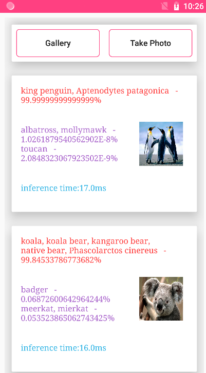

# Inference demo
The Inference demo describes the app integration process on CPU using the SqueezeNet under Caffe as an example.

## Table of Contents
* [Introduction](#Introduction)
* [Preparation && Getting Started](#Preparation && Getting Started)
* [Supported Environments](#Supported Environments)
* [Result](#Result)
* [License](#License)

## Introduction
The app integration process on CPU includes model pre-processing, model loading, model inference, and model post-processing.

## Preparation && Getting Started
  1. Check whether the Android studio development is ready. To build this demo, please first import the demo in the Android Studio. 
  2. Before using a model, you need to load the model. The DDK supports both single-model and multi-model loading. In sync mode, the app layer loads the model by calling the loadModelSync function at the JNI layer. In async mode, the app layer loads the model by calling the loadModelAsync function at the JNI layer.
  3. After the model is loaded, you can execute model inference. In sync mode, the app layer starts model inference by calling the runModelSync function at the JNI layer. In async mode, the app layer starts model inference by calling the runModelAsync function at the JNI layer.
  4. After inference, the model inference result is returned to the app layer. In sync mode, the app layer obtains the inference result by calling the runModelSync function and implements model post-processing by calling the postProcess function. In async mode, the app layer obtains the inference result by calling the OnProcessDone function and implements model post-processing by calling the postProcess function.
  5. Run the sample on your Android device or emulator.

## Supported Environments
- Use Ubuntu 16.04, Windows 10, or macOS to install Android Studio 3.5.3 or later
- Build native code with NDK R14b or later

## Result

## License
- The sample of HUAWEI HiAI Foundation has obtained the [Apache 2.0 License](http://www.apache.org/licenses/LICENSE-2.0).