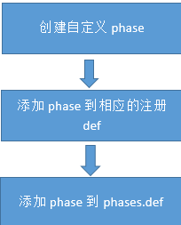

# 方舟编译器phase设计介绍

方舟编译器包含了一系列优化措施，并以phase的形式进行管理。本文将以中端的优化为例，介绍phase的设计和使用，以及如何自定义phase。

## Phase

中端主要包含两大类phase：ModulePhase和MeFuncPhase，都继承自Phase类。phase类最重要的是Run方法，根据是否要做分析分为两个重载。

```cpp
virtual AnalysisResult *Run(MeFunction *ir, MeFuncResultMgr *frm) {
  return nullptr;
}

// By default mrm will not be used because most ME phases do not need 
// IPA result. For those will use IPA result, this function will be overrode.
virtual AnalysisResult *Run(MeFunction *ir, MeFuncResultMgr *frm, ModuleResultMgr *mrm) {
  return Run(ir, frm);
}
```

所以，当添加一个新的phase的时候，必须要实现其中至少一个Run方法,并重写PhaseName方法返回名字。以rclowering作为一个例子：

```cpp
class MeDoRCLowering : public MeFuncPhase {
 public:
  MeDoRCLowering(MePhaseID id) : MeFuncPhase(id) {}

  virtual ~MeDoRCLowering() = default;
  AnalysisResult *Run(MeFunction*, MeFuncResultMgr*, ModuleResultMgr*) override;
  const std::string PhaseName() const override {
    return "rclowering";
  }
};
```

```cpp
AnalysisResult *MeDoRCLowering::Run(MeFunction *func, MeFuncResultMgr *m, ModuleResultMgr *mrm) {
  KlassHierarchy *kh = static_cast<KlassHierarchy*>(mrm->GetAnalysisResult(MoPhase_CHA, &func->GetMIRModule())); 
  DASSERT(kh != nullptr, "KlassHierarchy has problem");
  MeIRMap *hmap = static_cast<MeIRMap*>(m->GetAnalysisResult(MeFuncPhase_IRMAP, func));
  DASSERT(hmap != nullptr, "hssamap has problem");
  RCLowering rclowering(func, kh);
  MIRFunction *mirfunction = func->GetMirFunc();
  DASSERT(mirfunction->GetModule()->CurFunction() == mirfunction, "unexpected CurFunction");
  string funcname = mirfunction->GetName();
  if (DEBUGFUNC(func)) {
    LogInfo::MapleLogger() << "Handling function " << funcname << std::endl;
  }
  ...
```


# PhaseManager

PhaseManager负责phase的创建、管理和运行。与phase对应，有ModulePhaseManager和MeFuncPhaseManager两类。
PhaseManager首先注册其所有支持的phase，然后使用者就可以根据需要通过add phase接口添加期望使用的phase。

**1.注册phase**

以MeFuncPhaseManager为例，其通过RegisterFuncPhases方法来注册。注册的phase通过registeredPhases这个map来管理。

```cpp
void MeFuncPhaseManager::RegisterFuncPhases() {
  // register all Funcphases defined in mephases.def
#define FUNCTPHASE(id, mephase)                                                 \
  do {                                                                          \
    void *buf = GetMemAllocator()->GetMemPool()->Malloc(sizeof(mephase(id)));   \
    ASSERT(buf != nullptr, "null ptr check");                                   \                
    RegisterPhase(id, (new (buf) mephase(id)));                                 \                
  } while (0);
#define FUNCAPHASE(id, mephase)          
  do {                                                                           \        
    void *buf = GetMemAllocator()->GetMemPool()->Malloc(sizeof(mephase(id)));    \   
    ASSERT(buf != nullptr, "null ptr check");                                    \    
    RegisterPhase(id, (new (buf) mephase(id)));                                  \   
    arFuncManager.AddAnalysisPhase(id,(static_cast<MeFuncPhase*>(GetPhase(id))));\  
  } while (0);
#include "mephases.def"
#undef FUNCTPHASE
#undef FUNCAPHASE
}
void RegisterPhase(PhaseId id, Phase *p) {
  registeredPhases[id] = p;
}
```

这里使用了宏的机制来实现注册，便于管理需要注册的phase，只需编辑对应的def文件即可。mephases.def部分内容如下，第一个参数是id，第二个是phase类名。

```cpp
FUNCAPHASE(MeFuncPhase_SSATAB, MeDoSSATab)
FUNCAPHASE(MeFuncPhase_ALIASCLASS, MeDoAliasClass)
FUNCAPHASE(MeFuncPhase_SSA, MeDoSSA)
```

对于上面举例的rclowering phase，支持它只需添加如下一行即可:

```
FUNCTPHASE(MeFuncPhase_RCLOWERING, MeDoRCLowering)
```

**2.添加phase**

子类phase manager都提供了各自添加phase的接口，这些接口对输入进行处理后最终会调用基类PhaseManager的AddPhase方法。

```cpp
void MeFuncPhaseManager::AddPhasesNoDefault(std::vector<std::string> &phases) {
  for (unsigned i = 0; i < phases.size(); i++) {
    PhaseManager::AddPhase(phases[i].c_str());
  }
  DASSERT(phases.size() == GetphaseSeq()->size(), "invalid phase name");
}

void AddPhase(const std::string &pname) {
  for (auto it = RegPhaseBegin(); it != RegPhaseEnd(); it++) {
    if (GetPhaseName(it) == pname) {
      phaseSequences.push_back(GetPhaseId(it));
      phaseTimers.push_back(0);
      return;
    }
  }
...
```

添加的phase通过MapleVector来进行管理。

## InterleavedManager和DriverRunner

使用者除了可以使用上面的方式自行添加phase外，还可以借助InterleavedManager和DriverRunner组成的框架对phase进行更有效的管理。

**1.InterleavedManager**

InterleavedManager负责phase manager的创建、管理和运行。通过调用AddPhases接口，它将创建一个对应类型的phase manager并添加进MapleVector中, 同时该phase manager相应的phase注册、添加也会自动被触发。

```cpp
void InterleavedManager::AddPhases(vector<string> &phases, bool isModulePhase, bool timephases, bool genmpl) {
  ModuleResultMgr *mrm = nullptr;
  if (!phaseManagers.empty()) {
    // ModuleResult such class hierarchy need to be carried on
    ModulePhaseManager *mpm = dynamic_cast<ModulePhaseManager*>(phaseManagers[phaseManagers.size()-1]);
    MeFuncPhaseManager *mepm = dynamic_cast<MeFuncPhaseManager*>(phaseManagers[phaseManagers.size()-1]);
    if (mpm != nullptr) {
      mrm = mpm->GetModResultMgr();
    } else if (mepm != nullptr) {
      mrm = mepm->GetModResultMgr();
    }
  }
  if (isModulePhase) {
    ModulePhaseManager *mpm = GetMempool()->New<ModulePhaseManager>(GetMempool(), &mirmodule, mrm);
    mpm->RegisterModulePhases();
    mpm->AddModulePhases(phases);
    if (timephases) {
      mpm->SetTimePhases(true);
    }
    phaseManagers.push_back(mpm);
...
```

InterleavedManager的Run方法将依次运行所有管理的phase manager。

```cpp
void InterleavedManager::Run() {
  for (PhaseManager *const &pm : phaseManagers) {
    if (dynamic_cast<MeFuncPhaseManager*>(pm)) {
      MeFuncPhaseManager *fpm = static_cast<MeFuncPhaseManager*>(pm);
      unsigned long rangeNum = 0;
      MapleVector<MIRFunction*> *compList;
      if (!mirmodule.GetCompilationList().empty()) {
  ...
```

**2.DriverRunner**

DriverRunner包含了从一个mpl文件到优化结果文件的所有过程。ParseInput方法负责解析mpl文件。ProcessMpl2mplAndMePhases方法通过InterleavedManager负责phase的管理和运行。

DriverRunner也是通过宏的方式来集中管理phase，在phases.def文件里添加phase，然后通过InitPhases接口来遍历所有的phase并创建对应的phase manager。

phases.def内容如下：

```cpp
// Phase arguments are: name, condition. By default, all phases are required, so 
// the condition value is 'true'.
// You can use condition to control these phases and your custom phases. E.g. 
// ADD_PHASE("custom_phase", option1 == value1 [more conditions...]).
ADD_PHASE("classhierarchy", true)
ADD_PHASE("vtableanalysis", true)
ADD_PHASE("reflectionanalysis", true)
ADD_PHASE("gencheckcast", true)
ADD_PHASE("javaintrnlowering", true)
// mephase begin
ADD_PHASE("ssatab", true)
ADD_PHASE("aliasclass", true)
ADD_PHASE("ssa", true)
ADD_PHASE("analyzerc", true)
ADD_PHASE("rclowering", true)
ADD_PHASE("emit", true)
// mephase end
ADD_PHASE("GenNativeStubFunc", true)
ADD_PHASE("clinit", true)
ADD_PHASE("VtableImpl", true)
ADD_PHASE("javaehlower", true)
ADD_PHASE("MUIDReplacement", true)
```

第一个参数是phase名字，第二个参数是条件。现有的phase默认都是enable的，对于自定义的phase可以自行添加控制条件。

在ProcessMpl2mplAndMePhases里将该phases.def文件include进来，并通过宏添加进vector里。

```cpp
#include "../defs/phases.def"
```

```cpp
#define ADD_PHASE(name, condition)  \
  if ((condition)) {                \
    phases.push_back(string(name)); \
  }
```


InitPhases方法会将添加的phase拆解到InterleavedManager的phase manager集合里。

```cpp
void DriverRunner::InitPhases(InterleavedManager &mgr, vector<string> &phases) const {
  if (phases.empty()) {
    return;
  }
  const PhaseManager *curManager = nullptr;
  vector<string> curPhases;

  for (string phase : phases) {
    auto temp = mgr.GetSupportPhaseManager(phase);
    if (temp != nullptr) {
      if (temp != curManager) {
        AddPhases(mgr, curPhases, curManager);
        curManager = temp;
        curPhases.clear();
      }
      AddPhase(curPhases, phase, curManager);
    }
  }

  AddPhases(mgr, curPhases, curManager);
}
```

GetSupportPhaseManager用来获取当前phase对应的phase manager。

总结一下，phase涉及到的几个关键类如下：
- Phase类及其两个主要的子类ModulePhase和MeFuncPhase，通过扩展他们新增自定义phase
- PhaseManager类及其两个主要子类ModulePhaseManager和MeFuncPhaseManager，管理phase的注册和添加
- InterleavedManager类负责phase manager的创建、管理和运行
- DriverRunner类包含了从一个mpl文件到优化结果文件的所有过程。    ParseInput方法负责解析mpl文件。 ProcessMpl2mplAndMePhases方法通过InterleavedManager负责phase的管理和运行。


通过以上的框架，自定义phase只需完成如下三步便可应用到系统中：


