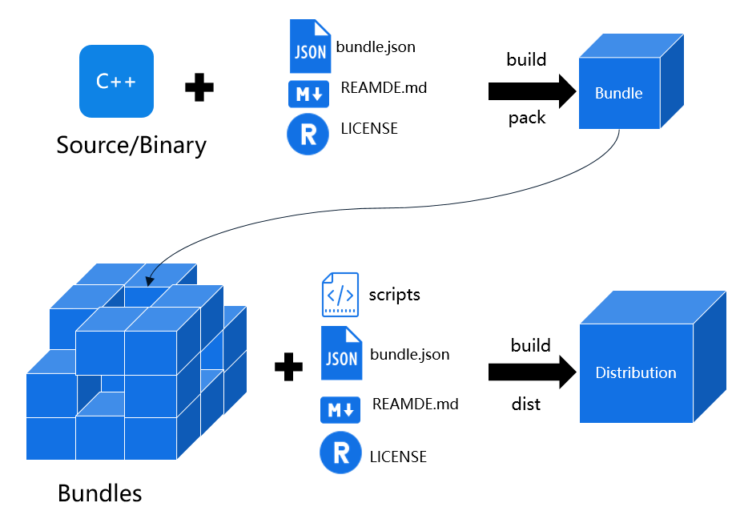

# 概述

本章节将简要介绍如何开发OpenHarmony组件和发行版，并通过命令行工具方式完成组件创建、开发、编译、烧录、调试等开发过程。

-   一个组件（bundle）通常和一个代码仓库对应，在代码的基础上增加bundle.json、README文件、LICENSE描述文件。
-   一个发行版（distribution）是由多个组件构成的。发行版中集合了一个完整系统的各种组件（如驱动、内核、框架、应用），可以用于设备的烧录。

**表 1**  组件和发行版的差异对比

<table><thead align="left"><tr id="row17288183614415"><th class="cellrowborder" valign="top" width="16.24162416241624%" id="mcps1.2.4.1.1">
异同点

</th>
<th class="cellrowborder" valign="top" width="33.31333133313331%" id="mcps1.2.4.1.2">
组件

</th>
<th class="cellrowborder" valign="top" width="50.44504450445044%" id="mcps1.2.4.1.3">
发行版

</th>
</tr>
</thead>
<tbody><tr id="row1728813361848"><td class="cellrowborder" valign="top" width="16.24162416241624%" headers="mcps1.2.4.1.1 ">
应用场景

</td>
<td class="cellrowborder" valign="top" width="33.31333133313331%" headers="mcps1.2.4.1.2 ">
面向功能特性开发

</td>
<td class="cellrowborder" valign="top" width="50.44504450445044%" headers="mcps1.2.4.1.3 ">
面向系统开发

</td>
</tr>
<tr id="row676745614472"><td class="cellrowborder" valign="top" width="16.24162416241624%" headers="mcps1.2.4.1.1 ">
内容

</td>
<td class="cellrowborder" valign="top" width="33.31333133313331%" headers="mcps1.2.4.1.2 ">
功能或特性的实现代码或二进制库

</td>
<td class="cellrowborder" valign="top" width="50.44504450445044%" headers="mcps1.2.4.1.3 ">
依赖的组件清单及编译构建脚本

</td>
</tr>
<tr id="row95114356"><td class="cellrowborder" valign="top" width="16.24162416241624%" headers="mcps1.2.4.1.1 ">
完整程度

</td>
<td class="cellrowborder" valign="top" width="33.31333133313331%" headers="mcps1.2.4.1.2 ">
操作系统的一部分

</td>
<td class="cellrowborder" valign="top" width="50.44504450445044%" headers="mcps1.2.4.1.3 ">
一个完整操作系统版本

</td>
</tr>
<tr id="row13581419518"><td class="cellrowborder" valign="top" width="16.24162416241624%" headers="mcps1.2.4.1.1 ">
编译后结果

</td>
<td class="cellrowborder" valign="top" width="33.31333133313331%" headers="mcps1.2.4.1.2 ">
组件包

</td>
<td class="cellrowborder" valign="top" width="50.44504450445044%" headers="mcps1.2.4.1.3 ">
系统镜像

</td>
</tr>
</tbody>
</table>

**图 1**  组件和发行版的构成  

