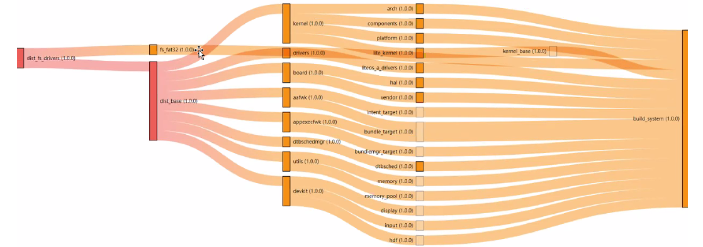

# Bundle Management<a name="EN-US_TOPIC_0000001052170830"></a>

## Dependency<a name="section12657593129"></a>

A basic  **bundle.json**  file needs to be enriched by bundle dependencies to implement more complex features. Bundle names and version numbers should be defined in the  **dependencies**  field of  **bundle.json**.

```
{
    "name": "my-bundle",
    "version": "1.0.0",
    "dependencies": {
        "net": "1.0.0"
    }
}
```

In this example,  **my-bundle**  depends on  **net 1.0.0**. After you globally install the hpm-cli tool, run the following command to obtain bundle dependencies from the remote repository:

```
hpm install 
```

Bundle dependencies are then stored in the  **ohos\_bundles**  folder in the root directory of the current bundle. A tree structure illustrating the bundle and its dependencies will be generated. You need to run the following command in the root directory of the bundle:

```
username@server MINGW64 /f/showcase/demo/demo
$ hpm list
+--demo@1.0.0
| +--@huawei/media@1.0.2
| +--@demo/sport_hi3518ev300_liteos_a@1.0.0
| | +--@demo/app@4.0.1
| | | +--@demo/build@4.0.1
| | | +--@demo/arm_harmonyeabi_gcc@4.0.0   
| | +--@demo/liteos_a@4.0.0
| | | +--@demo/third_party_fatfs@4.0.0     
| | | +--@demo/arm_harmonyeabi_gcc@4.0.0   
| | +--@demo/init@4.0.0
| | +--@demo/dist_tools@4.0.0
```

Alternatively, you can view the dependencies of the current bundle in a graph by running the following command:

```
hpm dependencies
```

A  **deps\_visual**  folder is generated in the current directory. The folder contains the  **deps.html**  and  **deps-data.js**  files. After you open the  **deps.html**  file via a browser, you can view bundle dependencies illustrated by a graph, as shown in the following figure.

Each dependency type is indicated by a different color at the corresponding node. You can move the mouse pointer to a node to view the implied information.

**Figure  1**  Bundle dependencies<a name="fig4306113315312"></a>  


## HPM Command Reference<a name="section1258849181312"></a>

You can use the hpm-cli tool to manage the lifecycle of a bundle. The following table describes available HPM commands. \(You can run the  **hpm -h**  command to get the command details\).

**Table  1**  HPM commands

<a name="table10510164515371"></a>
<table><thead align="left"><tr id="row125101745103718"><th class="cellrowborder" valign="top" width="20.95209520952095%" id="mcps1.2.4.1.1"><p id="p1451014454371"><a name="p1451014454371"></a><a name="p1451014454371"></a>Function</p>
</th>
<th class="cellrowborder" valign="top" width="30.623062306230626%" id="mcps1.2.4.1.2"><p id="p17510144553716"><a name="p17510144553716"></a><a name="p17510144553716"></a>Command</p>
</th>
<th class="cellrowborder" valign="top" width="48.42484248424842%" id="mcps1.2.4.1.3"><p id="p65102452371"><a name="p65102452371"></a><a name="p65102452371"></a>Description</p>
</th>
</tr>
</thead>
<tbody><tr id="row25106453375"><td class="cellrowborder" valign="top" width="20.95209520952095%" headers="mcps1.2.4.1.1 "><p id="p151044514378"><a name="p151044514378"></a><a name="p151044514378"></a>Querying version information</p>
</td>
<td class="cellrowborder" valign="top" width="30.623062306230626%" headers="mcps1.2.4.1.2 "><p id="p1653795113472"><a name="p1653795113472"></a><a name="p1653795113472"></a>hpm -V or hpm --version</p>
</td>
<td class="cellrowborder" valign="top" width="48.42484248424842%" headers="mcps1.2.4.1.3 "><p id="p399295684713"><a name="p399295684713"></a><a name="p399295684713"></a>Queries the <strong id="b107479812617"><a name="b107479812617"></a><a name="b107479812617"></a>hpm-cli</strong> version number.</p>
</td>
</tr>
<tr id="row651017455374"><td class="cellrowborder" rowspan="2" align="left" valign="top" width="20.95209520952095%" headers="mcps1.2.4.1.1 "><p id="p551054516372"><a name="p551054516372"></a><a name="p551054516372"></a>Querying help information</p>
</td>
<td class="cellrowborder" valign="top" width="30.623062306230626%" headers="mcps1.2.4.1.2 "><p id="p18648167124812"><a name="p18648167124812"></a><a name="p18648167124812"></a>hpm -h or hpm --version</p>
</td>
<td class="cellrowborder" valign="top" width="48.42484248424842%" headers="mcps1.2.4.1.3 "><p id="p1464811794817"><a name="p1464811794817"></a><a name="p1464811794817"></a>Queries the command list and help information.</p>
</td>
</tr>
<tr id="row1751016452379"><td class="cellrowborder" valign="top" headers="mcps1.2.4.1.1 "><p id="p16778111111487"><a name="p16778111111487"></a><a name="p16778111111487"></a>hpm -h</p>
</td>
<td class="cellrowborder" valign="top" headers="mcps1.2.4.1.2 "><p id="p1877811154818"><a name="p1877811154818"></a><a name="p1877811154818"></a>Queries command reference.</p>
</td>
</tr>
<tr id="row2511945123715"><td class="cellrowborder" rowspan="2" valign="top" width="20.95209520952095%" headers="mcps1.2.4.1.1 "><p id="p3955174864810"><a name="p3955174864810"></a><a name="p3955174864810"></a>Creating a project</p>
<p id="p14511184518374"><a name="p14511184518374"></a><a name="p14511184518374"></a></p>
</td>
<td class="cellrowborder" valign="top" width="30.623062306230626%" headers="mcps1.2.4.1.2 "><p id="p2046811558481"><a name="p2046811558481"></a><a name="p2046811558481"></a>hpm init bundle</p>
</td>
<td class="cellrowborder" valign="top" width="48.42484248424842%" headers="mcps1.2.4.1.3 "><p id="p1646818557481"><a name="p1646818557481"></a><a name="p1646818557481"></a>Creates a bundle project.</p>
</td>
</tr>
<tr id="row351184593713"><td class="cellrowborder" valign="top" headers="mcps1.2.4.1.1 "><p id="p18991313496"><a name="p18991313496"></a><a name="p18991313496"></a>hpm init -t template</p>
</td>
<td class="cellrowborder" valign="top" headers="mcps1.2.4.1.2 "><p id="p109912104911"><a name="p109912104911"></a><a name="p109912104911"></a>Creates a scaffolding project based on the template.</p>
</td>
</tr>
<tr id="row1751164511374"><td class="cellrowborder" rowspan="2" valign="top" width="20.95209520952095%" headers="mcps1.2.4.1.1 "><p id="p1351111454374"><a name="p1351111454374"></a><a name="p1351111454374"></a>Installing bundles</p>
<p id="p251144513715"><a name="p251144513715"></a><a name="p251144513715"></a></p>
</td>
<td class="cellrowborder" valign="top" width="30.623062306230626%" headers="mcps1.2.4.1.2 "><p id="p8896182914913"><a name="p8896182914913"></a><a name="p8896182914913"></a>hpm install or hpm i</p>
</td>
<td class="cellrowborder" valign="top" width="48.42484248424842%" headers="mcps1.2.4.1.3 "><p id="p1289692919493"><a name="p1289692919493"></a><a name="p1289692919493"></a>Installs dependent bundles in the <strong id="b161239403810"><a name="b161239403810"></a><a name="b161239403810"></a>bundle.json</strong> file.</p>
</td>
</tr>
<tr id="row15511194563712"><td class="cellrowborder" valign="top" headers="mcps1.2.4.1.1 "><p id="p17917436134911"><a name="p17917436134911"></a><a name="p17917436134911"></a>hpm install bundle@version</p>
</td>
<td class="cellrowborder" valign="top" headers="mcps1.2.4.1.2 "><p id="p1891723611494"><a name="p1891723611494"></a><a name="p1891723611494"></a>Installs bundles of a specified version.</p>
</td>
</tr>
<tr id="row21051110155011"><td class="cellrowborder" rowspan="2" valign="top" width="20.95209520952095%" headers="mcps1.2.4.1.1 "><p id="p1630384435010"><a name="p1630384435010"></a><a name="p1630384435010"></a>Uninstalling bundles</p>
<p id="p83417161509"><a name="p83417161509"></a><a name="p83417161509"></a></p>
</td>
<td class="cellrowborder" valign="top" width="30.623062306230626%" headers="mcps1.2.4.1.2 "><p id="p288195017502"><a name="p288195017502"></a><a name="p288195017502"></a>hpm uninstall bundle</p>
</td>
<td class="cellrowborder" valign="top" width="48.42484248424842%" headers="mcps1.2.4.1.3 "><p id="p2088450165014"><a name="p2088450165014"></a><a name="p2088450165014"></a>Removes dependent bundles.</p>
</td>
</tr>
<tr id="row73341617507"><td class="cellrowborder" valign="top" headers="mcps1.2.4.1.1 "><p id="p934161613508"><a name="p934161613508"></a><a name="p934161613508"></a>hpm remove or hpm rm bundlename</p>
</td>
<td class="cellrowborder" valign="top" headers="mcps1.2.4.1.2 "><p id="p234111685016"><a name="p234111685016"></a><a name="p234111685016"></a>Removes dependent bundles.</p>
</td>
</tr>
<tr id="row166449214501"><td class="cellrowborder" rowspan="2" valign="top" width="20.95209520952095%" headers="mcps1.2.4.1.1 "><p id="p8645421125016"><a name="p8645421125016"></a><a name="p8645421125016"></a>Viewing information</p>
<p id="p12645202115014"><a name="p12645202115014"></a><a name="p12645202115014"></a></p>
</td>
<td class="cellrowborder" valign="top" width="30.623062306230626%" headers="mcps1.2.4.1.2 "><p id="p679412535211"><a name="p679412535211"></a><a name="p679412535211"></a>hpm list or hpm ls</p>
</td>
<td class="cellrowborder" valign="top" width="48.42484248424842%" headers="mcps1.2.4.1.3 "><p id="p07941451526"><a name="p07941451526"></a><a name="p07941451526"></a>Displays the bundle tree of available bundles and distributions.</p>
</td>
</tr>
<tr id="row1764552105017"><td class="cellrowborder" valign="top" headers="mcps1.2.4.1.1 "><p id="p035818131525"><a name="p035818131525"></a><a name="p035818131525"></a>hpm dependencies</p>
</td>
<td class="cellrowborder" valign="top" headers="mcps1.2.4.1.2 "><p id="p19358413135217"><a name="p19358413135217"></a><a name="p19358413135217"></a>Generates the dependency diagram (in HTML format) of available bundles and distributions.</p>
</td>
</tr>
<tr id="row1553428145020"><td class="cellrowborder" valign="top" width="20.95209520952095%" headers="mcps1.2.4.1.1 "><p id="p353202845014"><a name="p353202845014"></a><a name="p353202845014"></a>Searching for bundles</p>
</td>
<td class="cellrowborder" valign="top" width="30.623062306230626%" headers="mcps1.2.4.1.2 "><p id="p1423903005211"><a name="p1423903005211"></a><a name="p1423903005211"></a>hpm search name</p>
</td>
<td class="cellrowborder" valign="top" width="48.42484248424842%" headers="mcps1.2.4.1.3 "><p id="p17239163018524"><a name="p17239163018524"></a><a name="p17239163018524"></a>Searches for bundles. <strong id="b19633144117155"><a name="b19633144117155"></a><a name="b19633144117155"></a>--json</strong> is used to specify the search result in JSON format, and <strong id="b082012211161"><a name="b082012211161"></a><a name="b082012211161"></a>-type</strong> is used to set the target type, which can be <strong id="b145758515160"><a name="b145758515160"></a><a name="b145758515160"></a>bundle</strong>, <strong id="b1555171214178"><a name="b1555171214178"></a><a name="b1555171214178"></a>distribution</strong>, or <strong id="b0446141811713"><a name="b0446141811713"></a><a name="b0446141811713"></a>code-segment</strong>.</p>
</td>
</tr>
<tr id="row135482855018"><td class="cellrowborder" rowspan="2" valign="top" width="20.95209520952095%" headers="mcps1.2.4.1.1 "><p id="p38201311174016"><a name="p38201311174016"></a><a name="p38201311174016"></a>Setting HPM configuration items</p>
</td>
<td class="cellrowborder" valign="top" width="30.623062306230626%" headers="mcps1.2.4.1.2 "><p id="p279915013522"><a name="p279915013522"></a><a name="p279915013522"></a>hpm config set key value</p>
</td>
<td class="cellrowborder" valign="top" width="48.42484248424842%" headers="mcps1.2.4.1.3 "><p id="p157991450205211"><a name="p157991450205211"></a><a name="p157991450205211"></a>Sets configuration items, such as the server address and network proxy.</p>
</td>
</tr>
<tr id="row454172810509"><td class="cellrowborder" valign="top" headers="mcps1.2.4.1.1 "><p id="p111125615215"><a name="p111125615215"></a><a name="p111125615215"></a>hpm config delete key</p>
</td>
<td class="cellrowborder" valign="top" headers="mcps1.2.4.1.2 "><p id="p171156105215"><a name="p171156105215"></a><a name="p171156105215"></a>Deletes configurations.</p>
</td>
</tr>
<tr id="row3925233115011"><td class="cellrowborder" rowspan="2" valign="top" width="20.95209520952095%" headers="mcps1.2.4.1.1 "><p id="p1250314020555"><a name="p1250314020555"></a><a name="p1250314020555"></a>Updating bundle versions</p>
<p id="p59251633105018"><a name="p59251633105018"></a><a name="p59251633105018"></a></p>
</td>
<td class="cellrowborder" valign="top" width="30.623062306230626%" headers="mcps1.2.4.1.2 "><p id="p1127981305516"><a name="p1127981305516"></a><a name="p1127981305516"></a>hpm update</p>
</td>
<td class="cellrowborder" valign="top" width="48.42484248424842%" headers="mcps1.2.4.1.3 "><p id="p427971311555"><a name="p427971311555"></a><a name="p427971311555"></a>Updates the versions of dependent bundles.</p>
</td>
</tr>
<tr id="row692503385015"><td class="cellrowborder" valign="top" headers="mcps1.2.4.1.1 "><p id="p627961317557"><a name="p627961317557"></a><a name="p627961317557"></a>hpm check-update</p>
</td>
<td class="cellrowborder" valign="top" headers="mcps1.2.4.1.2 "><p id="p3279121315557"><a name="p3279121315557"></a><a name="p3279121315557"></a>Checks whether version updates are available to dependent bundles.</p>
</td>
</tr>
<tr id="row1925173385019"><td class="cellrowborder" rowspan="2" valign="top" width="20.95209520952095%" headers="mcps1.2.4.1.1 "><p id="p2925133305014"><a name="p2925133305014"></a><a name="p2925133305014"></a>Building</p>
<p id="p692515335501"><a name="p692515335501"></a><a name="p692515335501"></a></p>
</td>
<td class="cellrowborder" valign="top" width="30.623062306230626%" headers="mcps1.2.4.1.2 "><p id="p2058919655611"><a name="p2058919655611"></a><a name="p2058919655611"></a>hpm build</p>
</td>
<td class="cellrowborder" valign="top" width="48.42484248424842%" headers="mcps1.2.4.1.3 "><p id="p1958920625619"><a name="p1958920625619"></a><a name="p1958920625619"></a>Builds a bundle or distribution.</p>
</td>
</tr>
<tr id="row18925233115016"><td class="cellrowborder" valign="top" headers="mcps1.2.4.1.1 "><p id="p1958912618563"><a name="p1958912618563"></a><a name="p1958912618563"></a>hpm dist</p>
</td>
<td class="cellrowborder" valign="top" headers="mcps1.2.4.1.2 "><p id="p2058936115611"><a name="p2058936115611"></a><a name="p2058936115611"></a>Packs a distribution, depending on the <strong id="b14860101202420"><a name="b14860101202420"></a><a name="b14860101202420"></a>dist</strong> script in <strong id="b1820214106247"><a name="b1820214106247"></a><a name="b1820214106247"></a>scripts</strong> of <strong id="b1589018155242"><a name="b1589018155242"></a><a name="b1589018155242"></a>bundle.json</strong>.</p>
</td>
</tr>
<tr id="row59261233155013"><td class="cellrowborder" valign="top" width="20.95209520952095%" headers="mcps1.2.4.1.1 "><p id="p3926123305011"><a name="p3926123305011"></a><a name="p3926123305011"></a>Packing</p>
</td>
<td class="cellrowborder" valign="top" width="30.623062306230626%" headers="mcps1.2.4.1.2 "><p id="p1785810219574"><a name="p1785810219574"></a><a name="p1785810219574"></a>hpm pack</p>
</td>
<td class="cellrowborder" valign="top" width="48.42484248424842%" headers="mcps1.2.4.1.3 "><p id="p1485872165714"><a name="p1485872165714"></a><a name="p1485872165714"></a>Packs dependencies of local bundles.</p>
</td>
</tr>
<tr id="row1592653305016"><td class="cellrowborder" valign="top" width="20.95209520952095%" headers="mcps1.2.4.1.1 "><p id="p84251810125716"><a name="p84251810125716"></a><a name="p84251810125716"></a>Burning</p>
</td>
<td class="cellrowborder" valign="top" width="30.623062306230626%" headers="mcps1.2.4.1.2 "><p id="p7973616175716"><a name="p7973616175716"></a><a name="p7973616175716"></a>hpm run flash</p>
</td>
<td class="cellrowborder" valign="top" width="48.42484248424842%" headers="mcps1.2.4.1.3 "><p id="p20973111612575"><a name="p20973111612575"></a><a name="p20973111612575"></a>Burns the firmware, depending on the <strong id="b19437163182610"><a name="b19437163182610"></a><a name="b19437163182610"></a>flash</strong> script in <strong id="b4343143492610"><a name="b4343143492610"></a><a name="b4343143492610"></a>scripts</strong> of <strong id="b14598153712617"><a name="b14598153712617"></a><a name="b14598153712617"></a>bundle.json</strong>.</p>
</td>
</tr>
<tr id="row992615339504"><td class="cellrowborder" valign="top" width="20.95209520952095%" headers="mcps1.2.4.1.1 "><p id="p1225172310576"><a name="p1225172310576"></a><a name="p1225172310576"></a>Publishing</p>
</td>
<td class="cellrowborder" valign="top" width="30.623062306230626%" headers="mcps1.2.4.1.2 "><p id="p198081455105712"><a name="p198081455105712"></a><a name="p198081455105712"></a>hpm publish</p>
</td>
<td class="cellrowborder" valign="top" width="48.42484248424842%" headers="mcps1.2.4.1.3 "><p id="p880885516574"><a name="p880885516574"></a><a name="p880885516574"></a>Publishes a bundle, which must be unique in the repository and has a unique version. (An account is required for login.)</p>
</td>
</tr>
<tr id="row5926333135014"><td class="cellrowborder" valign="top" width="20.95209520952095%" headers="mcps1.2.4.1.1 "><p id="p39267336504"><a name="p39267336504"></a><a name="p39267336504"></a>Running extended commands</p>
</td>
<td class="cellrowborder" valign="top" width="30.623062306230626%" headers="mcps1.2.4.1.2 "><p id="p9933172588"><a name="p9933172588"></a><a name="p9933172588"></a>hpm run</p>
</td>
<td class="cellrowborder" valign="top" width="48.42484248424842%" headers="mcps1.2.4.1.3 "><p id="p18933476584"><a name="p18933476584"></a><a name="p18933476584"></a>Runs the commands in <strong id="b15533934193012"><a name="b15533934193012"></a><a name="b15533934193012"></a>scripts</strong> defined in <strong id="b13594023013"><a name="b13594023013"></a><a name="b13594023013"></a>bundle.json</strong>. Multiple commands can be executed in batches by using <strong id="b118071346143019"><a name="b118071346143019"></a><a name="b118071346143019"></a>&amp;&amp;</strong>.</p>
</td>
</tr>
<tr id="row122864915206"><td class="cellrowborder" valign="top" width="20.95209520952095%" headers="mcps1.2.4.1.1 "><p id="p1529124912207"><a name="p1529124912207"></a><a name="p1529124912207"></a>Generating a key</p>
</td>
<td class="cellrowborder" valign="top" width="30.623062306230626%" headers="mcps1.2.4.1.2 "><p id="p9291492204"><a name="p9291492204"></a><a name="p9291492204"></a>hpm gen-keys</p>
</td>
<td class="cellrowborder" valign="top" width="48.42484248424842%" headers="mcps1.2.4.1.3 "><p id="p429249182012"><a name="p429249182012"></a><a name="p429249182012"></a>Generates a public-private key pair and configures the public key on the hpm server to enable <strong id="b139191811163315"><a name="b139191811163315"></a><a name="b139191811163315"></a>hpm-cli</strong>.</p>
</td>
</tr>
<tr id="row3556450102011"><td class="cellrowborder" valign="top" width="20.95209520952095%" headers="mcps1.2.4.1.1 "><p id="p35561850172015"><a name="p35561850172015"></a><a name="p35561850172015"></a>Generating third-party open source notice</p>
</td>
<td class="cellrowborder" valign="top" width="30.623062306230626%" headers="mcps1.2.4.1.2 "><p id="p1155625018209"><a name="p1155625018209"></a><a name="p1155625018209"></a>hpm gen-notice</p>
</td>
<td class="cellrowborder" valign="top" width="48.42484248424842%" headers="mcps1.2.4.1.3 "><p id="p11557175015205"><a name="p11557175015205"></a><a name="p11557175015205"></a>Generates a joint file describing the notice on third-party open source based on the description of each bundle.</p>
</td>
</tr>
</tbody>
</table>

