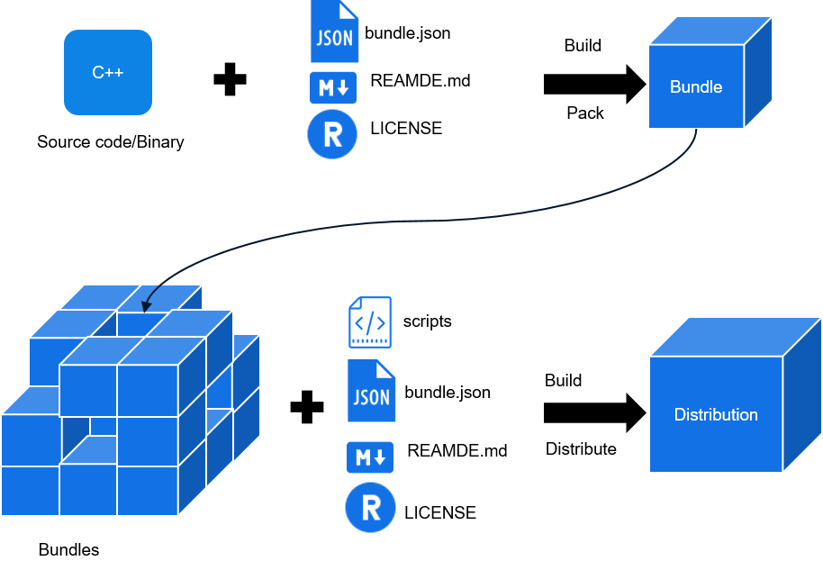

# Overview

This document describes how to develop OpenHarmony bundles and distributions, and how to create, develop, and build code, as well as burn and debug devices by using a command line tool.

-   A bundle usually maps onto a code repository, which is a code archive with the  **bundle.json**,  **README**, and  **LICENSE**  files.
-   A distribution consists of multiple bundles. Each distribution integrates various bundles of a comprehensive system, such as the driver, kernel, framework, and applications. These bundles can be used for device burning.

**Table  1**  Differences between a bundle and a distribution

<table><thead align="left"><tr id="row17288183614415"><th class="cellrowborder" valign="top" width="16.24162416241624%" id="mcps1.2.4.1.1">
Aspect

</th>
<th class="cellrowborder" valign="top" width="33.31333133313331%" id="mcps1.2.4.1.2">
Bundle

</th>
<th class="cellrowborder" valign="top" width="50.44504450445044%" id="mcps1.2.4.1.3">
Distribution

</th>
</tr>
</thead>
<tbody><tr id="row1728813361848"><td class="cellrowborder" valign="top" width="16.24162416241624%" headers="mcps1.2.4.1.1 ">
Application scenario

</td>
<td class="cellrowborder" valign="top" width="33.31333133313331%" headers="mcps1.2.4.1.2 ">
Feature-oriented

</td>
<td class="cellrowborder" valign="top" width="50.44504450445044%" headers="mcps1.2.4.1.3 ">
System-oriented

</td>
</tr>
<tr id="row676745614472"><td class="cellrowborder" valign="top" width="16.24162416241624%" headers="mcps1.2.4.1.1 ">
Content

</td>
<td class="cellrowborder" valign="top" width="33.31333133313331%" headers="mcps1.2.4.1.2 ">
Codes or a binary library for implementing features

</td>
<td class="cellrowborder" valign="top" width="50.44504450445044%" headers="mcps1.2.4.1.3 ">
List of dependent bundles as well as their compiling and building scripts

</td>
</tr>
<tr id="row95114356"><td class="cellrowborder" valign="top" width="16.24162416241624%" headers="mcps1.2.4.1.1 ">
Integrity

</td>
<td class="cellrowborder" valign="top" width="33.31333133313331%" headers="mcps1.2.4.1.2 ">
A part of the operating system

</td>
<td class="cellrowborder" valign="top" width="50.44504450445044%" headers="mcps1.2.4.1.3 ">
An entire operating system

</td>
</tr>
<tr id="row13581419518"><td class="cellrowborder" valign="top" width="16.24162416241624%" headers="mcps1.2.4.1.1 ">
Compilation result

</td>
<td class="cellrowborder" valign="top" width="33.31333133313331%" headers="mcps1.2.4.1.2 ">
Bundles

</td>
<td class="cellrowborder" valign="top" width="50.44504450445044%" headers="mcps1.2.4.1.3 ">
System image

</td>
</tr>
</tbody>
</table>

**Figure  1**  Composition of bundles and distributions  

