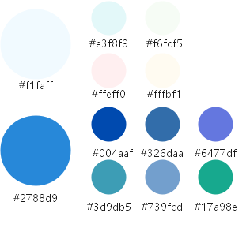

# Writing Instructions<a name="EN-US_TOPIC_0000001053707964"></a>

This document describes the writing specifications for contributing OpenHarmony documents.

## Naming Specifications<a name="section6823246189"></a>

To submit a new document, create a new  **.md**  file in the  **doc**  directory of the project code on Gitee. The file name must be in the  _xxx-xxx_**.md**  format.

For example, a document that describes writing specifications can be named  **write-standard.md**.

## Content Specifications<a name="section650663210183"></a>

The content should be concise and intuitive. Introductory documents describe principles, architecture, and design ideas in a concise manner, and operation documents describe key steps to help other developers. Chinese is preferred. It is recommended that both Chinese and English be supported. The OpenHarmony will be updated continuously to ensure the synchronization between Chinese and English.

**Title**

It is recommended that the title have no more than three levels.

Use the verb-object structure in operation documents if possible, and the execution subject should be clearly described. \(e.g., Apply for Privilege\)

**Body**

The following shows the structure of an  **operation document**  for porting.

-   Purpose \(Briefly describe the purpose of the operation, for example, the model of the board to which the port is to be migrated.\)

-   Hardware and software requirements

-   Detailed steps

-   Result verification

    Writing requirements:

    -   The APIs used in steps must be described in the available capabilities at the beginning of the document.
    -   If an operation is optional, specify the optional conditions.
    -   If API calls are required in a step, provide the API, its description, and sample code if any.


**Introductory documents**: The development guide of a feature is used as an example to show the document structure.

-   Overview \(concepts and principles\)

-   Functions \(supported APIs\)

-   Development process \(steps of how to use and develop\)

-   Programming examples \(sample code\)

-   Important notes


**Pictures**

Pictures are stored in the  **pic-en**  folder in the directory where the document is stored. For example,

Pictures used in  **OpenHarmony\_DOCUMENTS/docs/quick-start/write-standard.md**  are stored in the following directory:

**OpenHarmony\_DOCUMENTS/docs/quick-start/pic**. Use relative paths to reference pictures in the document.

> **CAUTION:** 
>Use the original pictures to avoid intellectual property infringement risks.

-   Pictures are clear and complete. For example, a flowchart has a start and an end.
-   The graphics has clear logic and are provided with text descriptions. Do not separate the graphics from the text.
-   It is recommended that the image height be about 640 px, the image width be less than or equal to 820 px, the image format be .png, and the image size be less than or equal to 150 KB.
-   The text on pictures should be Chinese in Chinese documents and English in English documents.
-   It is recommended that pictures be named based on the content. Using only a number is difficult for picture inheritance.

> **NOTE:** 
>Reference:
>!\[\]\(./pic/pic-standard.png\)

If a self-made picture is used, refer to the following figure to configure the color. The format can be  **png**,  **jpg**,  **gif**, and so on.

**Figure  1**  Example<a name="fig952595173513"></a>  


For screenshots, see the requirements below. If you need to highlight key information in the figure, add a red box or text remarks.

Stroke width: 0.75 pt

Line color: CE0E2D

Chinese font: MicrosoftYaHei

English font: Arial

Font size: 10 pt

**Figure  2** <a name="fig1472123913217"></a>  


**Table**

You can insert a table in  **.md**  documents in the following format:

Input

```
| Tables      | Type          | Note  |
| ----------- |:-------------:| -----:|
| first       | standard      |  None |
| second      | outstanding   |     5 |
| third       | inside        |  with |
```

Output

**Table  1**  Parameters

<a name="table163931041183019"></a>
<table><thead align="left"><tr id="row1393134183014"><th class="cellrowborder" valign="top" width="33.33333333333333%" id="mcps1.2.4.1.1"><p id="p1539314418307"><a name="p1539314418307"></a><a name="p1539314418307"></a>Table</p>
</th>
<th class="cellrowborder" valign="top" width="33.33333333333333%" id="mcps1.2.4.1.2"><p id="p1339324120303"><a name="p1339324120303"></a><a name="p1339324120303"></a>Type</p>
</th>
<th class="cellrowborder" valign="top" width="33.33333333333333%" id="mcps1.2.4.1.3"><p id="p13932041133012"><a name="p13932041133012"></a><a name="p13932041133012"></a>Note</p>
</th>
</tr>
</thead>
<tbody><tr id="row1839304110309"><td class="cellrowborder" valign="top" width="33.33333333333333%" headers="mcps1.2.4.1.1 "><p id="p4393174143014"><a name="p4393174143014"></a><a name="p4393174143014"></a>first</p>
</td>
<td class="cellrowborder" valign="top" width="33.33333333333333%" headers="mcps1.2.4.1.2 "><p id="p6393141133013"><a name="p6393141133013"></a><a name="p6393141133013"></a>standard</p>
</td>
<td class="cellrowborder" valign="top" width="33.33333333333333%" headers="mcps1.2.4.1.3 "><p id="p17393184112307"><a name="p17393184112307"></a><a name="p17393184112307"></a>None</p>
</td>
</tr>
<tr id="row1039318412306"><td class="cellrowborder" valign="top" width="33.33333333333333%" headers="mcps1.2.4.1.1 "><p id="p113941541103012"><a name="p113941541103012"></a><a name="p113941541103012"></a>second</p>
</td>
<td class="cellrowborder" valign="top" width="33.33333333333333%" headers="mcps1.2.4.1.2 "><p id="p83941841153016"><a name="p83941841153016"></a><a name="p83941841153016"></a>outstanding</p>
</td>
<td class="cellrowborder" valign="top" width="33.33333333333333%" headers="mcps1.2.4.1.3 "><p id="p1539404114305"><a name="p1539404114305"></a><a name="p1539404114305"></a>5</p>
</td>
</tr>
<tr id="row6547101813118"><td class="cellrowborder" valign="top" width="33.33333333333333%" headers="mcps1.2.4.1.1 "><p id="p35483184313"><a name="p35483184313"></a><a name="p35483184313"></a>third</p>
</td>
<td class="cellrowborder" valign="top" width="33.33333333333333%" headers="mcps1.2.4.1.2 "><p id="p1554821817318"><a name="p1554821817318"></a><a name="p1554821817318"></a>inside</p>
</td>
<td class="cellrowborder" valign="top" width="33.33333333333333%" headers="mcps1.2.4.1.3 "><p id="p15548201819310"><a name="p15548201819310"></a><a name="p15548201819310"></a>with</p>
</td>
</tr>
</tbody>
</table>

**Code**

The code example shows how to implement a specific feature. Developers can use the code example to write and debug code. The code requirements are as follows:

-   The logic and syntax of the code are correct.
-   Describe the return values if any.
-   Ensure that key fields are highlighted in bold and that comments are provided for key steps.

