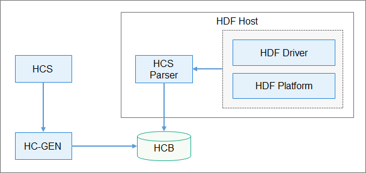

# Driver Configuration Management<a name="EN-US_TOPIC_0000001053493462"></a>

## HDF Configuration Overview<a name="section59914284576"></a>

HCS is the source code that describes the configuration of the HDF using key-value pairs. It decouples the configuration code from driver code, thereby facilitating configuration management.

HDF Configuration Generator \(HC-GEN\) is a tool for converting a configuration file into a file that can be read by the target software.

-   In a low-performance system on a chip \(SoC\), this tool can convert a configuration file into the source code of the configuration tree so that the driver can obtain the configuration by directly calling the C library code.
-   In a high-performance SoC, this tool can convert an HCS configuration file into the HDF Configuration Binary \(HCB\) file, allowing the driver to obtain the configuration through the APIs provided by the HDF.

The following figure shows the typical application scenario of the HCB mode.

**Figure  1**  Process of using HCS<a name="fig814111371944"></a>  




The HCS is compiled using the HC-GEN tool to generate an HCB file. The HCS Parser module in the HDF recreates a configuration tree using the HCB file. Then, the HDF driver modules obtain the configurations using the API provided by the HCS Paser.

## Configuration Syntax<a name="section533713333580"></a>

The HCS syntax is described as follows:

## Keywords<a name="section1316625413586"></a>

The keywords listed in the following table below are reserved for HCS configuration files.

**Table  1**  Reserved keywords for HCS configuration files

<a name="table0540103952020"></a>
<table><thead align="left"><tr id="row1658420394208"><th class="cellrowborder" valign="top" width="18.51185118511851%" id="mcps1.2.4.1.1"><p id="p1758463962014"><a name="p1758463962014"></a><a name="p1758463962014"></a>Keywords</p>
</th>
<th class="cellrowborder" valign="top" width="32.363236323632364%" id="mcps1.2.4.1.2"><p id="p115841393209"><a name="p115841393209"></a><a name="p115841393209"></a>Description</p>
</th>
<th class="cellrowborder" valign="top" width="49.12491249124913%" id="mcps1.2.4.1.3"><p id="p135841039202017"><a name="p135841039202017"></a><a name="p135841039202017"></a>Remarks</p>
</th>
</tr>
</thead>
<tbody><tr id="row45841639182020"><td class="cellrowborder" valign="top" width="18.51185118511851%" headers="mcps1.2.4.1.1 "><p id="p19584139112019"><a name="p19584139112019"></a><a name="p19584139112019"></a>root</p>
</td>
<td class="cellrowborder" valign="top" width="32.363236323632364%" headers="mcps1.2.4.1.2 "><p id="p165841939172011"><a name="p165841939172011"></a><a name="p165841939172011"></a>Configures the root node.</p>
</td>
<td class="cellrowborder" valign="top" width="49.12491249124913%" headers="mcps1.2.4.1.3 "><p id="p0584153922011"><a name="p0584153922011"></a><a name="p0584153922011"></a>-</p>
</td>
</tr>
<tr id="row13584173911205"><td class="cellrowborder" valign="top" width="18.51185118511851%" headers="mcps1.2.4.1.1 "><p id="p658418395207"><a name="p658418395207"></a><a name="p658418395207"></a>include</p>
</td>
<td class="cellrowborder" valign="top" width="32.363236323632364%" headers="mcps1.2.4.1.2 "><p id="p25844395200"><a name="p25844395200"></a><a name="p25844395200"></a>References other HCS configuration files.</p>
</td>
<td class="cellrowborder" valign="top" width="49.12491249124913%" headers="mcps1.2.4.1.3 "><p id="p358533922018"><a name="p358533922018"></a><a name="p358533922018"></a>-</p>
</td>
</tr>
<tr id="row45852392209"><td class="cellrowborder" valign="top" width="18.51185118511851%" headers="mcps1.2.4.1.1 "><p id="p17585339172016"><a name="p17585339172016"></a><a name="p17585339172016"></a>delete</p>
</td>
<td class="cellrowborder" valign="top" width="32.363236323632364%" headers="mcps1.2.4.1.2 "><p id="p458503982018"><a name="p458503982018"></a><a name="p458503982018"></a>Deletes a node or an attribute.</p>
</td>
<td class="cellrowborder" valign="top" width="49.12491249124913%" headers="mcps1.2.4.1.3 "><p id="p6585193915204"><a name="p6585193915204"></a><a name="p6585193915204"></a>This keyword applies only to the configuration tree imported using the <strong id="b2160333103716"><a name="b2160333103716"></a><a name="b2160333103716"></a>include</strong> keyword.</p>
</td>
</tr>
<tr id="row15585239182011"><td class="cellrowborder" valign="top" width="18.51185118511851%" headers="mcps1.2.4.1.1 "><p id="p175851039172019"><a name="p175851039172019"></a><a name="p175851039172019"></a>template</p>
</td>
<td class="cellrowborder" valign="top" width="32.363236323632364%" headers="mcps1.2.4.1.2 "><p id="p1158518393203"><a name="p1158518393203"></a><a name="p1158518393203"></a>Defines a template node.</p>
</td>
<td class="cellrowborder" valign="top" width="49.12491249124913%" headers="mcps1.2.4.1.3 "><p id="p105851139202016"><a name="p105851139202016"></a><a name="p105851139202016"></a>-</p>
</td>
</tr>
<tr id="row1572183734014"><td class="cellrowborder" valign="top" width="18.51185118511851%" headers="mcps1.2.4.1.1 "><p id="p872193744010"><a name="p872193744010"></a><a name="p872193744010"></a>match_attr</p>
</td>
<td class="cellrowborder" valign="top" width="32.363236323632364%" headers="mcps1.2.4.1.2 "><p id="p17721937104014"><a name="p17721937104014"></a><a name="p17721937104014"></a>Marks the node attribute for matching.</p>
</td>
<td class="cellrowborder" valign="top" width="49.12491249124913%" headers="mcps1.2.4.1.3 "><p id="p11722537104018"><a name="p11722537104018"></a><a name="p11722537104018"></a>During configuration parsing, the keyword value can be used to find the corresponding node.</p>
</td>
</tr>
</tbody>
</table>

## Basic Syntax<a name="section173481622115918"></a>

The HCS configuration file consists of configurations of attributes and nodes.

**Attributes**

An attribute, as the minimum configuration unit, is an independent configuration item. Its syntax is as follows:

```
  attribute_name = value;
```

-   The value of  **attribute\_name**  is a case-sensitive string of characters starting with a letter and consisting of letters, digits, and underscores \(\_\).

-   Available formats of  **value**  are as follows:

    -   A binary, octal, decimal, or hexadecimal integer. For details, see  [Data Types](#section96521601302).

    -   A character string. The content should be enclosed in double quotation marks \(" "\).

    -   A node reference


-   An attribute key-value pair must end with a semicolon \(;\) and belong to a node.


**Nodes**

A node is a set of attributes. Its syntax is as follows:

```
  node_name {
      module = "sample";
      ...
  }
```

-   The value of  **node\_name**  is a case-sensitive string of characters starting with a letter and consisting of letters, digits, and underscores \(\_\).

-   A semicolon \(;\) is not required after the curly brace \(\}\).

-   The reserved keyword  **root**  is used to declare the root node of a configuration table.

-   The root node must contain a  **module**  attribute that uses a string to represent the module to which the configuration belongs.

-   The  **match\_attr**  attribute can be added to a node. Its value is a globally unique character string. During configuration parsing, the query interface can be invoked to query the nodes with the attribute based on the attribute value.

## Data Types<a name="section96521601302"></a>

Attributes automatically use built-in data types, including integers, strings, arrays, and booleans. You do not need to explicitly specify the data type for the attribute values.

**Integer**

An integer can be binary, octal, decimal, or hexadecimal. The minimum space is automatically allocated to the integer based on the actual data length.

-   Binary: prefixed with 0b, for example, 0b1010

-   Octal: prefixed with 0, for example, 0664
-   Decimal: either signed or unsigned, without a prefix, for example, 1024 or +1024. Negative integers can be read only via signed interfaces.

-   Hexadecimal: prefixed with 0x, for example, 0xff00 and 0xFF


**String**

A string is enclosed by double quotation marks \(" "\).

**Array**

The elements in an array can be integers or strings, but cannot be a combination of both. The combination of  **uint32\_t**  and  **uint64\_t**  in an integer array will enable up-casting to  **uint64**. The following is an example of an integer array and a string array:

```
attr_foo = [0x01, 0x02, 0x03, 0x04];
attr_bar = ["hello", "world"];
```

**Boolean**

A Boolean data type has two possible values:  **true**  and  **false**.

## Pre-processing<a name="section8164295515"></a>

**include**

The  **include**  keyword is used to import other HCS files. The syntax is as follows:

```
#include "foo.hcs"
#include "../bar.hcs"
```

-   The file names must be enclosed by double quotation marks \(" "\). Files in different directories can be referenced using relative paths. The file included must be a valid HCS file.
-   In the scenario that multiple HCS files are imported using  **include**, if the same nodes exist, the latter node will override the former one, and other nodes are listed in sequence.

## Commenting<a name="section0338205819610"></a>

Comments can be formatted as follows:

-   Single-line comment

    ```
    // comment
    ```

-   Multi-line comment

    ```
    /*
    comment
    */
    ```

    > **NOTE:** 
    >Multi-line comments cannot be nested.


## Modifying a Reference<a name="section179799204716"></a>

You can use the following syntax to modify the content of any other node:

```
 node :& source_node
```

This syntax indicates that the node value is a modification of the source\_node value. Example:

```
root {
    module = "sample";
    foo {
        foo_ :& root.bar{
            attr = "foo";
        }
        foo1 :& foo2 {
            attr = 0x2;
        }
        foo2 {
            attr = 0x1;
        }
    }

    bar {
        attr = "bar";
    }
}
```

The following configuration tree is generated:

```
root {
    module = "sample";
    foo {
        foo2 {
            attr = 0x2;
        }
    }
    bar {
        attr = "foo";
    }
}
```

In the preceding example, the  **foo.foo\_**  node changes the value of the referenced  **bar.attr**  to "**foo**", and the  **foo.foo1**  node changes the value of the referenced  **foo.foo2.attr**  to  **0x2**. In the generated configuration tree,  **foo.foo\_**  and  **foo.foo1**  are not displayed, but their configuration modifications are presented by their referenced nodes.

-   A node of the same level can be referenced simply using the node name. A node of a different level must be referenced by the absolute path, and node names are separated using a period \(.\).  **root**  indicates the root node. The path format is the node path sequence starting with root. For example,  **root.foo.bar**  is a valid absolute path.
-   If multiple modifications are made to the same attribute, only one uncertain modification can take effect, and a warning will be displayed.

## Replicating Node Configuration<a name="section382424014712"></a>

The content of a node can be replicated to another node to define the node with similar content. The syntax is as follows:

```
 node : source_node
```

The preceding statement indicates that the attributes of  **source\_node**  are replicated to  **node**. Example:

```
root {
	module = "sample";
    foo {
        attr_0 = 0x0;
    }
    bar:foo {
        attr_1 = 0x1;
    }
}
```

The following configuration tree is generated:

```
root {
    module = "sample";
    foo {
        attribute0 = 0x0;
    }
    bar {
        attr_1 = 0x1;
        attr_0 = 0x0;
    }
}
```

In the preceding example, the  **bar**  node configuration includes both the  **attribute0**  and  **attribute1**  values. The modification to  **attribute0**  in the  **bar**  node does not affect the  **foo**  node.

The path of the  **foo**  node is not required if the  **foo**  node and the  **bar**  node are of the same level. Otherwise, the absolute path must be used. For details, see  [Modifying a Reference](#section179799204716).

## Deleting a Node or Attribute<a name="section165211112586"></a>

You can use the keyword  **delete**  to delete unnecessary nodes or attributes in the base configuration tree imported by the  **include**  keyword. In the following example,  **sample1.hcs**  imports the configuration of  **sample2.hcs**  using  **include**, and deletes the  **attribute2**  attribute and the  **foo\_2**  node using the  **delete**  keyword.

```
// sample2.hcs
root {
    attr_1 = 0x1;
    attr_2 = 0x2;
    foo_2 {
        t = 0x1;
    }
}

// sample1.hcs
#include "sample2.hcs"
root {
    attr_2 = delete;
    foo_2 : delete {
    }
}
```

The following configuration tree is generated:

```
root {
    attr_1 = 0x1;
}
```

> **NOTE:** 
>The  **delete**  keyword cannot be used in the same HCS file. It is recommended that you delete unnecessary attributes directly from the configuration source code.

## Referencing an Attribute<a name="section192841514490"></a>

To quickly locate the associated node during configuration parsing, you can use the node as the value of the attribute and read the attribute to find the corresponding node. The syntax is as follows:

```
 attribute = &node;
```

This syntax indicates that the  **attribute**  value is a reference to  **node**. During code parsing, you can quickly locate the node using this attribute. Example:

```
node1 {
    attributes;
}

node2 {
    attr_1 = &node1;
}
```

## Keyword Template<a name="section520134294"></a>

The  **template**  keyword is used to generate nodes with strictly consistent syntax, thereby facilitating the traverse and management of nodes of the same type.

If a node is defined using the keyword  **template**, its child nodes inherit the node configuration through the double colon operator \(::\). The child nodes can modify but cannot add or delete attributes in  **template**. The attributes not defined in the child nodes will use the attributes defined in  **template**  as the default values. Example:

```
root {
    module = "sample";
    template foo {
        attr_1 = 0x1;
        attr_2 = 0x2;
    }

    bar :: foo {
    }

    bar_1 :: foo {
        attr_1 = 0x2;
    }
}
```

The following configuration tree is generated:

```
root {
    module = "sample";
    bar {
        attr_1 = 0x1;
        attr_2 = 0x2;
    }
    bar_1 {
        attr_1 = 0x2;
        attr_2 = 0x2;
    }
}
```

In the preceding example, the  **bar**  and  **bar\_1**  nodes inherit the  **foo**  node. The structures of the generated configuration tree nodes are the same as that of the  **foo**  node, but the attribute values are different.

## Configuration Generation<a name="section106152531919"></a>

The HC-GEN tool is used to generate configurations. It checks the HCS configuration syntax and converts HCS source files into HCB files.

## Introduction to HC-GEN<a name="section8260625101012"></a>

Parameter description:

```
Usage: hc-gen [Options] [File]
options:
  -o <file>   output file name, default same as input
  -a          hcb align with four bytes
  -b          output binary output, default enable
  -t          output config in C language source file style
  -i          output binary hex dump in C language source file style
  -p <prefix> prefix of generated symbol name
  -d          decompile hcb to hcs
  -V          show verbose info
  -v          show version
  -h          show this help message
```

Generate a  **.c**  or  **.h**  configuration file.

```
hc-gen -o [OutputCFileName] -t [SourceHcsFileName]
```

Generate an HCB file.

```
hc-gen -o [OutputHcbFileName] -b [SourceHcsFileName]
```

Compile an  **HCB**  file to an  **HCS**  file:

```
hc-gen -o [OutputHcsFileName] -d [SourceHcbFileName]
```

