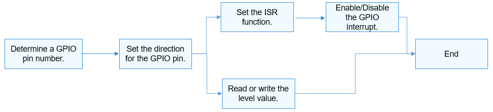

# GPIO Usage Guidelines<a name="EN-US_TOPIC_0000001052937593"></a>

## How to Use<a name="section1583613406410"></a>

The GPIO APIs use the GPIO pin number to specify a pin.  [Figure 1](#fig1399416053717)  shows the general process of using a GPIO.

**Figure  1**  Process of using a GPIO<a name="fig1399416053717"></a>  


## Determining a GPIO Pin Number<a name="section135943361443"></a>

The method for converting GPIO pin numbers varies according to the GPIO controller model, parameters, and controller driver of different system on chips \(SoCs\).

-   Hi3516D V300

    A controller manages 12 groups of GPIO pins. Each group contains 8 GPIO pins.

    GPIO pin number = GPIO group index \(0-11\) x Number of GPIO pins in each group \(8\) + Offset in the group

    Example: GPIO number of GPIO10\_3 = 10 x 8 + 3 = 83

-   Hi3518E V300

    A controller manages 10 groups of GPIO pins. Each group contains 10 GPIO pins.

    GPIO pin number = GPIO group index \(0–9\) x Number of GPIO pins in each group \(10\) + Offset in the group

    Example: GPIO pin number of GPIO7\_3 = 7 x 10 + 3 = 73


## Using APIs to Operate GPIO Pins<a name="section69151114115315"></a>

-   Set the direction for a GPIO pin.

    Before performing read/write operations on a GPIO pin, call the following function to set the direction:

    int32\_t GpioSetDir\(uint16\_t gpio, uint16\_t dir\);

    **Table  1**  Description of GpioSetDir

    <a name="table63111557616"></a>
    <table><tbody><tr id="row17311165469"><td class="cellrowborder" valign="top" width="48.120000000000005%"><p id="p53110515616"><a name="p53110515616"></a><a name="p53110515616"></a><strong id="b0791151712335"><a name="b0791151712335"></a><a name="b0791151712335"></a>Parameter</strong></p>
    </td>
    <td class="cellrowborder" valign="top" width="51.88%"><p id="p5311454616"><a name="p5311454616"></a><a name="p5311454616"></a><strong id="b14451220183314"><a name="b14451220183314"></a><a name="b14451220183314"></a>Description</strong></p>
    </td>
    </tr>
    <tr id="row0312151666"><td class="cellrowborder" valign="top" width="48.120000000000005%"><p id="p1431265763"><a name="p1431265763"></a><a name="p1431265763"></a>gpio</p>
    </td>
    <td class="cellrowborder" valign="top" width="51.88%"><p id="p83121553613"><a name="p83121553613"></a><a name="p83121553613"></a>GPIO pin number.</p>
    </td>
    </tr>
    <tr id="row11312151619"><td class="cellrowborder" valign="top" width="48.120000000000005%"><p id="p173121451664"><a name="p173121451664"></a><a name="p173121451664"></a>dir</p>
    </td>
    <td class="cellrowborder" valign="top" width="51.88%"><p id="p153122520615"><a name="p153122520615"></a><a name="p153122520615"></a>Direction to set.</p>
    </td>
    </tr>
    <tr id="row165937126386"><td class="cellrowborder" valign="top" width="48.120000000000005%"><p id="p83111453613"><a name="p83111453613"></a><a name="p83111453613"></a><strong id="b034894963313"><a name="b034894963313"></a><a name="b034894963313"></a>Return Value</strong></p>
    </td>
    <td class="cellrowborder" valign="top" width="51.88%"><p id="p83111151165"><a name="p83111151165"></a><a name="p83111151165"></a><strong id="b770825012335"><a name="b770825012335"></a><a name="b770825012335"></a>Description</strong></p>
    </td>
    </tr>
    <tr id="row205931212123817"><td class="cellrowborder" valign="top" width="48.120000000000005%"><p id="p18312151463"><a name="p18312151463"></a><a name="p18312151463"></a>0</p>
    </td>
    <td class="cellrowborder" valign="top" width="51.88%"><p id="p103124517618"><a name="p103124517618"></a><a name="p103124517618"></a>The setting is successful.</p>
    </td>
    </tr>
    <tr id="row75931212153818"><td class="cellrowborder" valign="top" width="48.120000000000005%"><p id="p23121951261"><a name="p23121951261"></a><a name="p23121951261"></a>Negative value</p>
    </td>
    <td class="cellrowborder" valign="top" width="51.88%"><p id="p153121553610"><a name="p153121553610"></a><a name="p153121553610"></a>The setting failed.</p>
    </td>
    </tr>
    </tbody>
    </table>

-   Read or write the level value for a GPIO pin.

    To read the level value of a GPIO pin, call the following function:

    int32\_t GpioRead\(uint16\_t gpio, uint16\_t \*val\);

    **Table  2**  Description of GpioRead

    <a name="table20347743174816"></a>
    <table><tbody><tr id="row17348144394816"><td class="cellrowborder" valign="top" width="48.120000000000005%"><p id="p19348164313481"><a name="p19348164313481"></a><a name="p19348164313481"></a><strong>Parameter</strong></p>
    </td>
    <td class="cellrowborder" valign="top" width="51.88%"><p id="p134810432488"><a name="p134810432488"></a><a name="p134810432488"></a><strong>Description</strong></p>
    </td>
    </tr>
    <tr id="row134874324814"><td class="cellrowborder" valign="top" width="48.120000000000005%"><p id="p183481437485"><a name="p183481437485"></a><a name="p183481437485"></a>gpio</p>
    </td>
    <td class="cellrowborder" valign="top" width="51.88%"><p id="p43481043194819"><a name="p43481043194819"></a><a name="p43481043194819"></a>GPIO pin number.</p>
    </td>
    </tr>
    <tr id="row20348343144815"><td class="cellrowborder" valign="top" width="48.120000000000005%"><p id="p1534864310480"><a name="p1534864310480"></a><a name="p1534864310480"></a>val</p>
    </td>
    <td class="cellrowborder" valign="top" width="51.88%"><p id="p13689159154815"><a name="p13689159154815"></a><a name="p13689159154815"></a>Pointer to the level value.</p>
    </td>
    </tr>
    <tr id="row19348043154813"><td class="cellrowborder" valign="top" width="48.120000000000005%"><p id="p1234812431480"><a name="p1234812431480"></a><a name="p1234812431480"></a><strong>Return Value</strong></p>
    </td>
    <td class="cellrowborder" valign="top" width="51.88%"><p id="p434894334814"><a name="p434894334814"></a><a name="p434894334814"></a><strong>Description</strong></p>
    </td>
    </tr>
    <tr id="row3348184311486"><td class="cellrowborder" valign="top" width="48.120000000000005%"><p id="p1934854315487"><a name="p1934854315487"></a><a name="p1934854315487"></a>0</p>
    </td>
    <td class="cellrowborder" valign="top" width="51.88%"><p id="p103481943114814"><a name="p103481943114814"></a><a name="p103481943114814"></a>Succeeded in reading the level value.</p>
    </td>
    </tr>
    <tr id="row23485436482"><td class="cellrowborder" valign="top" width="48.120000000000005%"><p id="p1134834310486"><a name="p1134834310486"></a><a name="p1134834310486"></a>Negative value</p>
    </td>
    <td class="cellrowborder" valign="top" width="51.88%"><p id="p93491343144815"><a name="p93491343144815"></a><a name="p93491343144815"></a>Failed to read the level value.</p>
    </td>
    </tr>
    </tbody>
    </table>

    To write the level value for a GPIO pin, call the following function:

    int32\_t GpioWrite\(uint16\_t gpio, uint16\_t val\);

    **Table  3**  Description of GpioWrite

    <a name="table1214911207520"></a>
    <table><tbody><tr id="row6149720175218"><td class="cellrowborder" valign="top" width="48.120000000000005%"><p id="p18149132005216"><a name="p18149132005216"></a><a name="p18149132005216"></a><strong>Parameter</strong></p>
    </td>
    <td class="cellrowborder" valign="top" width="51.88%"><p id="p16149220145216"><a name="p16149220145216"></a><a name="p16149220145216"></a><strong>Description</strong></p>
    </td>
    </tr>
    <tr id="row16149102014526"><td class="cellrowborder" valign="top" width="48.120000000000005%"><p id="p31495206527"><a name="p31495206527"></a><a name="p31495206527"></a>gpio</p>
    </td>
    <td class="cellrowborder" valign="top" width="51.88%"><p id="p1014972085212"><a name="p1014972085212"></a><a name="p1014972085212"></a>GPIO pin number.</p>
    </td>
    </tr>
    <tr id="row3149112095214"><td class="cellrowborder" valign="top" width="48.120000000000005%"><p id="p1815072011528"><a name="p1815072011528"></a><a name="p1815072011528"></a>val</p>
    </td>
    <td class="cellrowborder" valign="top" width="51.88%"><p id="p1931618337524"><a name="p1931618337524"></a><a name="p1931618337524"></a>Level value to write.</p>
    </td>
    </tr>
    <tr id="row1115062015220"><td class="cellrowborder" valign="top" width="48.120000000000005%"><p id="p10150172015218"><a name="p10150172015218"></a><a name="p10150172015218"></a><strong>Return Value</strong></p>
    </td>
    <td class="cellrowborder" valign="top" width="51.88%"><p id="p1150192015527"><a name="p1150192015527"></a><a name="p1150192015527"></a><strong>Description</strong></p>
    </td>
    </tr>
    <tr id="row111503202526"><td class="cellrowborder" valign="top" width="48.120000000000005%"><p id="p171501320205216"><a name="p171501320205216"></a><a name="p171501320205216"></a>0</p>
    </td>
    <td class="cellrowborder" valign="top" width="51.88%"><p id="p15150102017522"><a name="p15150102017522"></a><a name="p15150102017522"></a>Succeeded in writing the level value.</p>
    </td>
    </tr>
    <tr id="row1615002018528"><td class="cellrowborder" valign="top" width="48.120000000000005%"><p id="p15150182045212"><a name="p15150182045212"></a><a name="p15150182045212"></a>Negative value</p>
    </td>
    <td class="cellrowborder" valign="top" width="51.88%"><p id="p13150320105212"><a name="p13150320105212"></a><a name="p13150320105212"></a>Failed to write the level value.</p>
    </td>
    </tr>
    </tbody>
    </table>

    Example:

    ```
    int32_t ret;
    uint16_t val;
    /* Set the output direction for GPIO3. */
    ret = GpioSetDir(3, GPIO_DIR_OUT);
    if (ret != 0) {
        HDF_LOGE("GpioSerDir: failed, ret %d\n", ret);
        return;
    }
    /* Write the low level GPIO_VAL_LOW for GPIO3. */
    ret = GpioWrite(3, GPIO_VAL_LOW);
    if (ret != 0) {
        HDF_LOGE("GpioWrite: failed, ret %d\n", ret);
        return;
    }
    /* Set the input direction for GPIO6. */
    ret = GpioSetDir(6, GPIO_DIR_IN);
    if (ret != 0) {
        HDF_LOGE("GpioSetDir: failed, ret %d\n", ret);
        return;
    }
    /* Read the level value of GPIO6. */
    ret = GpioRead(6, &val);
    ```


-   Set the ISR function for a GPIO pin.

    To set the ISR function for a GPIO pin, call the following function:

    int32\_t GpioSetIrq\(uint16\_t gpio, uint16\_t mode, GpioIrqFunc func, void \*arg\);

    **Table  4**  Description of GpioSetIrq

    <a name="table16804111812466"></a>
    <table><tbody><tr id="row880401834615"><td class="cellrowborder" valign="top" width="48.54%"><p id="p380491819469"><a name="p380491819469"></a><a name="p380491819469"></a><strong>Parameter</strong></p>
    </td>
    <td class="cellrowborder" valign="top" width="51.459999999999994%"><p id="p48041318114619"><a name="p48041318114619"></a><a name="p48041318114619"></a><strong>Description</strong></p>
    </td>
    </tr>
    <tr id="row19805181812465"><td class="cellrowborder" valign="top" width="48.54%"><p id="p11805101874611"><a name="p11805101874611"></a><a name="p11805101874611"></a>gpio</p>
    </td>
    <td class="cellrowborder" valign="top" width="51.459999999999994%"><p id="p6805181818461"><a name="p6805181818461"></a><a name="p6805181818461"></a>GPIO pin number.</p>
    </td>
    </tr>
    <tr id="row1080541817469"><td class="cellrowborder" valign="top" width="48.54%"><p id="p580541864611"><a name="p580541864611"></a><a name="p580541864611"></a>mode</p>
    </td>
    <td class="cellrowborder" valign="top" width="51.459999999999994%"><p id="p380511180463"><a name="p380511180463"></a><a name="p380511180463"></a>Interrupt trigger mode.</p>
    </td>
    </tr>
    <tr id="row83541951134617"><td class="cellrowborder" valign="top" width="48.54%"><p id="p5355351104610"><a name="p5355351104610"></a><a name="p5355351104610"></a>func</p>
    </td>
    <td class="cellrowborder" valign="top" width="51.459999999999994%"><p id="p11355551174619"><a name="p11355551174619"></a><a name="p11355551174619"></a>ISR function to set.</p>
    </td>
    </tr>
    <tr id="row6593577469"><td class="cellrowborder" valign="top" width="48.54%"><p id="p165985724619"><a name="p165985724619"></a><a name="p165985724619"></a>arg</p>
    </td>
    <td class="cellrowborder" valign="top" width="51.459999999999994%"><p id="p559185784619"><a name="p559185784619"></a><a name="p559185784619"></a>Pointer to the parameters passed to the ISR function.</p>
    </td>
    </tr>
    <tr id="row16299193210587"><td class="cellrowborder" valign="top" width="48.54%"><p id="p7804101884614"><a name="p7804101884614"></a><a name="p7804101884614"></a><strong>Return Value</strong></p>
    </td>
    <td class="cellrowborder" valign="top" width="51.459999999999994%"><p id="p680441818466"><a name="p680441818466"></a><a name="p680441818466"></a><strong>Description</strong></p>
    </td>
    </tr>
    <tr id="row12299632125817"><td class="cellrowborder" valign="top" width="48.54%"><p id="p1180511189465"><a name="p1180511189465"></a><a name="p1180511189465"></a>0</p>
    </td>
    <td class="cellrowborder" valign="top" width="51.459999999999994%"><p id="p180521812465"><a name="p180521812465"></a><a name="p180521812465"></a>The setting is successful.</p>
    </td>
    </tr>
    <tr id="row029833235815"><td class="cellrowborder" valign="top" width="48.54%"><p id="p1080591814468"><a name="p1080591814468"></a><a name="p1080591814468"></a>Negative value</p>
    </td>
    <td class="cellrowborder" valign="top" width="51.459999999999994%"><p id="p18805141884611"><a name="p18805141884611"></a><a name="p18805141884611"></a>The setting failed.</p>
    </td>
    </tr>
    </tbody>
    </table>

    > **CAUTION:** 
    >Only one ISR function can be set for a GPIO pin at a time. If  **GpioSetIrq**  is called repeatedly, the previous IRS function will be replaced.

    If the ISR function is no longer required, call the following function to cancel the setting:

    int32\_t GpioUnSetIrq\(uint16\_t gpio\);

    **Table  5**  Description of GpioUnSetIrq

    <a name="table1157224664316"></a>
    <table><tbody><tr id="row175721546174317"><td class="cellrowborder" valign="top" width="48.54%"><p id="p16572144694311"><a name="p16572144694311"></a><a name="p16572144694311"></a><strong>Parameter</strong></p>
    </td>
    <td class="cellrowborder" valign="top" width="51.459999999999994%"><p id="p185721461435"><a name="p185721461435"></a><a name="p185721461435"></a><strong>Description</strong></p>
    </td>
    </tr>
    <tr id="row1257284664318"><td class="cellrowborder" valign="top" width="48.54%"><p id="p95721946144317"><a name="p95721946144317"></a><a name="p95721946144317"></a>gpio</p>
    </td>
    <td class="cellrowborder" valign="top" width="51.459999999999994%"><p id="p1557313464439"><a name="p1557313464439"></a><a name="p1557313464439"></a>GPIO pin number.</p>
    </td>
    </tr>
    <tr id="row1857324618435"><td class="cellrowborder" valign="top" width="48.54%"><p id="p1257344624314"><a name="p1257344624314"></a><a name="p1257344624314"></a><strong>Return Value</strong></p>
    </td>
    <td class="cellrowborder" valign="top" width="51.459999999999994%"><p id="p457384611439"><a name="p457384611439"></a><a name="p457384611439"></a><strong>Description</strong></p>
    </td>
    </tr>
    <tr id="row357318466439"><td class="cellrowborder" valign="top" width="48.54%"><p id="p1573164616438"><a name="p1573164616438"></a><a name="p1573164616438"></a>0</p>
    </td>
    <td class="cellrowborder" valign="top" width="51.459999999999994%"><p id="p857384614319"><a name="p857384614319"></a><a name="p857384614319"></a>The ISR function is canceled.</p>
    </td>
    </tr>
    <tr id="row18573124610433"><td class="cellrowborder" valign="top" width="48.54%"><p id="p165731146134311"><a name="p165731146134311"></a><a name="p165731146134311"></a>Negative value</p>
    </td>
    <td class="cellrowborder" valign="top" width="51.459999999999994%"><p id="p6573164613437"><a name="p6573164613437"></a><a name="p6573164613437"></a>Failed to cancel the ISR function.</p>
    </td>
    </tr>
    </tbody>
    </table>

    After the ISR function is set, call the following function to enable a GPIO interrupt:

    int32\_t GpioEnableIrq\(uint16\_t gpio\);

    **Table  6**  Description of GpioEnableIrq

    <a name="table26659291568"></a>
    <table><tbody><tr id="row866632919566"><td class="cellrowborder" valign="top" width="50%"><p id="p066642985615"><a name="p066642985615"></a><a name="p066642985615"></a><strong>Parameter</strong></p>
    </td>
    <td class="cellrowborder" valign="top" width="50%"><p id="p566613293568"><a name="p566613293568"></a><a name="p566613293568"></a><strong>Description</strong></p>
    </td>
    </tr>
    <tr id="row19666029165620"><td class="cellrowborder" valign="top" width="50%"><p id="p16660295566"><a name="p16660295566"></a><a name="p16660295566"></a>gpio</p>
    </td>
    <td class="cellrowborder" valign="top" width="50%"><p id="p1566632916566"><a name="p1566632916566"></a><a name="p1566632916566"></a>GPIO pin number.</p>
    </td>
    </tr>
    <tr id="row84182176010"><td class="cellrowborder" valign="top" width="50%"><p id="p1566652915566"><a name="p1566652915566"></a><a name="p1566652915566"></a><strong>Return Value</strong></p>
    </td>
    <td class="cellrowborder" valign="top" width="50%"><p id="p966642917562"><a name="p966642917562"></a><a name="p966642917562"></a><strong>Description</strong></p>
    </td>
    </tr>
    <tr id="row154188171403"><td class="cellrowborder" valign="top" width="50%"><p id="p1866610292563"><a name="p1866610292563"></a><a name="p1866610292563"></a>0</p>
    </td>
    <td class="cellrowborder" valign="top" width="50%"><p id="p13666182975613"><a name="p13666182975613"></a><a name="p13666182975613"></a>The GPIO interrupt is enabled.</p>
    </td>
    </tr>
    <tr id="row1041891720012"><td class="cellrowborder" valign="top" width="50%"><p id="p766642911562"><a name="p766642911562"></a><a name="p766642911562"></a>Negative value</p>
    </td>
    <td class="cellrowborder" valign="top" width="50%"><p id="p1566652995613"><a name="p1566652995613"></a><a name="p1566652995613"></a>Failed to enable a GPIO interrupt.</p>
    </td>
    </tr>
    </tbody>
    </table>

    > **CAUTION:** 
    >The configured ISR function can be responded only after the ISR function is enabled.

    Use the following function to disable the GPIO interrupt:

    int32\_t GpioDisableIrq\(uint16\_t gpio\);

    **Table  7**  Description of GpioDisableIrq

    <a name="table186682041918"></a>
    <table><tbody><tr id="row186684413116"><td class="cellrowborder" valign="top" width="50%"><p id="p866844916"><a name="p866844916"></a><a name="p866844916"></a><strong>Parameter</strong></p>
    </td>
    <td class="cellrowborder" valign="top" width="50%"><p id="p46681413119"><a name="p46681413119"></a><a name="p46681413119"></a><strong>Description</strong></p>
    </td>
    </tr>
    <tr id="row4668243113"><td class="cellrowborder" valign="top" width="50%"><p id="p46681141919"><a name="p46681141919"></a><a name="p46681141919"></a>gpio</p>
    </td>
    <td class="cellrowborder" valign="top" width="50%"><p id="p136681241311"><a name="p136681241311"></a><a name="p136681241311"></a>GPIO pin number.</p>
    </td>
    </tr>
    <tr id="row066884412"><td class="cellrowborder" valign="top" width="50%"><p id="p566824015"><a name="p566824015"></a><a name="p566824015"></a><strong>Return Value</strong></p>
    </td>
    <td class="cellrowborder" valign="top" width="50%"><p id="p1766974515"><a name="p1766974515"></a><a name="p1766974515"></a><strong>Description</strong></p>
    </td>
    </tr>
    <tr id="row156694410112"><td class="cellrowborder" valign="top" width="50%"><p id="p14669141214"><a name="p14669141214"></a><a name="p14669141214"></a>0</p>
    </td>
    <td class="cellrowborder" valign="top" width="50%"><p id="p1266934818"><a name="p1266934818"></a><a name="p1266934818"></a>The GPIO interrupt is disabled.</p>
    </td>
    </tr>
    <tr id="row176691543117"><td class="cellrowborder" valign="top" width="50%"><p id="p7669941716"><a name="p7669941716"></a><a name="p7669941716"></a>Negative value</p>
    </td>
    <td class="cellrowborder" valign="top" width="50%"><p id="p4669164219"><a name="p4669164219"></a><a name="p4669164219"></a>Failed to disable the GPIO interrupt.</p>
    </td>
    </tr>
    </tbody>
    </table>

    Example:

    ```
    /* ISR function */
    */
    int32_t MyCallBackFunc(uint16_t gpio, void *data)
    {
        HDF_LOGI("%s: gpio:%u interrupt service in! data=%p\n", __func__, gpio, data);
        return 0;
    }
    
    int32_t ret;
    /* Set the ISR function to MyCallBackFunc, the parameter to NULL, and the interrupt trigger mode to rising edge. */
    ret = GpioSetIrq(3, OSAL_IRQF_TRIGGER_RISING, MyCallBackFunc, NULL);
    if (ret != 0) {
        HDF_LOGE("GpioSetIrq: failed, ret %d\n", ret);
        return;
    }
    
    /* Enable an interrupt for GPIO3. */
    ret = GpioEnableIrq(3);
    if (ret != 0) {
        HDF_LOGE("GpioEnableIrq: failed, ret %d\n", ret);
        return;
    }
    
    /* Disable the interrupt for GPIO3. */
    ret = GpioDisableIrq(3);
    if (ret != 0) {
        HDF_LOGE("GpioDisableIrq: failed, ret %d\n", ret);
        return;
    }
    
    /* Cancel the ISR function for GPIO3. */
    ret = GpioUnSetIrq(3);
    if (ret != 0) {
        HDF_LOGE("GpioUnSetIrq: failed, ret %d\n", ret);
        return;
    }
    ```


