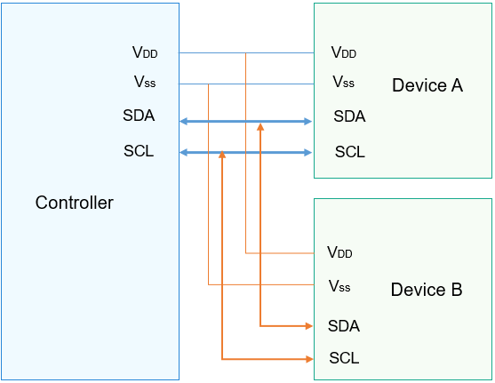

# I2C Overview

## Introduction

-   The Inter-Integrated Circuit \(I2C\) is a simple, bidirectional, and synchronous serial bus that uses merely two wires.
-   In an I2C communication, one controller communicates with one or more devices through the serial data line \(SDA\) and serial clock line \(SCL\), as shown in  [Figure 1](#fig1135561232714).

-   I2C data transfer must begin with a  **START**  condition and end with a  **STOP**  condition. Data is transmitted byte-by-byte from the most significant bit to the least significant bit.
-   Each I2C node is recognized by a unique address and can serve as either a controller or a device. When the controller needs to communicate with a device, it writes the device address to the bus through broadcast. A device matching this address sends a response to set up a data transfer channel.

-   The I2C APIs define a set of common functions for I2C data transfer, including:

    -   I2C controller management: opening or closing an I2C controller
    -   I2C message transfer: custom transfer by using a message array

    **Figure  1**  Physical connection diagram for I2C  
    

## Available APIs

**Table  1**  APIs available for the I2C driver

<table><thead align="left"><tr id="row4419501537"><th class="cellrowborder" valign="top" width="18.63%" id="mcps1.2.4.1.1">
Capability

</th>
<th class="cellrowborder" valign="top" width="28.03%" id="mcps1.2.4.1.2">
Function

</th>
<th class="cellrowborder" valign="top" width="53.339999999999996%" id="mcps1.2.4.1.3">
Description

</th>
</tr>
</thead>
<tbody><tr id="row34145016535"><td class="cellrowborder" rowspan="2" valign="top" width="18.63%" headers="mcps1.2.4.1.1 ">
I2C controller management

</td>
<td class="cellrowborder" valign="top" width="28.03%" headers="mcps1.2.4.1.2 ">
I2cOpen

</td>
<td class="cellrowborder" valign="top" width="53.339999999999996%" headers="mcps1.2.4.1.3 ">
Opens an I2C controller.

</td>
</tr>
<tr id="row5632152611414"><td class="cellrowborder" valign="top" headers="mcps1.2.4.1.1 ">
I2cClose

</td>
<td class="cellrowborder" valign="top" headers="mcps1.2.4.1.2 ">
Closes an I2C controller.

</td>
</tr>
<tr id="row15108165391412"><td class="cellrowborder" valign="top" width="18.63%" headers="mcps1.2.4.1.1 ">
I2C message transfer

</td>
<td class="cellrowborder" valign="top" width="28.03%" headers="mcps1.2.4.1.2 ">
I2cTransfer

</td>
<td class="cellrowborder" valign="top" width="53.339999999999996%" headers="mcps1.2.4.1.3 ">
Performs a custom transfer.

</td>
</tr>
</tbody>
</table>

> **NOTE:** 
>All functions provided in this document can be called only in kernel mode.

