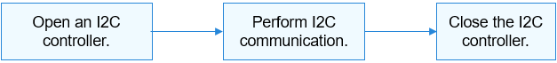

# I2C Usage Guidelines<a name="EN-US_TOPIC_0000001053058269"></a>

## How to Use<a name="section333203315215"></a>

[Figure 1](#fig166181128151112)  illustrates the process of an I2C device.

**Figure  1**  Process of using an I2C device<a name="fig166181128151112"></a>  




## Opening an I2C Controller<a name="section123631358135713"></a>

Call the following function to open an I2C controller:

struct DevHandle \*I2cOpen\(int16\_t number\);

**Table  1**  Description of I2cOpen

<a name="table7603619123820"></a>
<table><thead align="left"><tr id="row1060351914386"><th class="cellrowborder" valign="top" width="20.66%" id="mcps1.2.3.1.1"><p id="p14603181917382"><a name="p14603181917382"></a><a name="p14603181917382"></a><strong id="b114677572574"><a name="b114677572574"></a><a name="b114677572574"></a>Parameter</strong></p>
</th>
<th class="cellrowborder" valign="top" width="79.34%" id="mcps1.2.3.1.2"><p id="p36031519183819"><a name="p36031519183819"></a><a name="p36031519183819"></a><strong id="b111211593574"><a name="b111211593574"></a><a name="b111211593574"></a>Description</strong></p>
</th>
</tr>
</thead>
<tbody><tr id="row1960431983813"><td class="cellrowborder" valign="top" width="20.66%" headers="mcps1.2.3.1.1 "><p id="p3604719123817"><a name="p3604719123817"></a><a name="p3604719123817"></a>number</p>
</td>
<td class="cellrowborder" valign="top" width="79.34%" headers="mcps1.2.3.1.2 "><p id="p221392414442"><a name="p221392414442"></a><a name="p221392414442"></a>I2C controller ID.</p>
</td>
</tr>
<tr id="row11410612183019"><td class="cellrowborder" valign="top" width="20.66%" headers="mcps1.2.3.1.1 "><p id="p460381915385"><a name="p460381915385"></a><a name="p460381915385"></a><strong id="b1986279105819"><a name="b1986279105819"></a><a name="b1986279105819"></a>Return Value</strong></p>
</td>
<td class="cellrowborder" valign="top" width="79.34%" headers="mcps1.2.3.1.2 "><p id="p96031619153812"><a name="p96031619153812"></a><a name="p96031619153812"></a><strong id="b448021385812"><a name="b448021385812"></a><a name="b448021385812"></a>Description</strong></p>
</td>
</tr>
<tr id="row15410111273017"><td class="cellrowborder" valign="top" width="20.66%" headers="mcps1.2.3.1.1 "><p id="p1060418195389"><a name="p1060418195389"></a><a name="p1060418195389"></a>NULL</p>
</td>
<td class="cellrowborder" valign="top" width="79.34%" headers="mcps1.2.3.1.2 "><p id="p760471912388"><a name="p760471912388"></a><a name="p760471912388"></a>Failed to open the I2C controller.</p>
</td>
</tr>
<tr id="row1241081213303"><td class="cellrowborder" valign="top" width="20.66%" headers="mcps1.2.3.1.1 "><p id="p5604719133811"><a name="p5604719133811"></a><a name="p5604719133811"></a>Device handle</p>
</td>
<td class="cellrowborder" valign="top" width="79.34%" headers="mcps1.2.3.1.2 "><p id="p3604181933818"><a name="p3604181933818"></a><a name="p3604181933818"></a>Handle of the I2C controller.</p>
</td>
</tr>
</tbody>
</table>

This example assumes that the system has eight I2C controllers \(numbered from 0 to 7\) and I2C controller 3 is to open.

```
struct DevHandle *i2cHandle = NULL; /* I2C controller handle */

/* Open an I2C controller. */
i2cHandle = I2cOpen(3);
if (i2cHandle == NULL) {
    HDF_LOGE("I2cOpen: failed\n");
    return;
}
```

## Performing I2C Communication<a name="section11091522125812"></a>

Use the following function for message transfer:

int32\_t I2cTransfer\(struct DevHandle \*handle, struct I2cMsg \*msgs, int16\_t count\);

**Table  2**  Description of I2cTransfer

<a name="table1934414174212"></a>
<table><thead align="left"><tr id="row1134415176216"><th class="cellrowborder" valign="top" width="50%" id="mcps1.2.3.1.1"><p id="p13295152320217"><a name="p13295152320217"></a><a name="p13295152320217"></a><strong>Parameter</strong></p>
</th>
<th class="cellrowborder" valign="top" width="50%" id="mcps1.2.3.1.2"><p id="p1295112352115"><a name="p1295112352115"></a><a name="p1295112352115"></a><strong>Description</strong></p>
</th>
</tr>
</thead>
<tbody><tr id="row5344101702113"><td class="cellrowborder" valign="top" width="50%" headers="mcps1.2.3.1.1 "><p id="p19295132382111"><a name="p19295132382111"></a><a name="p19295132382111"></a>handle</p>
</td>
<td class="cellrowborder" valign="top" width="50%" headers="mcps1.2.3.1.2 "><p id="p1051172572919"><a name="p1051172572919"></a><a name="p1051172572919"></a>Handle of an I2C controller.</p>
</td>
</tr>
<tr id="row17344171722117"><td class="cellrowborder" valign="top" width="50%" headers="mcps1.2.3.1.1 "><p id="p9295122332113"><a name="p9295122332113"></a><a name="p9295122332113"></a>msgs</p>
</td>
<td class="cellrowborder" valign="top" width="50%" headers="mcps1.2.3.1.2 "><p id="p202951238218"><a name="p202951238218"></a><a name="p202951238218"></a>Message array of the data to transfer.</p>
</td>
</tr>
<tr id="row45812466213"><td class="cellrowborder" valign="top" width="50%" headers="mcps1.2.3.1.1 "><p id="p1659246112117"><a name="p1659246112117"></a><a name="p1659246112117"></a>count</p>
</td>
<td class="cellrowborder" valign="top" width="50%" headers="mcps1.2.3.1.2 "><p id="p259124622119"><a name="p259124622119"></a><a name="p259124622119"></a>Length of the message array.</p>
</td>
</tr>
<tr id="row04701426105110"><td class="cellrowborder" valign="top" width="50%" headers="mcps1.2.3.1.1 "><p id="p17295142322113"><a name="p17295142322113"></a><a name="p17295142322113"></a><strong>Return Value</strong></p>
</td>
<td class="cellrowborder" valign="top" width="50%" headers="mcps1.2.3.1.2 "><p id="p142959232211"><a name="p142959232211"></a><a name="p142959232211"></a><strong id="b8287252308"><a name="b8287252308"></a><a name="b8287252308"></a>Description</strong></p>
</td>
</tr>
<tr id="row74701226125110"><td class="cellrowborder" valign="top" width="50%" headers="mcps1.2.3.1.1 "><p id="p929532313211"><a name="p929532313211"></a><a name="p929532313211"></a>Positive integer</p>
</td>
<td class="cellrowborder" valign="top" width="50%" headers="mcps1.2.3.1.2 "><p id="p829512237217"><a name="p829512237217"></a><a name="p829512237217"></a>Number of message structures that are successfully transmitted.</p>
</td>
</tr>
<tr id="row204701126195115"><td class="cellrowborder" valign="top" width="50%" headers="mcps1.2.3.1.1 "><p id="p12958234217"><a name="p12958234217"></a><a name="p12958234217"></a>Negative value</p>
</td>
<td class="cellrowborder" valign="top" width="50%" headers="mcps1.2.3.1.2 "><p id="p1295192312112"><a name="p1295192312112"></a><a name="p1295192312112"></a>Failed to perform the message transfer.</p>
</td>
</tr>
</tbody>
</table>

The type of an I2C message transfer is defined by  **I2cMsg**. Each message structure indicates a read or write operation. Multiple read or write operations can be performed by using a message array.

```
int32_t ret;
uint8_t wbuff[2] = { 0x12, 0x13 };
uint8_t rbuff[2] = { 0 };
struct I2cMsg msgs[2]; /* Custom message array for transfer */
msgs[0].buf = wbuff;    /* Data to write */
msgs[0].len = 2;        /* The length of the data to write is 2. */
msgs[0].addr = 0x5A;    /* The address of the device to write the data is 0x5A. */
msgs[0].flags = 0;      /* The flag is 0, indicating the write operation. */
msgs[1].buf = rbuff;    /* Data to read */
msgs[1].len = 2;        /* The length of the data to read is 2. */
msgs[1].addr = 0x5A;    /* The address of the device to read the data is 0x5A. */
msgs[1].flags = I2C_FLAG_READ /* I2C_FLAG_READ is configured, indicating the read operation. */
/* Perform a custom transfer to transfer two messages. */
ret = I2cTransfer(i2cHandle, msgs, 2);
if (ret != 2) {
    HDF_LOGE("I2cTransfer: failed, ret %d\n", ret);
    return;
}
```

> **CAUTION:** 
>-   The device address in the  **I2cMsg**  structure does not contain the read/write flag bit. The read/write information is transferred by the read/write control bit in the member variable  **flags**.
>-   The  **I2cTransfer**  function does not limit the number of message structures, which is determined by the I2C controller.
>-   The  **I2cTransfer**  function does not limit the data length of each message structure, which is determined by the I2C controller.
>-   The  **I2cTransfer**  function may cause the system to sleep and therefore cannot be invoked in the interrupt context.

## Closing an I2C Controller<a name="section13519505589"></a>

Call the following function to close the I2C controller after the communication is complete:

void I2cClose\(DevHandle \*handle\);

**Table  3**  Description of I2cClose

<a name="table72517953115"></a>
<table><thead align="left"><tr id="row1525793312"><th class="cellrowborder" valign="top" width="50%" id="mcps1.2.3.1.1"><p id="p115402031153111"><a name="p115402031153111"></a><a name="p115402031153111"></a>Parameter</p>
</th>
<th class="cellrowborder" valign="top" width="50%" id="mcps1.2.3.1.2"><p id="p65406313319"><a name="p65406313319"></a><a name="p65406313319"></a>Description</p>
</th>
</tr>
</thead>
<tbody><tr id="row1926109193116"><td class="cellrowborder" valign="top" width="50%" headers="mcps1.2.3.1.1 "><p id="p105419317318"><a name="p105419317318"></a><a name="p105419317318"></a>handle</p>
</td>
<td class="cellrowborder" valign="top" width="50%" headers="mcps1.2.3.1.2 "><p id="p1213245577"><a name="p1213245577"></a><a name="p1213245577"></a>Handle of an I2C controller.</p>
</td>
</tr>
</tbody>
</table>

```
I2cClose(i2cHandle); /* Close the I2C controller. */
```

