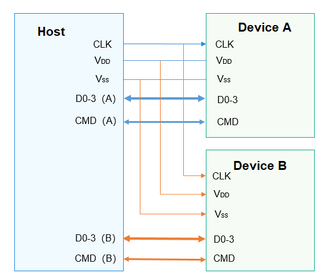

# SDIO Overview

## Introduction

-   Secure Digital Input/Output \(SDIO\) is a peripheral interface evolved from the Secure Digital \(SD\) memory card interface. The SDIO interface is compatible with SD memory cards and can be connected to devices that support the SDIO interface.
-   SDIO is widely used. Currently, many smartphones support SDIO, and many SDIO peripherals are developed for connections to smartphones. Common SDIO peripherals include WLAN, GPS, cameras, and Bluetooth.
-   The SDIO bus has two ends, named host and device. All communication starts when the host sends a command. The device can communicate with the host as long as it can parse the command of the host. An SDIO host can connect to multiple devices, as shown in the figure below.

    1.  CLK signal: clock signal sent from the host to the device
    2.  VDD signal: power signal
    3.  VSS signal: ground signal
    4.  D0-3 signal: four data lines. The DAT1 signal cable is multiplexed as the interrupt line. In 1-bit mode, DAT0 is used to transmit data. In 4-bit mode, DAT0 to DAT3 are used to transmit data.
    5.  CMD signal: used by the host to send commands and the device to respond to commands.

    **Figure  1**  Connections between the host and devices in SDIO  
    

    

-   The SDIO interface defines a set of common methods for operating an SDIO device, including opening and closing an SDIO controller, exclusively claiming and releasing the host, enabling and disabling devices, claiming and releasing an SDIO IRQ, reading and writing data based on SDIO, and obtaining and setting common information.

## Available APIs

**Table  1**  APIs available for the SDIO driver

<table><thead align="left"><tr id="row1625342317507"><th class="cellrowborder" valign="top" width="21.07%" id="mcps1.2.4.1.1">
Capability

</th>
<th class="cellrowborder" valign="top" width="34.04%" id="mcps1.2.4.1.2">
Function

</th>
<th class="cellrowborder" valign="top" width="44.89%" id="mcps1.2.4.1.3">
Description

</th>
</tr>
</thead>
<tbody><tr id="row1351945135614"><td class="cellrowborder" rowspan="2" valign="top" width="21.07%" headers="mcps1.2.4.1.1 ">
SDIO device opening/closing

</td>
<td class="cellrowborder" valign="top" width="34.04%" headers="mcps1.2.4.1.2 ">
SdioOpen

</td>
<td class="cellrowborder" valign="top" width="44.89%" headers="mcps1.2.4.1.3 ">
Opens an SDIO controller with a specified bus number.

</td>
</tr>
<tr id="row1062610995616"><td class="cellrowborder" valign="top" headers="mcps1.2.4.1.1 ">
SdioClose

</td>
<td class="cellrowborder" valign="top" headers="mcps1.2.4.1.2 ">
Closes an SDIO controller.

</td>
</tr>
<tr id="row337105133315"><td class="cellrowborder" rowspan="6" valign="top" width="21.07%" headers="mcps1.2.4.1.1 ">
SDIO reading/writing

</td>
<td class="cellrowborder" valign="top" width="34.04%" headers="mcps1.2.4.1.2 ">
SdioReadBytes

</td>
<td class="cellrowborder" valign="top" width="44.89%" headers="mcps1.2.4.1.3 ">
Incrementally reads a given length of data from a specified SDIO address.

</td>
</tr>
<tr id="row9317134301618"><td class="cellrowborder" valign="top" headers="mcps1.2.4.1.1 ">
SdioWriteBytes

</td>
<td class="cellrowborder" valign="top" headers="mcps1.2.4.1.2 ">
Incrementally writes a given length of data into a specified SDIO address.

</td>
</tr>
<tr id="row131301734171616"><td class="cellrowborder" valign="top" headers="mcps1.2.4.1.1 ">
SdioReadBytesFromFixedAddr

</td>
<td class="cellrowborder" valign="top" headers="mcps1.2.4.1.2 ">
Reads a given length of data from a fixed SDIO address.

</td>
</tr>
<tr id="row1434434011147"><td class="cellrowborder" valign="top" headers="mcps1.2.4.1.1 ">
SdioWriteBytesToFixedAddr

</td>
<td class="cellrowborder" valign="top" headers="mcps1.2.4.1.2 ">
Writes a given length of data into a fixed SDIO address.

</td>
</tr>
<tr id="row364393591410"><td class="cellrowborder" valign="top" headers="mcps1.2.4.1.1 ">
SdioReadBytesFromFunc0

</td>
<td class="cellrowborder" valign="top" headers="mcps1.2.4.1.2 ">
Reads a given length of data from the address space of SDIO function 0.

</td>
</tr>
<tr id="row17455333175"><td class="cellrowborder" valign="top" headers="mcps1.2.4.1.1 ">
SdioWriteBytesToFunc0

</td>
<td class="cellrowborder" valign="top" headers="mcps1.2.4.1.2 ">
Writes a given length of data into the address space of SDIO function 0.

</td>
</tr>
<tr id="row34145016535"><td class="cellrowborder" valign="top" width="21.07%" headers="mcps1.2.4.1.1 ">
SDIO block size setting

</td>
<td class="cellrowborder" valign="top" width="34.04%" headers="mcps1.2.4.1.2 ">
SdioSetBlockSize

</td>
<td class="cellrowborder" valign="top" width="44.89%" headers="mcps1.2.4.1.3 ">
Sets the block size.

</td>
</tr>
<tr id="row778816813238"><td class="cellrowborder" rowspan="2" valign="top" width="21.07%" headers="mcps1.2.4.1.1 ">
SDIO common information retrieval/setting

</td>
<td class="cellrowborder" valign="top" width="34.04%" headers="mcps1.2.4.1.2 ">
SdioGetCommonInfo

</td>
<td class="cellrowborder" valign="top" width="44.89%" headers="mcps1.2.4.1.3 ">
Obtains common information.

</td>
</tr>
<tr id="row5667102342417"><td class="cellrowborder" valign="top" headers="mcps1.2.4.1.1 ">
SdioSetCommonInfo

</td>
<td class="cellrowborder" valign="top" headers="mcps1.2.4.1.2 ">
Sets common information.

</td>
</tr>
<tr id="row1165101111256"><td class="cellrowborder" valign="top" width="21.07%" headers="mcps1.2.4.1.1 ">
SDIO data flushing

</td>
<td class="cellrowborder" valign="top" width="34.04%" headers="mcps1.2.4.1.2 ">
SdioFlushData

</td>
<td class="cellrowborder" valign="top" width="44.89%" headers="mcps1.2.4.1.3 ">
Flushes data.

</td>
</tr>
<tr id="row17388101522515"><td class="cellrowborder" rowspan="2" valign="top" width="21.07%" headers="mcps1.2.4.1.1 ">
SDIO host exclusively claiming or releasing

</td>
<td class="cellrowborder" valign="top" width="34.04%" headers="mcps1.2.4.1.2 ">
SdioClaimHost

</td>
<td class="cellrowborder" valign="top" width="44.89%" headers="mcps1.2.4.1.3 ">
Claims a host exclusively.

</td>
</tr>
<tr id="row5352175517251"><td class="cellrowborder" valign="top" headers="mcps1.2.4.1.1 ">
SdioReleaseHost

</td>
<td class="cellrowborder" valign="top" headers="mcps1.2.4.1.2 ">
Releases the exclusively claimed host.

</td>
</tr>
<tr id="row8759125415269"><td class="cellrowborder" rowspan="2" valign="top" width="21.07%" headers="mcps1.2.4.1.1 ">
SDIO device enablement

</td>
<td class="cellrowborder" valign="top" width="34.04%" headers="mcps1.2.4.1.2 ">
SdioEnableFunc

</td>
<td class="cellrowborder" valign="top" width="44.89%" headers="mcps1.2.4.1.3 ">
Enables an SDIO device.

</td>
</tr>
<tr id="row1166105762620"><td class="cellrowborder" valign="top" headers="mcps1.2.4.1.1 ">
SdioDisableFunc

</td>
<td class="cellrowborder" valign="top" headers="mcps1.2.4.1.2 ">
Disables an SDIO device.

</td>
</tr>
<tr id="row12332331113517"><td class="cellrowborder" rowspan="2" valign="top" width="21.07%" headers="mcps1.2.4.1.1 ">
SDIO IRQ claiming/releasing

</td>
<td class="cellrowborder" valign="top" width="34.04%" headers="mcps1.2.4.1.2 ">
SdioClaimIrq

</td>
<td class="cellrowborder" valign="top" width="44.89%" headers="mcps1.2.4.1.3 ">
Claims an SDIO IRQ.

</td>
</tr>
<tr id="row173103413357"><td class="cellrowborder" valign="top" headers="mcps1.2.4.1.1 ">
SdioReleaseIrq

</td>
<td class="cellrowborder" valign="top" headers="mcps1.2.4.1.2 ">
Releases an SDIO IRQ.

</td>
</tr>
</tbody>
</table>

> **NOTE:** 
>All functions provided in this document can be called only in kernel mode.

