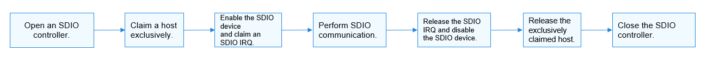

# SDIO Usage Guidelines<a name="EN-US_TOPIC_0000001052218016"></a>

## How to Use<a name="section1962415610383"></a>

[Figure 1](spiusage-guidelines.md#fig23885455594)  illustrates the process of using an SDIO.

**Figure  1**  Process of using an SDIO<a name="fig112731977522"></a>  




## Opening an SDIO Controller<a name="section814751015461"></a>

Before performing SDIO communication, obtain the device handle of an SDIO controller by calling  **SdioOpen**. This function returns the device handle of the SDIO controller with a specified bus number.

struct DevHandle \*SdioOpen\(int16\_t busNum\);

**Table  1**  Parameters and return values of SdioOpen

<a name="table511305944514"></a>
<table><thead align="left"><tr id="row1011212598452"><th class="cellrowborder" valign="top" width="50%" id="mcps1.2.3.1.1"><p id="p141124595457"><a name="p141124595457"></a><a name="p141124595457"></a>Parameter</p>
</th>
<th class="cellrowborder" valign="top" width="50%" id="mcps1.2.3.1.2"><p id="p1111214593455"><a name="p1111214593455"></a><a name="p1111214593455"></a>Description</p>
</th>
</tr>
</thead>
<tbody><tr id="row19112195918454"><td class="cellrowborder" valign="top" width="50%" headers="mcps1.2.3.1.1 "><p id="p11121759124515"><a name="p11121759124515"></a><a name="p11121759124515"></a>busNum</p>
</td>
<td class="cellrowborder" valign="top" width="50%" headers="mcps1.2.3.1.2 "><p id="p111121459194519"><a name="p111121459194519"></a><a name="p111121459194519"></a>SDIO bus number.</p>
</td>
</tr>
<tr id="row6112659184518"><td class="cellrowborder" valign="top" width="50%" headers="mcps1.2.3.1.1 "><p id="p1112105919453"><a name="p1112105919453"></a><a name="p1112105919453"></a><strong id="b1358115072811"><a name="b1358115072811"></a><a name="b1358115072811"></a>Return Value</strong></p>
</td>
<td class="cellrowborder" valign="top" width="50%" headers="mcps1.2.3.1.2 "><p id="p6112659114518"><a name="p6112659114518"></a><a name="p6112659114518"></a><strong id="b108432513282"><a name="b108432513282"></a><a name="b108432513282"></a>Description</strong></p>
</td>
</tr>
<tr id="row3113559164519"><td class="cellrowborder" valign="top" width="50%" headers="mcps1.2.3.1.1 "><p id="p51121159104517"><a name="p51121159104517"></a><a name="p51121159104517"></a>NULL</p>
</td>
<td class="cellrowborder" valign="top" width="50%" headers="mcps1.2.3.1.2 "><p id="p1811313597458"><a name="p1811313597458"></a><a name="p1811313597458"></a>Failed to obtain the device handle of an SDIO controller.</p>
</td>
</tr>
<tr id="row201131059194512"><td class="cellrowborder" valign="top" width="50%" headers="mcps1.2.3.1.1 "><p id="p1311375919456"><a name="p1311375919456"></a><a name="p1311375919456"></a>Device handle</p>
</td>
<td class="cellrowborder" valign="top" width="50%" headers="mcps1.2.3.1.2 "><p id="p1911312599450"><a name="p1911312599450"></a><a name="p1911312599450"></a>Device handle of an SDIO controller.</p>
</td>
</tr>
</tbody>
</table>

The following example shows how to open an SDIO controller.

```
struct DevHandle *handle = NULL;
int16_t busNum = 1;
/* Open an SDIO controller whose bus number is 1. */
handle = SdioOpen(busNum);
if (handle == NULL) {
    HDF_LOGE("SdioOpen: failed!\n");
}
```

## Claiming a Host Exclusively<a name="section49274582455"></a>

After obtaining the device handle of an SDIO controller, exclusively claim the host before performing subsequent operations on the SDIO device.

void SdioClaimHost\(struct DevHandle\*handle\);

**Table  2**  Parameter description of SdioClaimHost

<a name="table14114175994514"></a>
<table><thead align="left"><tr id="row1211325914459"><th class="cellrowborder" valign="top" width="50%" id="mcps1.2.3.1.1"><p id="p611365954517"><a name="p611365954517"></a><a name="p611365954517"></a>Parameter</p>
</th>
<th class="cellrowborder" valign="top" width="50%" id="mcps1.2.3.1.2"><p id="p1711365954510"><a name="p1711365954510"></a><a name="p1711365954510"></a>Description</p>
</th>
</tr>
</thead>
<tbody><tr id="row3114205920451"><td class="cellrowborder" valign="top" width="50%" headers="mcps1.2.3.1.1 "><p id="p181141592457"><a name="p181141592457"></a><a name="p181141592457"></a>handle</p>
</td>
<td class="cellrowborder" valign="top" width="50%" headers="mcps1.2.3.1.2 "><p id="p41144595458"><a name="p41144595458"></a><a name="p41144595458"></a>Device handle of an SDIO controller</p>
</td>
</tr>
</tbody>
</table>

The following example shows how to exclusively claim a host.

```
SdioClaimHost(handle); /* Claim a host exclusively. */
```

## Enabling the SDIO Device<a name="section1431520410489"></a>

Before accessing a register, enable the SDIO device.

int32\_t SdioEnableFunc\(struct DevHandle \*handle\);

**Table  3**  Parameters and return values of SdioEnableFunc

<a name="table144881047485"></a>
<table><thead align="left"><tr id="row8487204184815"><th class="cellrowborder" valign="top" width="50%" id="mcps1.2.3.1.1"><p id="p1648611415486"><a name="p1648611415486"></a><a name="p1648611415486"></a>Parameter</p>
</th>
<th class="cellrowborder" valign="top" width="50%" id="mcps1.2.3.1.2"><p id="p19487134124820"><a name="p19487134124820"></a><a name="p19487134124820"></a>Description</p>
</th>
</tr>
</thead>
<tbody><tr id="row16487044480"><td class="cellrowborder" valign="top" width="50%" headers="mcps1.2.3.1.1 "><p id="p74878414810"><a name="p74878414810"></a><a name="p74878414810"></a>handle</p>
</td>
<td class="cellrowborder" valign="top" width="50%" headers="mcps1.2.3.1.2 "><p id="p17487184194819"><a name="p17487184194819"></a><a name="p17487184194819"></a>Device handle of an SDIO controller.</p>
</td>
</tr>
<tr id="row13487748487"><td class="cellrowborder" valign="top" width="50%" headers="mcps1.2.3.1.1 "><p id="p24873424811"><a name="p24873424811"></a><a name="p24873424811"></a><strong id="b17324127153718"><a name="b17324127153718"></a><a name="b17324127153718"></a>Return Value</strong></p>
</td>
<td class="cellrowborder" valign="top" width="50%" headers="mcps1.2.3.1.2 "><p id="p4487174134813"><a name="p4487174134813"></a><a name="p4487174134813"></a><strong id="b5828181123719"><a name="b5828181123719"></a><a name="b5828181123719"></a>Description</strong></p>
</td>
</tr>
<tr id="row1748814494812"><td class="cellrowborder" valign="top" width="50%" headers="mcps1.2.3.1.1 "><p id="p84878410488"><a name="p84878410488"></a><a name="p84878410488"></a>0</p>
</td>
<td class="cellrowborder" valign="top" width="50%" headers="mcps1.2.3.1.2 "><p id="p948715410483"><a name="p948715410483"></a><a name="p948715410483"></a>The SDIO device is enabled.</p>
</td>
</tr>
<tr id="row54881416482"><td class="cellrowborder" valign="top" width="50%" headers="mcps1.2.3.1.1 "><p id="p24881645489"><a name="p24881645489"></a><a name="p24881645489"></a>Negative value</p>
</td>
<td class="cellrowborder" valign="top" width="50%" headers="mcps1.2.3.1.2 "><p id="p10488247487"><a name="p10488247487"></a><a name="p10488247487"></a>Failed to enable the SDIO device.</p>
</td>
</tr>
</tbody>
</table>

The following example shows how to enable the SDIO device.

```
int32_t ret;
/* Enable the SDIO device. */
ret = SdioEnableFunc(handle);
if (ret != 0) {
    HDF_LOGE("SdioEnableFunc: failed, ret %d\n", ret);
}
```

## Claiming an SDIO IRQ<a name="section3662781537"></a>

Before SDIO communication, claim an SDIO IRQ.

int32\_t SdioClaimIrq\(struct DevHandle \*handle, SdioIrqHandler \*handler\);

**Table  4**  Parameters and return values of SdioClaimIrq

<a name="table1149014114815"></a>
<table><thead align="left"><tr id="row114891042488"><th class="cellrowborder" valign="top" width="49.980000000000004%" id="mcps1.2.3.1.1"><p id="p1348864164811"><a name="p1348864164811"></a><a name="p1348864164811"></a>Parameter</p>
</th>
<th class="cellrowborder" valign="top" width="50.019999999999996%" id="mcps1.2.3.1.2"><p id="p14885410486"><a name="p14885410486"></a><a name="p14885410486"></a>Description</p>
</th>
</tr>
</thead>
<tbody><tr id="row048911404820"><td class="cellrowborder" valign="top" width="49.980000000000004%" headers="mcps1.2.3.1.1 "><p id="p248974174814"><a name="p248974174814"></a><a name="p248974174814"></a>handle</p>
</td>
<td class="cellrowborder" valign="top" width="50.019999999999996%" headers="mcps1.2.3.1.2 "><p id="p1848915494813"><a name="p1848915494813"></a><a name="p1848915494813"></a>Device handle of an SDIO controller.</p>
</td>
</tr>
<tr id="row204894454813"><td class="cellrowborder" valign="top" width="49.980000000000004%" headers="mcps1.2.3.1.1 "><p id="p17489944488"><a name="p17489944488"></a><a name="p17489944488"></a>handler</p>
</td>
<td class="cellrowborder" valign="top" width="50.019999999999996%" headers="mcps1.2.3.1.2 "><p id="p1548984174813"><a name="p1548984174813"></a><a name="p1548984174813"></a>Pointer to the SDIO IRQ function.</p>
</td>
</tr>
<tr id="row44898413488"><td class="cellrowborder" valign="top" width="49.980000000000004%" headers="mcps1.2.3.1.1 "><p id="p1548934124815"><a name="p1548934124815"></a><a name="p1548934124815"></a><strong id="b79101542153816"><a name="b79101542153816"></a><a name="b79101542153816"></a>Return Value</strong></p>
</td>
<td class="cellrowborder" valign="top" width="50.019999999999996%" headers="mcps1.2.3.1.2 "><p id="p54891444485"><a name="p54891444485"></a><a name="p54891444485"></a><strong id="b1592435273812"><a name="b1592435273812"></a><a name="b1592435273812"></a>Description</strong></p>
</td>
</tr>
<tr id="row748994144811"><td class="cellrowborder" valign="top" width="49.980000000000004%" headers="mcps1.2.3.1.1 "><p id="p448918415484"><a name="p448918415484"></a><a name="p448918415484"></a>0</p>
</td>
<td class="cellrowborder" valign="top" width="50.019999999999996%" headers="mcps1.2.3.1.2 "><p id="p174892412489"><a name="p174892412489"></a><a name="p174892412489"></a>The SDIO IRQ is claimed.</p>
</td>
</tr>
<tr id="row448914420489"><td class="cellrowborder" valign="top" width="49.980000000000004%" headers="mcps1.2.3.1.1 "><p id="p248912464817"><a name="p248912464817"></a><a name="p248912464817"></a>Negative value</p>
</td>
<td class="cellrowborder" valign="top" width="50.019999999999996%" headers="mcps1.2.3.1.2 "><p id="p34891645485"><a name="p34891645485"></a><a name="p34891645485"></a>Failed to claim an SDIO IRQ.</p>
</td>
</tr>
</tbody>
</table>

The following example shows how to claim an SDIO IRQ.

```
/* Implement the SDIO IRQ function based on the application. */
static void SdioIrqFunc(void *data)
{
    if (data == NULL) {
        HDF_LOGE("SdioIrqFunc: data is NULL.\n");
        return;
    }
    /* You need to add specific implementations. */
}

int32_t ret;
/* Claim an SDIO IRQ. */
ret = SdioClaimIrq(handle, SdioIrqFunc);
if (ret != 0) {
    HDF_LOGE("SdioClaimIrq: failed, ret %d\n", ret);
}
```

## Performing SDIO Communication<a name="section391941913484"></a>

-   Incrementally write a given length of data into the SDIO device.

The corresponding function is as follows:

int32\_t SdioWriteBytes\(struct DevHandle \*handle, uint8\_t \*data, uint32\_t addr, uint32\_t size, uint32\_t timeOut\);

**Table  5**  Parameters and return values of SdioWriteBytes

<a name="table6887174174111"></a>
<table><thead align="left"><tr id="row10887144111419"><th class="cellrowborder" valign="top" width="50%" id="mcps1.2.3.1.1"><p id="p181381751164113"><a name="p181381751164113"></a><a name="p181381751164113"></a>Parameter</p>
</th>
<th class="cellrowborder" valign="top" width="50%" id="mcps1.2.3.1.2"><p id="p19138115184116"><a name="p19138115184116"></a><a name="p19138115184116"></a>Description</p>
</th>
</tr>
</thead>
<tbody><tr id="row4887341174114"><td class="cellrowborder" valign="top" width="50%" headers="mcps1.2.3.1.1 "><p id="p1534612017427"><a name="p1534612017427"></a><a name="p1534612017427"></a>handle</p>
</td>
<td class="cellrowborder" valign="top" width="50%" headers="mcps1.2.3.1.2 "><p id="p8179347434"><a name="p8179347434"></a><a name="p8179347434"></a>Device handle of an SDIO controller.</p>
</td>
</tr>
<tr id="row18881041144120"><td class="cellrowborder" valign="top" width="50%" headers="mcps1.2.3.1.1 "><p id="p10888154118412"><a name="p10888154118412"></a><a name="p10888154118412"></a>data</p>
</td>
<td class="cellrowborder" valign="top" width="50%" headers="mcps1.2.3.1.2 "><p id="p1288854115413"><a name="p1288854115413"></a><a name="p1288854115413"></a>Pointer to the data to write.</p>
</td>
</tr>
<tr id="row191054911432"><td class="cellrowborder" valign="top" width="50%" headers="mcps1.2.3.1.1 "><p id="p91054994311"><a name="p91054994311"></a><a name="p91054994311"></a>addr</p>
</td>
<td class="cellrowborder" valign="top" width="50%" headers="mcps1.2.3.1.2 "><p id="p111024915432"><a name="p111024915432"></a><a name="p111024915432"></a>Start address where the data is written into.</p>
</td>
</tr>
<tr id="row14888144124119"><td class="cellrowborder" valign="top" width="50%" headers="mcps1.2.3.1.1 "><p id="p1588814413412"><a name="p1588814413412"></a><a name="p1588814413412"></a>size</p>
</td>
<td class="cellrowborder" valign="top" width="50%" headers="mcps1.2.3.1.2 "><p id="p1288813411413"><a name="p1288813411413"></a><a name="p1288813411413"></a>Length of the data to write.</p>
</td>
</tr>
<tr id="row188213710445"><td class="cellrowborder" valign="top" width="50%" headers="mcps1.2.3.1.1 "><p id="p08227154415"><a name="p08227154415"></a><a name="p08227154415"></a>timeOut</p>
</td>
<td class="cellrowborder" valign="top" width="50%" headers="mcps1.2.3.1.2 "><p id="p6821875446"><a name="p6821875446"></a><a name="p6821875446"></a>Timeout duration for writing data, in milliseconds. If the value is <strong id="b62393444422"><a name="b62393444422"></a><a name="b62393444422"></a>0</strong>, the default value is used.</p>
</td>
</tr>
<tr id="row18247654163519"><td class="cellrowborder" valign="top" width="50%" headers="mcps1.2.3.1.1 "><p id="p486155173610"><a name="p486155173610"></a><a name="p486155173610"></a><strong id="b11356135114216"><a name="b11356135114216"></a><a name="b11356135114216"></a>Return Value</strong></p>
</td>
<td class="cellrowborder" valign="top" width="50%" headers="mcps1.2.3.1.2 "><p id="p1686155113620"><a name="p1686155113620"></a><a name="p1686155113620"></a><strong id="b911120524421"><a name="b911120524421"></a><a name="b911120524421"></a>Description</strong></p>
</td>
</tr>
<tr id="row10574165663512"><td class="cellrowborder" valign="top" width="50%" headers="mcps1.2.3.1.1 "><p id="p912141012364"><a name="p912141012364"></a><a name="p912141012364"></a>0</p>
</td>
<td class="cellrowborder" valign="top" width="50%" headers="mcps1.2.3.1.2 "><p id="p51219107363"><a name="p51219107363"></a><a name="p51219107363"></a>Data is written into the SDIO device.</p>
</td>
</tr>
<tr id="row1490635883519"><td class="cellrowborder" valign="top" width="50%" headers="mcps1.2.3.1.1 "><p id="p10121510133617"><a name="p10121510133617"></a><a name="p10121510133617"></a>Negative value</p>
</td>
<td class="cellrowborder" valign="top" width="50%" headers="mcps1.2.3.1.2 "><p id="p131212106365"><a name="p131212106365"></a><a name="p131212106365"></a>Failed to write data into the SDIO device.</p>
</td>
</tr>
</tbody>
</table>

The following example shows how to incrementally write a given length of data into the SDIO device.

```
int32_t ret;
uint8_t wbuff[] = {1,2,3,4,5};
uint32_t addr = 0x100 + 0x09;
/* Incrementally write 5-byte data into the start address 0x109 of the SDIO device. */
ret = SdioWriteBytes(handle, wbuff, addr, sizeof(wbuff) / sizeof(wbuff[0]), 0);
if (ret != 0) {
    HDF_LOGE("SdioWriteBytes: failed, ret %d\n", ret);
}
```

-   Incrementally read a given length of data from the SDIO device.

The corresponding function is as follows:

int32\_t SdioReadBytes\(struct DevHandle \*handle, uint8\_t \*data, uint32\_t addr, uint32\_t size, uint32\_t timeOut\);

**Table  6**  Parameters and return values of SdioReadBytes

<a name="table5783755152110"></a>
<table><thead align="left"><tr id="row19783355162116"><th class="cellrowborder" valign="top" width="50%" id="mcps1.2.3.1.1"><p id="p635754142212"><a name="p635754142212"></a><a name="p635754142212"></a>Parameter</p>
</th>
<th class="cellrowborder" valign="top" width="50%" id="mcps1.2.3.1.2"><p id="p1035774182215"><a name="p1035774182215"></a><a name="p1035774182215"></a>Description</p>
</th>
</tr>
</thead>
<tbody><tr id="row137831055192118"><td class="cellrowborder" valign="top" width="50%" headers="mcps1.2.3.1.1 "><p id="p14783155192114"><a name="p14783155192114"></a><a name="p14783155192114"></a>handle</p>
</td>
<td class="cellrowborder" valign="top" width="50%" headers="mcps1.2.3.1.2 "><p id="p9676437202218"><a name="p9676437202218"></a><a name="p9676437202218"></a>Device handle of an SDIO controller.</p>
</td>
</tr>
<tr id="row4784155102111"><td class="cellrowborder" valign="top" width="50%" headers="mcps1.2.3.1.1 "><p id="p1978455510217"><a name="p1978455510217"></a><a name="p1978455510217"></a>data</p>
</td>
<td class="cellrowborder" valign="top" width="50%" headers="mcps1.2.3.1.2 "><p id="p767683714223"><a name="p767683714223"></a><a name="p767683714223"></a>Pointer to the data to read.</p>
</td>
</tr>
<tr id="row63651118499"><td class="cellrowborder" valign="top" width="50%" headers="mcps1.2.3.1.1 "><p id="p73669113496"><a name="p73669113496"></a><a name="p73669113496"></a>addr</p>
</td>
<td class="cellrowborder" valign="top" width="50%" headers="mcps1.2.3.1.2 "><p id="p53661144916"><a name="p53661144916"></a><a name="p53661144916"></a>Start address where the data is read from.</p>
</td>
</tr>
<tr id="row7784145510218"><td class="cellrowborder" valign="top" width="50%" headers="mcps1.2.3.1.1 "><p id="p1078413554219"><a name="p1078413554219"></a><a name="p1078413554219"></a>size</p>
</td>
<td class="cellrowborder" valign="top" width="50%" headers="mcps1.2.3.1.2 "><p id="p14676163782210"><a name="p14676163782210"></a><a name="p14676163782210"></a>Length of the data to read.</p>
</td>
</tr>
<tr id="row1823311517494"><td class="cellrowborder" valign="top" width="50%" headers="mcps1.2.3.1.1 "><p id="p723314152499"><a name="p723314152499"></a><a name="p723314152499"></a>timeOut</p>
</td>
<td class="cellrowborder" valign="top" width="50%" headers="mcps1.2.3.1.2 "><p id="p1323351515493"><a name="p1323351515493"></a><a name="p1323351515493"></a>Timeout duration for reading data, in milliseconds. If the value is <strong id="b1042211934510"><a name="b1042211934510"></a><a name="b1042211934510"></a>0</strong>, the default value is used.</p>
</td>
</tr>
<tr id="row964182643610"><td class="cellrowborder" valign="top" width="50%" headers="mcps1.2.3.1.1 "><p id="p7833639163612"><a name="p7833639163612"></a><a name="p7833639163612"></a><strong id="b83016222455"><a name="b83016222455"></a><a name="b83016222455"></a>Return Value</strong></p>
</td>
<td class="cellrowborder" valign="top" width="50%" headers="mcps1.2.3.1.2 "><p id="p3833939113619"><a name="p3833939113619"></a><a name="p3833939113619"></a><strong id="b940852318450"><a name="b940852318450"></a><a name="b940852318450"></a>Description</strong></p>
</td>
</tr>
<tr id="row199479312363"><td class="cellrowborder" valign="top" width="50%" headers="mcps1.2.3.1.1 "><p id="p567424413611"><a name="p567424413611"></a><a name="p567424413611"></a>0</p>
</td>
<td class="cellrowborder" valign="top" width="50%" headers="mcps1.2.3.1.2 "><p id="p166741544113615"><a name="p166741544113615"></a><a name="p166741544113615"></a>Data is read from the SDIO device.</p>
</td>
</tr>
<tr id="row5166203418361"><td class="cellrowborder" valign="top" width="50%" headers="mcps1.2.3.1.1 "><p id="p1167416448361"><a name="p1167416448361"></a><a name="p1167416448361"></a>Negative value</p>
</td>
<td class="cellrowborder" valign="top" width="50%" headers="mcps1.2.3.1.2 "><p id="p9674114410364"><a name="p9674114410364"></a><a name="p9674114410364"></a>Failed to read data from the SDIO device.</p>
</td>
</tr>
</tbody>
</table>

The following example shows how to incrementally read a given length of data from the SDIO device.

```
int32_t ret;
uint8_t rbuff[5] = {0};
uint32_t addr = 0x100 + 0x09;
/* Incrementally read 5-byte data from the start address 0x109 of the SDIO device. */
ret = SdioReadBytes(handle, rbuff, addr, 5, 0);
if (ret != 0) {
    HDF_LOGE("SdioReadBytes: failed, ret %d\n", ret);
}
```

-   Write a given length of data into the fixed address of an SDIO device.

    The corresponding function is as follows:

    int32\_t SdioWriteBytesToFixedAddr\(struct DevHandle \*handle, uint8\_t \*data, uint32\_t addr, uint32\_t size, uint32\_t timeOut\)

    **Table  7**  Parameters and return values of SdioWriteBytesToFixedAddr

    <a name="table1982918113010"></a>
    <table><thead align="left"><tr id="row1582911114010"><th class="cellrowborder" valign="top" width="48.43%" id="mcps1.2.3.1.1"><p id="p28301411903"><a name="p28301411903"></a><a name="p28301411903"></a>Parameter</p>
    </th>
    <th class="cellrowborder" valign="top" width="51.57000000000001%" id="mcps1.2.3.1.2"><p id="p1883019111018"><a name="p1883019111018"></a><a name="p1883019111018"></a>Description</p>
    </th>
    </tr>
    </thead>
    <tbody><tr id="row10830141111014"><td class="cellrowborder" valign="top" width="48.43%" headers="mcps1.2.3.1.1 "><p id="p470818551018"><a name="p470818551018"></a><a name="p470818551018"></a>handle</p>
    </td>
    <td class="cellrowborder" valign="top" width="51.57000000000001%" headers="mcps1.2.3.1.2 "><p id="p18578510518"><a name="p18578510518"></a><a name="p18578510518"></a>Device handle of an SDIO controller.</p>
    </td>
    </tr>
    <tr id="row48303111304"><td class="cellrowborder" valign="top" width="48.43%" headers="mcps1.2.3.1.1 "><p id="p127081955502"><a name="p127081955502"></a><a name="p127081955502"></a>data</p>
    </td>
    <td class="cellrowborder" valign="top" width="51.57000000000001%" headers="mcps1.2.3.1.2 "><p id="p1857841013110"><a name="p1857841013110"></a><a name="p1857841013110"></a>Pointer to the data to write.</p>
    </td>
    </tr>
    <tr id="row9830111119019"><td class="cellrowborder" valign="top" width="48.43%" headers="mcps1.2.3.1.1 "><p id="p187085555011"><a name="p187085555011"></a><a name="p187085555011"></a>addr</p>
    </td>
    <td class="cellrowborder" valign="top" width="51.57000000000001%" headers="mcps1.2.3.1.2 "><p id="p257831016115"><a name="p257831016115"></a><a name="p257831016115"></a>Fixed address where the data is written into.</p>
    </td>
    </tr>
    <tr id="row683091120012"><td class="cellrowborder" valign="top" width="48.43%" headers="mcps1.2.3.1.1 "><p id="p370819555013"><a name="p370819555013"></a><a name="p370819555013"></a>size</p>
    </td>
    <td class="cellrowborder" valign="top" width="51.57000000000001%" headers="mcps1.2.3.1.2 "><p id="p7578181015113"><a name="p7578181015113"></a><a name="p7578181015113"></a>Length of the data to write.</p>
    </td>
    </tr>
    <tr id="row58301911309"><td class="cellrowborder" valign="top" width="48.43%" headers="mcps1.2.3.1.1 "><p id="p570810551107"><a name="p570810551107"></a><a name="p570810551107"></a>timeOut</p>
    </td>
    <td class="cellrowborder" valign="top" width="51.57000000000001%" headers="mcps1.2.3.1.2 "><p id="p17579910915"><a name="p17579910915"></a><a name="p17579910915"></a>Timeout duration for writing data, in milliseconds. If the value is <strong id="b1954414402499"><a name="b1954414402499"></a><a name="b1954414402499"></a>0</strong>, the default value is used.</p>
    </td>
    </tr>
    <tr id="row18215162810212"><td class="cellrowborder" valign="top" width="48.43%" headers="mcps1.2.3.1.1 "><p id="p1521319452211"><a name="p1521319452211"></a><a name="p1521319452211"></a><strong id="b13882204015494"><a name="b13882204015494"></a><a name="b13882204015494"></a>Return Value</strong></p>
    </td>
    <td class="cellrowborder" valign="top" width="51.57000000000001%" headers="mcps1.2.3.1.2 "><p id="p162138457217"><a name="p162138457217"></a><a name="p162138457217"></a><strong id="b450016418498"><a name="b450016418498"></a><a name="b450016418498"></a>Description</strong></p>
    </td>
    </tr>
    <tr id="row2197123118210"><td class="cellrowborder" valign="top" width="48.43%" headers="mcps1.2.3.1.1 "><p id="p1921413451212"><a name="p1921413451212"></a><a name="p1921413451212"></a>0</p>
    </td>
    <td class="cellrowborder" valign="top" width="51.57000000000001%" headers="mcps1.2.3.1.2 "><p id="p32146451624"><a name="p32146451624"></a><a name="p32146451624"></a>Data is written into the SDIO device.</p>
    </td>
    </tr>
    <tr id="row18629103314218"><td class="cellrowborder" valign="top" width="48.43%" headers="mcps1.2.3.1.1 "><p id="p132141245622"><a name="p132141245622"></a><a name="p132141245622"></a>Negative value</p>
    </td>
    <td class="cellrowborder" valign="top" width="51.57000000000001%" headers="mcps1.2.3.1.2 "><p id="p17214345328"><a name="p17214345328"></a><a name="p17214345328"></a>Failed to write data into the SDIO device.</p>
    </td>
    </tr>
    </tbody>
    </table>

    The following example shows how to write a given length of data into the fixed address of an SDIO device.

    ```
    int32_t ret;
    uint8_t wbuff[] = {1, 2, 3, 4, 5};
    uint32_t addr = 0x100 + 0x09;
    /* Write 5-byte data into the fixed address 0x109 of the SDIO device. */
    ret = SdioWriteBytesToFixedAddr(handle, wbuff, addr, sizeof(wbuff) / sizeof(wbuff[0]), 0);
    if (ret != 0) {
        HDF_LOGE("SdioWriteBytesToFixedAddr: failed, ret %d\n", ret);
    }
    ```

-   Read a given length of data from the fixed address of an SDIO device.

    The corresponding function is as follows:

    int32\_t SdioReadBytesFromFixedAddr\(struct DevHandle \*handle, uint8\_t \*data, uint32\_t addr, uint32\_t size, uint32\_t timeOut\)

    **Table  8**  Parameters and return values of SdioReadBytesFromFixedAddr

    <a name="table2724132220115"></a>
    <table><thead align="left"><tr id="row8724142214115"><th class="cellrowborder" valign="top" width="48.699999999999996%" id="mcps1.2.3.1.1"><p id="p16752055131112"><a name="p16752055131112"></a><a name="p16752055131112"></a>Parameter</p>
    </th>
    <th class="cellrowborder" valign="top" width="51.300000000000004%" id="mcps1.2.3.1.2"><p id="p914434191218"><a name="p914434191218"></a><a name="p914434191218"></a>Description</p>
    </th>
    </tr>
    </thead>
    <tbody><tr id="row1372462214119"><td class="cellrowborder" valign="top" width="48.699999999999996%" headers="mcps1.2.3.1.1 "><p id="p2752175516113"><a name="p2752175516113"></a><a name="p2752175516113"></a>handle</p>
    </td>
    <td class="cellrowborder" valign="top" width="51.300000000000004%" headers="mcps1.2.3.1.2 "><p id="p1353155020125"><a name="p1353155020125"></a><a name="p1353155020125"></a>Device handle of an SDIO controller.</p>
    </td>
    </tr>
    <tr id="row197244220117"><td class="cellrowborder" valign="top" width="48.699999999999996%" headers="mcps1.2.3.1.1 "><p id="p12752165581117"><a name="p12752165581117"></a><a name="p12752165581117"></a>data</p>
    </td>
    <td class="cellrowborder" valign="top" width="51.300000000000004%" headers="mcps1.2.3.1.2 "><p id="p9540508121"><a name="p9540508121"></a><a name="p9540508121"></a>Pointer to the data to read.</p>
    </td>
    </tr>
    <tr id="row172519228116"><td class="cellrowborder" valign="top" width="48.699999999999996%" headers="mcps1.2.3.1.1 "><p id="p1675315521120"><a name="p1675315521120"></a><a name="p1675315521120"></a>addr</p>
    </td>
    <td class="cellrowborder" valign="top" width="51.300000000000004%" headers="mcps1.2.3.1.2 "><p id="p05415501125"><a name="p05415501125"></a><a name="p05415501125"></a>Start address where the data is read from.</p>
    </td>
    </tr>
    <tr id="row137251922131117"><td class="cellrowborder" valign="top" width="48.699999999999996%" headers="mcps1.2.3.1.1 "><p id="p47531355111111"><a name="p47531355111111"></a><a name="p47531355111111"></a>size</p>
    </td>
    <td class="cellrowborder" valign="top" width="51.300000000000004%" headers="mcps1.2.3.1.2 "><p id="p1954165031214"><a name="p1954165031214"></a><a name="p1954165031214"></a>Length of the data to read.</p>
    </td>
    </tr>
    <tr id="row972552281111"><td class="cellrowborder" valign="top" width="48.699999999999996%" headers="mcps1.2.3.1.1 "><p id="p2753755161114"><a name="p2753755161114"></a><a name="p2753755161114"></a>timeOut</p>
    </td>
    <td class="cellrowborder" valign="top" width="51.300000000000004%" headers="mcps1.2.3.1.2 "><p id="p3541350111218"><a name="p3541350111218"></a><a name="p3541350111218"></a>Timeout duration for reading data, in milliseconds. If the value is <strong id="b1649405802013"><a name="b1649405802013"></a><a name="b1649405802013"></a>0</strong>, the default value is used.</p>
    </td>
    </tr>
    <tr id="row15725162210117"><td class="cellrowborder" valign="top" width="48.699999999999996%" headers="mcps1.2.3.1.1 "><p id="p681073451314"><a name="p681073451314"></a><a name="p681073451314"></a><strong id="b1289515862016"><a name="b1289515862016"></a><a name="b1289515862016"></a>Return Value</strong></p>
    </td>
    <td class="cellrowborder" valign="top" width="51.300000000000004%" headers="mcps1.2.3.1.2 "><p id="p17810134121316"><a name="p17810134121316"></a><a name="p17810134121316"></a><strong id="b1764119595203"><a name="b1764119595203"></a><a name="b1764119595203"></a>Description</strong></p>
    </td>
    </tr>
    <tr id="row1772511227119"><td class="cellrowborder" valign="top" width="48.699999999999996%" headers="mcps1.2.3.1.1 "><p id="p78105346133"><a name="p78105346133"></a><a name="p78105346133"></a>0</p>
    </td>
    <td class="cellrowborder" valign="top" width="51.300000000000004%" headers="mcps1.2.3.1.2 "><p id="p18810173411312"><a name="p18810173411312"></a><a name="p18810173411312"></a>Data is read from the SDIO device.</p>
    </td>
    </tr>
    <tr id="row191829161138"><td class="cellrowborder" valign="top" width="48.699999999999996%" headers="mcps1.2.3.1.1 "><p id="p1581012340131"><a name="p1581012340131"></a><a name="p1581012340131"></a>Negative value</p>
    </td>
    <td class="cellrowborder" valign="top" width="51.300000000000004%" headers="mcps1.2.3.1.2 "><p id="p28101834161317"><a name="p28101834161317"></a><a name="p28101834161317"></a>Failed to read data from the SDIO device.</p>
    </td>
    </tr>
    </tbody>
    </table>

    The following example shows how to read a given length of data from the fixed address of an SDIO device.

    ```
    int32_t ret;
    uint8_t rbuff[5] = {0};
    uint32_t addr = 0x100 + 0x09;
    /* Read 5-byte data from the fixed address 0x109 of the SDIO device. */
    ret = SdioReadBytesFromFixedAddr(handle, rbuff, addr, 5, 0);
    if (ret != 0) {
        HDF_LOGE("SdioReadBytesFromFixedAddr: failed, ret %d\n", ret);
    }
    ```


-   Write a given length of data into the address space of SDIO function 0.

Currently, only 1-byte data can be written. The corresponding function is as follows:

int32\_t SdioWriteBytesToFunc0\(struct DevHandle \*handle, uint8\_t \*data, uint32\_t addr, uint32\_t size, uint32\_t timeOut\);

**Table  9**  Parameters and return values of SdioWriteBytesToFunc0

<a name="table5339151811112"></a>
<table><thead align="left"><tr id="row2033991881120"><th class="cellrowborder" valign="top" width="49.94%" id="mcps1.2.3.1.1"><p id="p1116916499117"><a name="p1116916499117"></a><a name="p1116916499117"></a>Parameter</p>
</th>
<th class="cellrowborder" valign="top" width="50.06%" id="mcps1.2.3.1.2"><p id="p13169174971115"><a name="p13169174971115"></a><a name="p13169174971115"></a>Description</p>
</th>
</tr>
</thead>
<tbody><tr id="row9339171871118"><td class="cellrowborder" valign="top" width="49.94%" headers="mcps1.2.3.1.1 "><p id="p16169194914117"><a name="p16169194914117"></a><a name="p16169194914117"></a>handle</p>
</td>
<td class="cellrowborder" valign="top" width="50.06%" headers="mcps1.2.3.1.2 "><p id="p10169114921110"><a name="p10169114921110"></a><a name="p10169114921110"></a>Device handle of an SDIO controller.</p>
</td>
</tr>
<tr id="row93401118171116"><td class="cellrowborder" valign="top" width="49.94%" headers="mcps1.2.3.1.1 "><p id="p216919491118"><a name="p216919491118"></a><a name="p216919491118"></a>data</p>
</td>
<td class="cellrowborder" valign="top" width="50.06%" headers="mcps1.2.3.1.2 "><p id="p5169449121117"><a name="p5169449121117"></a><a name="p5169449121117"></a>Pointer to the data to write.</p>
</td>
</tr>
<tr id="row534019182114"><td class="cellrowborder" valign="top" width="49.94%" headers="mcps1.2.3.1.1 "><p id="p2016934941114"><a name="p2016934941114"></a><a name="p2016934941114"></a>addr</p>
</td>
<td class="cellrowborder" valign="top" width="50.06%" headers="mcps1.2.3.1.2 "><p id="p8169649101112"><a name="p8169649101112"></a><a name="p8169649101112"></a>Start address where the data is written into.</p>
</td>
</tr>
<tr id="row334011871113"><td class="cellrowborder" valign="top" width="49.94%" headers="mcps1.2.3.1.1 "><p id="p6169194913117"><a name="p6169194913117"></a><a name="p6169194913117"></a>size</p>
</td>
<td class="cellrowborder" valign="top" width="50.06%" headers="mcps1.2.3.1.2 "><p id="p71691449141119"><a name="p71691449141119"></a><a name="p71691449141119"></a>Length of the data to write.</p>
</td>
</tr>
<tr id="row1634015181114"><td class="cellrowborder" valign="top" width="49.94%" headers="mcps1.2.3.1.1 "><p id="p9169049161114"><a name="p9169049161114"></a><a name="p9169049161114"></a>timeOut</p>
</td>
<td class="cellrowborder" valign="top" width="50.06%" headers="mcps1.2.3.1.2 "><p id="p51701849121115"><a name="p51701849121115"></a><a name="p51701849121115"></a>Timeout duration for writing data, in milliseconds. If the value is <strong id="b845193552314"><a name="b845193552314"></a><a name="b845193552314"></a>0</strong>, the default value is used.</p>
</td>
</tr>
<tr id="row123407185111"><td class="cellrowborder" valign="top" width="49.94%" headers="mcps1.2.3.1.1 "><p id="p294173071617"><a name="p294173071617"></a><a name="p294173071617"></a><strong id="b1585213582316"><a name="b1585213582316"></a><a name="b1585213582316"></a>Return Value</strong></p>
</td>
<td class="cellrowborder" valign="top" width="50.06%" headers="mcps1.2.3.1.2 "><p id="p39421830111616"><a name="p39421830111616"></a><a name="p39421830111616"></a><strong id="b37921536122318"><a name="b37921536122318"></a><a name="b37921536122318"></a>Description</strong></p>
</td>
</tr>
<tr id="row8950101811164"><td class="cellrowborder" valign="top" width="49.94%" headers="mcps1.2.3.1.1 "><p id="p9942730181613"><a name="p9942730181613"></a><a name="p9942730181613"></a>0</p>
</td>
<td class="cellrowborder" valign="top" width="50.06%" headers="mcps1.2.3.1.2 "><p id="p89421130141617"><a name="p89421130141617"></a><a name="p89421130141617"></a>Data is written into the SDIO device.</p>
</td>
</tr>
<tr id="row42485216168"><td class="cellrowborder" valign="top" width="49.94%" headers="mcps1.2.3.1.1 "><p id="p1194223012167"><a name="p1194223012167"></a><a name="p1194223012167"></a>Negative value</p>
</td>
<td class="cellrowborder" valign="top" width="50.06%" headers="mcps1.2.3.1.2 "><p id="p19942630121617"><a name="p19942630121617"></a><a name="p19942630121617"></a>Failed to write data into the SDIO device.</p>
</td>
</tr>
</tbody>
</table>

The following example shows how to write a given length of data into the address space of SDIO function 0.

```
int32_t ret;
uint8_t wbuff = 1;
/* Write 1-byte data into the address 0x2 of SDIO function 0. */
ret = SdioWriteBytesToFunc0(handle, &wbuff, 0x2, 1, 0);
if (ret != 0) {
    HDF_LOGE("SdioWriteBytesToFunc0: failed, ret %d\n", ret);
}
```

-   Read a given length of data from the address space of SDIO function 0.

Currently, only 1-byte data can be read. The corresponding function is as follows:

int32\_t SdioReadBytesFromFunc0\(struct DevHandle \*handle, uint8\_t \*data, uint32\_t addr, uint32\_t size, uint32\_t timeOut\);

**Table  10**  Parameters and return values of SdioReadBytesFromFunc0

<a name="table1071931161814"></a>
<table><thead align="left"><tr id="row771918171819"><th class="cellrowborder" valign="top" width="50%" id="mcps1.2.3.1.1"><p id="p71291418171813"><a name="p71291418171813"></a><a name="p71291418171813"></a>Parameter</p>
</th>
<th class="cellrowborder" valign="top" width="50%" id="mcps1.2.3.1.2"><p id="p51291818101818"><a name="p51291818101818"></a><a name="p51291818101818"></a>Description</p>
</th>
</tr>
</thead>
<tbody><tr id="row9720113186"><td class="cellrowborder" valign="top" width="50%" headers="mcps1.2.3.1.1 "><p id="p121294185189"><a name="p121294185189"></a><a name="p121294185189"></a>handle</p>
</td>
<td class="cellrowborder" valign="top" width="50%" headers="mcps1.2.3.1.2 "><p id="p20129141815184"><a name="p20129141815184"></a><a name="p20129141815184"></a>Device handle of an SDIO controller.</p>
</td>
</tr>
<tr id="row672017114185"><td class="cellrowborder" valign="top" width="50%" headers="mcps1.2.3.1.1 "><p id="p171291186185"><a name="p171291186185"></a><a name="p171291186185"></a>data</p>
</td>
<td class="cellrowborder" valign="top" width="50%" headers="mcps1.2.3.1.2 "><p id="p8129118171820"><a name="p8129118171820"></a><a name="p8129118171820"></a>Pointer to the data to read.</p>
</td>
</tr>
<tr id="row5720910188"><td class="cellrowborder" valign="top" width="50%" headers="mcps1.2.3.1.1 "><p id="p8129121816184"><a name="p8129121816184"></a><a name="p8129121816184"></a>addr</p>
</td>
<td class="cellrowborder" valign="top" width="50%" headers="mcps1.2.3.1.2 "><p id="p21296189182"><a name="p21296189182"></a><a name="p21296189182"></a>Start address where the data is read from.</p>
</td>
</tr>
<tr id="row172020115189"><td class="cellrowborder" valign="top" width="50%" headers="mcps1.2.3.1.1 "><p id="p18129418191816"><a name="p18129418191816"></a><a name="p18129418191816"></a>size</p>
</td>
<td class="cellrowborder" valign="top" width="50%" headers="mcps1.2.3.1.2 "><p id="p612921851820"><a name="p612921851820"></a><a name="p612921851820"></a>Length of the data to read.</p>
</td>
</tr>
<tr id="row147201613181"><td class="cellrowborder" valign="top" width="50%" headers="mcps1.2.3.1.1 "><p id="p3130161831815"><a name="p3130161831815"></a><a name="p3130161831815"></a>timeOut</p>
</td>
<td class="cellrowborder" valign="top" width="50%" headers="mcps1.2.3.1.2 "><p id="p1513031831816"><a name="p1513031831816"></a><a name="p1513031831816"></a>Timeout duration for reading data, in milliseconds. If the value is <strong id="b38794374242"><a name="b38794374242"></a><a name="b38794374242"></a>0</strong>, the default value is used.</p>
</td>
</tr>
<tr id="row167202113189"><td class="cellrowborder" valign="top" width="50%" headers="mcps1.2.3.1.1 "><p id="p1813001881810"><a name="p1813001881810"></a><a name="p1813001881810"></a><strong id="b088853932420"><a name="b088853932420"></a><a name="b088853932420"></a>Return Value</strong></p>
</td>
<td class="cellrowborder" valign="top" width="50%" headers="mcps1.2.3.1.2 "><p id="p1313081817184"><a name="p1313081817184"></a><a name="p1313081817184"></a><strong id="b7430114117242"><a name="b7430114117242"></a><a name="b7430114117242"></a>Description</strong></p>
</td>
</tr>
<tr id="row17720151101818"><td class="cellrowborder" valign="top" width="50%" headers="mcps1.2.3.1.1 "><p id="p131307185182"><a name="p131307185182"></a><a name="p131307185182"></a>0</p>
</td>
<td class="cellrowborder" valign="top" width="50%" headers="mcps1.2.3.1.2 "><p id="p113019187182"><a name="p113019187182"></a><a name="p113019187182"></a>Data is read from the SDIO device.</p>
</td>
</tr>
<tr id="row1972019118189"><td class="cellrowborder" valign="top" width="50%" headers="mcps1.2.3.1.1 "><p id="p18130151815185"><a name="p18130151815185"></a><a name="p18130151815185"></a>Negative value</p>
</td>
<td class="cellrowborder" valign="top" width="50%" headers="mcps1.2.3.1.2 "><p id="p1013001861815"><a name="p1013001861815"></a><a name="p1013001861815"></a>Failed to read data from the SDIO device.</p>
</td>
</tr>
</tbody>
</table>

The following example shows how to read a given length of data from the address space of SDIO function 0.

```
int32_t ret;
uint8_t rbuff;
/* Read 1-byte data from the address 0x2 of SDIO function 0. */
ret = SdioReadBytesFromFunc0(handle, &rbuff, 0x2, 1, 0);
if (ret != 0) {
    HDF_LOGE("SdioReadBytesFromFunc0: failed, ret %d\n", ret);
}
```

## Releasing the SDIO IRQ<a name="section56205204481"></a>

After the SDIO communication, release the SDIO IRQ.

int32\_t SdioReleaseIrq\(struct DevHandle \*handle\);

**Table  11**  Parameters and return values of SdioReleaseIrq

<a name="table165006412481"></a>
<table><thead align="left"><tr id="row15499849482"><th class="cellrowborder" valign="top" width="50%" id="mcps1.2.3.1.1"><p id="p1549964114814"><a name="p1549964114814"></a><a name="p1549964114814"></a>Parameter</p>
</th>
<th class="cellrowborder" valign="top" width="50%" id="mcps1.2.3.1.2"><p id="p749915484816"><a name="p749915484816"></a><a name="p749915484816"></a>Description</p>
</th>
</tr>
</thead>
<tbody><tr id="row1499194104813"><td class="cellrowborder" valign="top" width="50%" headers="mcps1.2.3.1.1 "><p id="p9499743481"><a name="p9499743481"></a><a name="p9499743481"></a>handle</p>
</td>
<td class="cellrowborder" valign="top" width="50%" headers="mcps1.2.3.1.2 "><p id="p184999434815"><a name="p184999434815"></a><a name="p184999434815"></a>Device handle of an SDIO controller.</p>
</td>
</tr>
<tr id="row3499442485"><td class="cellrowborder" valign="top" width="50%" headers="mcps1.2.3.1.1 "><p id="p649918414812"><a name="p649918414812"></a><a name="p649918414812"></a><strong id="b20332183102619"><a name="b20332183102619"></a><a name="b20332183102619"></a>Return Value</strong></p>
</td>
<td class="cellrowborder" valign="top" width="50%" headers="mcps1.2.3.1.2 "><p id="p164991242486"><a name="p164991242486"></a><a name="p164991242486"></a><strong id="b710618413263"><a name="b710618413263"></a><a name="b710618413263"></a>Description</strong></p>
</td>
</tr>
<tr id="row1349919494810"><td class="cellrowborder" valign="top" width="50%" headers="mcps1.2.3.1.1 "><p id="p24994484820"><a name="p24994484820"></a><a name="p24994484820"></a>0</p>
</td>
<td class="cellrowborder" valign="top" width="50%" headers="mcps1.2.3.1.2 "><p id="p1649920414482"><a name="p1649920414482"></a><a name="p1649920414482"></a>The SDIO IRQ is released.</p>
</td>
</tr>
<tr id="row17500204154810"><td class="cellrowborder" valign="top" width="50%" headers="mcps1.2.3.1.1 "><p id="p194990415489"><a name="p194990415489"></a><a name="p194990415489"></a>Negative value</p>
</td>
<td class="cellrowborder" valign="top" width="50%" headers="mcps1.2.3.1.2 "><p id="p74997419484"><a name="p74997419484"></a><a name="p74997419484"></a>Failed to release the SDIO IRQ.</p>
</td>
</tr>
</tbody>
</table>

The following example shows how to release the SDIO IRQ.

```
int32_t ret;
/* Release the SDIO IRQ. */
ret = SdioReleaseIrq(handle);
if (ret != 0) {
    HDF_LOGE("SdioReleaseIrq: failed, ret %d\n", ret);
}
```

## Disabling the SDIO Device<a name="section181181621124815"></a>

After the SDIO communication, disable the SDIO device.

int32\_t SdioDisableFunc\(struct DevHandle \*handle\);

**Table  12**  Parameters and return values of SdioDisableFunc

<a name="table25012415481"></a>
<table><thead align="left"><tr id="row1050010474810"><th class="cellrowborder" valign="top" width="50%" id="mcps1.2.3.1.1"><p id="p05002419488"><a name="p05002419488"></a><a name="p05002419488"></a>Parameter</p>
</th>
<th class="cellrowborder" valign="top" width="50%" id="mcps1.2.3.1.2"><p id="p17500114174811"><a name="p17500114174811"></a><a name="p17500114174811"></a>Description</p>
</th>
</tr>
</thead>
<tbody><tr id="row65001946482"><td class="cellrowborder" valign="top" width="50%" headers="mcps1.2.3.1.1 "><p id="p1150054104814"><a name="p1150054104814"></a><a name="p1150054104814"></a>handle</p>
</td>
<td class="cellrowborder" valign="top" width="50%" headers="mcps1.2.3.1.2 "><p id="p1850014184812"><a name="p1850014184812"></a><a name="p1850014184812"></a>Device handle of an SDIO controller.</p>
</td>
</tr>
<tr id="row175013494817"><td class="cellrowborder" valign="top" width="50%" headers="mcps1.2.3.1.1 "><p id="p350013434816"><a name="p350013434816"></a><a name="p350013434816"></a><strong id="b1964651072717"><a name="b1964651072717"></a><a name="b1964651072717"></a>Return Value</strong></p>
</td>
<td class="cellrowborder" valign="top" width="50%" headers="mcps1.2.3.1.2 "><p id="p1750184104813"><a name="p1750184104813"></a><a name="p1750184104813"></a><strong id="b9373141120273"><a name="b9373141120273"></a><a name="b9373141120273"></a>Description</strong></p>
</td>
</tr>
<tr id="row1850113413481"><td class="cellrowborder" valign="top" width="50%" headers="mcps1.2.3.1.1 "><p id="p11501164114818"><a name="p11501164114818"></a><a name="p11501164114818"></a>0</p>
</td>
<td class="cellrowborder" valign="top" width="50%" headers="mcps1.2.3.1.2 "><p id="p1550116416489"><a name="p1550116416489"></a><a name="p1550116416489"></a>The SDIO device is disabled.</p>
</td>
</tr>
<tr id="row45015444817"><td class="cellrowborder" valign="top" width="50%" headers="mcps1.2.3.1.1 "><p id="p7501184154816"><a name="p7501184154816"></a><a name="p7501184154816"></a>Negative value</p>
</td>
<td class="cellrowborder" valign="top" width="50%" headers="mcps1.2.3.1.2 "><p id="p35011040484"><a name="p35011040484"></a><a name="p35011040484"></a>Failed to disable the SDIO device.</p>
</td>
</tr>
</tbody>
</table>

The following example shows how to disable the SDIO device.

```
int32_t ret;
/* Disable the SDIO device. */
ret = SdioDisableFunc(handle);
if (ret != 0) {
    HDF_LOGE("SdioDisableFunc: failed, ret %d\n", ret);
}
```

## Releasing the Exclusively Claimed Host<a name="section657117215486"></a>

After the SDIO communication, release the exclusively claimed host.

void SdioReleaseHost\(struct DevHandle \*handle\);

**Table  13**  Parameter description of SdioReleaseHost

<a name="table1350214164813"></a>
<table><thead align="left"><tr id="row6502134194814"><th class="cellrowborder" valign="top" width="50%" id="mcps1.2.3.1.1"><p id="p18501945486"><a name="p18501945486"></a><a name="p18501945486"></a>Parameter</p>
</th>
<th class="cellrowborder" valign="top" width="50%" id="mcps1.2.3.1.2"><p id="p45028414817"><a name="p45028414817"></a><a name="p45028414817"></a>Description</p>
</th>
</tr>
</thead>
<tbody><tr id="row135027411483"><td class="cellrowborder" valign="top" width="50%" headers="mcps1.2.3.1.1 "><p id="p16502174204816"><a name="p16502174204816"></a><a name="p16502174204816"></a>handle</p>
</td>
<td class="cellrowborder" valign="top" width="50%" headers="mcps1.2.3.1.2 "><p id="p6502164184816"><a name="p6502164184816"></a><a name="p6502164184816"></a>Device handle of an SDIO controller</p>
</td>
</tr>
</tbody>
</table>

The following example shows how to release the exclusively claimed host.

```
SdioReleaseHost(handle); /* Release the exclusively claimed host. */
```

## Closing an SDIO Controller<a name="section1898172114818"></a>

After the SDIO communication, close the SDIO controller.

void SdioClose\(struct DevHandle \*handle\);

This function releases the resources requested.

**Table  14**  Parameter description of SdioClose

<a name="table950324124815"></a>
<table><thead align="left"><tr id="row1050213424819"><th class="cellrowborder" valign="top" width="50%" id="mcps1.2.3.1.1"><p id="p18502134194818"><a name="p18502134194818"></a><a name="p18502134194818"></a>Parameter</p>
</th>
<th class="cellrowborder" valign="top" width="50%" id="mcps1.2.3.1.2"><p id="p2502154104813"><a name="p2502154104813"></a><a name="p2502154104813"></a>Description</p>
</th>
</tr>
</thead>
<tbody><tr id="row25035434810"><td class="cellrowborder" valign="top" width="50%" headers="mcps1.2.3.1.1 "><p id="p175028434819"><a name="p175028434819"></a><a name="p175028434819"></a>handle</p>
</td>
<td class="cellrowborder" valign="top" width="50%" headers="mcps1.2.3.1.2 "><p id="p2050274194819"><a name="p2050274194819"></a><a name="p2050274194819"></a>Device handle of an SDIO controller</p>
</td>
</tr>
</tbody>
</table>

The following example shows how to close an SDIO controller.

```
SdioClose(handle); /* Close an SDIO controller. */
```

