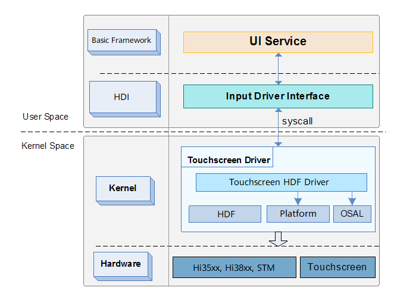
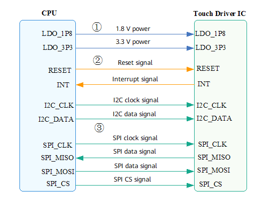

# Touchscreen Overview

## Introduction

-   **Functions of the Touchscreen driver**

    The Touchscreen driver is used to power on its integrated circuit \(IC\), configure and initialize hardware pins, register interrupts, configure Inter-Integrated Circuit \(I2C\) or SPI APIs, set input-related configurations, and download and update firmware, thereby enabling a touchscreen to work properly.

-   **Layers of the Touchscreen driver**

    Figure 1 shows an overall structure of the Touchscreen driver.

    The Touchscreen driver is developed based on the OpenHarmony Driver Foundation \(HDF\), Platform, and operating system abstraction layer \(OSAL\) interfaces. It provides hardware capabilities for external systems through the OpenHarmony Driver Interface \(HDI\) layer, so that upper-layer services can obtain driver capabilities through the HDI layer, and then control the touchscreen.

**Figure  1**  Layers of the Touchscreen driver  

-   **Advantages of developing drivers based on the HDF**

    The Touchscreen driver is developed based on the HDF  [Driver Development](driver-development.md)  and is implemented via calls to the OSAL and Platform APIs, including bus APIs and native operating system \(OS\) APIs \(such as memory, lock, thread, and timer\). The OSAL and Platform hides the differences of underlying hardware, so that the Touchscreen HDF driver can be executed across platforms and OSs. In this regard, you can develop the Touchscreen driver only once but deploy it on multiple devices.

## Available APIs

Based on the attributes of the pins, interfaces on the touchscreens can be classified into the following types:

-   Power interfaces
-   I/O control interfaces
-   Communications interfaces

**Figure  2**  Common pins of the touchscreen  

The interfaces shown in the figure are described as follows:

1.  **Power interfaces**
    -   LDO\_1P8: 1.8 V digital circuits
    -   LDO\_3P3: 3.3 V analog circuits

        Generally, the Touchscreen driver IC is separated from the LCD driver IC. In this case, the Touchscreen driver IC requires both 1.8 V and 3.3 V power supplies. Nowadays, the Touchscreen driver IC and LCD driver IC can be integrated. Therefore, the touchscreen, requires only the 1.8 V power supply, and the 3.3 V power required internally is supplied by the LCD VSP power \(typical value: 5.5 V\) in the driver chip IC.

2.  **I/O control interfaces**
    -   RESET: reset pin, which is used to reset the driver IC on the host when suspending or resuming the system.
    -   INT: interrupt pin, which needs to be set to the input direction and pull-up status during driver initialization. After detecting an external touch signal, the driver IC notifies the driver by operating the interrupt pin. The driver reads the touch reporting data in the ISR function.

3.  **Communications interfaces**
    -   I2C: Since only a small amount of touch data is reported by the touchscreen, I2C is used to transmit the reported data. For details about the I2C protocol and interfaces, see  [I2C Usage Guidelines](i2c-usage-guidelines.md).
    -   SPI: In addition to touch reporting data coordinates, some vendors need to obtain basic capacitance data. Therefore, Serial Peripheral Interface \(SPI\) is used to transmit such huge amount of data. For details about the SPI protocol and interfaces, see  [SPI Usage Guidelines](spiusage-guidelines.md).

