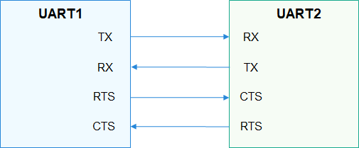

# UART Overview

## Introduction

-   The Universal Asynchronous Receiver/Transmitter \(UART\) is a universal serial data bus used for asynchronous communication. It enables bi-directional communication between devices in full-duplex mode.
-   UART is widely used to print information for debugging or to connect to various external modules such as GPS and Bluetooth.
-   A UART is connected to other modules through two wires \(as shown in  [Figure 1](#fig209936401896)\) or four wires \(as shown in  [Figure 2](#fig1435614171015)\).
    1.  TX: TX pin of the transmitting UART. It is connected to the RX pin of the peer UART.
    2.  RX: RX pin of the receiving UART. It is connected to the TX pin of the peer UART.
    3.  RTS: Request to Send signal pin. It is connected to the CTS pin of the peer UART and is used to indicate whether the local UART is ready to receive data.
    4.  CTS: Clear to Send signal pin. It is connected to the RTS pin of the peer UART and is used to indicate whether the local UART is allowed to send data to the peer end.

        **Figure  1**  2-wire UART communication  
        

        

        **Figure  2**  4-wire UART communication  
        

        

-   The transmitting and receiving UARTs must ensure that they have the same settings on particular attributes such as the baud rate and data format \(start bit, data bit, parity bit, and stop bit\) before they start to communicate. During data transmission, a UART sends data to the peer end over the TX pin and receives data from the peer end over the RX pin. When the size of the buffer used by a UART for storing received data reaches the preset threshold, the RTS signal of the UART changes to  **1**  \(data cannot be received\), and the peer UART stops sending data to it because its CTS signal does not allow it to send data.
-   The UART interface defines a set of common functions for operating a UART port, including obtaining and releasing device handles, reading and writing data of a specified length, and obtaining and setting the baud rate, as well as the device attributes.

## Available APIs

**Table  1**  APIs for the UART driver

<table><thead align="left"><tr id="row1223152681611"><th class="cellrowborder" valign="top" width="26.619999999999997%" id="mcps1.2.4.1.1">
<strong id="b4100105545211">Capability</strong>

</th>
<th class="cellrowborder" valign="top" width="31.369999999999997%" id="mcps1.2.4.1.2">
<strong id="b1653121711186">Function</strong>

</th>
<th class="cellrowborder" valign="top" width="42.01%" id="mcps1.2.4.1.3">
<strong id="b69108168153412">Description</strong>

</th>
</tr>
</thead>
<tbody><tr id="row1638573613415"><td class="cellrowborder" rowspan="2" valign="top" width="26.619999999999997%" headers="mcps1.2.4.1.1 ">
Obtaining and releasing device handles

</td>
<td class="cellrowborder" valign="top" width="31.369999999999997%" headers="mcps1.2.4.1.2 ">
UartOpen

</td>
<td class="cellrowborder" valign="top" width="42.01%" headers="mcps1.2.4.1.3 ">
Obtains the UART device handle.

</td>
</tr>
<tr id="row5950143316415"><td class="cellrowborder" valign="top" headers="mcps1.2.4.1.1 ">
UartClose

</td>
<td class="cellrowborder" valign="top" headers="mcps1.2.4.1.2 ">
Releases a specified UART device handle.

</td>
</tr>
<tr id="row34145016535"><td class="cellrowborder" rowspan="2" valign="top" width="26.619999999999997%" headers="mcps1.2.4.1.1 ">
Reading and writing data

</td>
<td class="cellrowborder" valign="top" width="31.369999999999997%" headers="mcps1.2.4.1.2 ">
UartRead

</td>
<td class="cellrowborder" valign="top" width="42.01%" headers="mcps1.2.4.1.3 ">
Reads data of a specified length from a UART device.

</td>
</tr>
<tr id="row11585016539"><td class="cellrowborder" valign="top" headers="mcps1.2.4.1.1 ">
UartWrite

</td>
<td class="cellrowborder" valign="top" headers="mcps1.2.4.1.2 ">
Writes data of a specified length into a UART device.

</td>
</tr>
<tr id="row8687115843715"><td class="cellrowborder" rowspan="2" valign="top" width="26.619999999999997%" headers="mcps1.2.4.1.1 ">
Obtaining and setting the baud rate

</td>
<td class="cellrowborder" valign="top" width="31.369999999999997%" headers="mcps1.2.4.1.2 ">
UartGetBaud

</td>
<td class="cellrowborder" valign="top" width="42.01%" headers="mcps1.2.4.1.3 ">
Obtains the UART baud rate.

</td>
</tr>
<tr id="row18987529382"><td class="cellrowborder" valign="top" headers="mcps1.2.4.1.1 ">
UartSetBaud

</td>
<td class="cellrowborder" valign="top" headers="mcps1.2.4.1.2 ">
Sets the UART baud rate.

</td>
</tr>
<tr id="row1551850115317"><td class="cellrowborder" rowspan="2" valign="top" width="26.619999999999997%" headers="mcps1.2.4.1.1 ">
Obtaining and setting device attributes

</td>
<td class="cellrowborder" valign="top" width="31.369999999999997%" headers="mcps1.2.4.1.2 ">
UartGetAttribute

</td>
<td class="cellrowborder" valign="top" width="42.01%" headers="mcps1.2.4.1.3 ">
Obtains the UART device attributes.

</td>
</tr>
<tr id="row7545065311"><td class="cellrowborder" valign="top" headers="mcps1.2.4.1.1 ">
UartSetAttribute

</td>
<td class="cellrowborder" valign="top" headers="mcps1.2.4.1.2 ">
Sets the UART device attributes.

</td>
</tr>
<tr id="row14614115403"><td class="cellrowborder" valign="top" width="26.619999999999997%" headers="mcps1.2.4.1.1 ">
Setting the transmission mode

</td>
<td class="cellrowborder" valign="top" width="31.369999999999997%" headers="mcps1.2.4.1.2 ">
UartSetTransMode

</td>
<td class="cellrowborder" valign="top" width="42.01%" headers="mcps1.2.4.1.3 ">
Sets the UART transmission mode.

</td>
</tr>
</tbody>
</table>

> **NOTE:** 
>All functions provided in this document can be called only in kernel space.

