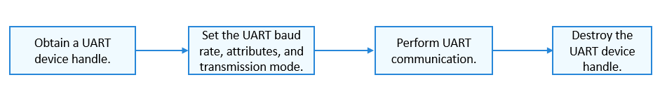

# UART Usage Guidelines<a name="EN-US_TOPIC_0000001052459079"></a>

## How to Use<a name="section47784125013"></a>

[Figure 1](#fig1852173020185)  shows the process of using a UART device.

**Figure  1**  Process of using a UART device<a name="fig1852173020185"></a>  




## Obtaining a UART Device Handle<a name="section146445153110"></a>

Before performing UART communication, call  **UartOpen**  to obtain a UART device handle. This function returns the pointer to the UART device handle with a specified port number.

struct DevHandle \*UartOpen\(uint32\_t port\);

**Table  1**  Description of  **UartOpen**

<a name="table14222165114310"></a>
<table><thead align="left"><tr id="row1022175133111"><th class="cellrowborder" valign="top" width="50%" id="mcps1.2.3.1.1"><p id="p13221551153117"><a name="p13221551153117"></a><a name="p13221551153117"></a><strong id="b14139220181318"><a name="b14139220181318"></a><a name="b14139220181318"></a>Parameter</strong></p>
</th>
<th class="cellrowborder" valign="top" width="50%" id="mcps1.2.3.1.2"><p id="p122211251103111"><a name="p122211251103111"></a><a name="p122211251103111"></a><strong id="b138421526171318"><a name="b138421526171318"></a><a name="b138421526171318"></a>Description</strong></p>
</th>
</tr>
</thead>
<tbody><tr id="row6222451133114"><td class="cellrowborder" valign="top" width="50%" headers="mcps1.2.3.1.1 "><p id="p92221518315"><a name="p92221518315"></a><a name="p92221518315"></a>port</p>
</td>
<td class="cellrowborder" valign="top" width="50%" headers="mcps1.2.3.1.2 "><p id="p1322217518318"><a name="p1322217518318"></a><a name="p1322217518318"></a>UART port number.</p>
</td>
</tr>
<tr id="row1122245153112"><td class="cellrowborder" valign="top" width="50%" headers="mcps1.2.3.1.1 "><p id="p102221451123118"><a name="p102221451123118"></a><a name="p102221451123118"></a><strong id="b1922235110318"><a name="b1922235110318"></a><a name="b1922235110318"></a>Return Value</strong></p>
</td>
<td class="cellrowborder" valign="top" width="50%" headers="mcps1.2.3.1.2 "><p id="p1122215143113"><a name="p1122215143113"></a><a name="p1122215143113"></a><strong id="b9395143891210"><a name="b9395143891210"></a><a name="b9395143891210"></a>Description</strong></p>
</td>
</tr>
<tr id="row522275114317"><td class="cellrowborder" valign="top" width="50%" headers="mcps1.2.3.1.1 "><p id="p422235114313"><a name="p422235114313"></a><a name="p422235114313"></a>NULL</p>
</td>
<td class="cellrowborder" valign="top" width="50%" headers="mcps1.2.3.1.2 "><p id="p5222351203112"><a name="p5222351203112"></a><a name="p5222351203112"></a>Failed to obtain the UART device handle.</p>
</td>
</tr>
<tr id="row1222212513311"><td class="cellrowborder" valign="top" width="50%" headers="mcps1.2.3.1.1 "><p id="p5222125115316"><a name="p5222125115316"></a><a name="p5222125115316"></a>Device handle</p>
</td>
<td class="cellrowborder" valign="top" width="50%" headers="mcps1.2.3.1.2 "><p id="p192228515311"><a name="p192228515311"></a><a name="p192228515311"></a>Pointer to the UART device handle.</p>
</td>
</tr>
</tbody>
</table>

The following example shows how to obtain a UART device handle based on the assumption that the UART port number is  **3**:

```
struct DevHandle *handle = NULL;    /* Pointer to the UART device handle */
uint32_t port = 3;                  /* UART port number */
handle = UartOpen(port);
if (handle == NULL) {
    HDF_LOGE("UartOpen: failed!\n");
    return;
}
```

## Setting the UART Baud Rate<a name="section1862705516339"></a>

After obtaining the UART device handle, set the UART baud rate by calling the following function:

int32\_t UartSetBaud\(struct DevHandle \*handle, uint32\_t baudRate\);

**Table  2**  Description of  **UartSetBaud**

<a name="table539135313325"></a>
<table><thead align="left"><tr id="row15391205311323"><th class="cellrowborder" valign="top" width="50%" id="mcps1.2.3.1.1"><p id="p11390453103216"><a name="p11390453103216"></a><a name="p11390453103216"></a><strong id="b10877122183418"><a name="b10877122183418"></a><a name="b10877122183418"></a>Parameter</strong></p>
</th>
<th class="cellrowborder" valign="top" width="50%" id="mcps1.2.3.1.2"><p id="p839065316328"><a name="p839065316328"></a><a name="p839065316328"></a><strong id="b18124271345"><a name="b18124271345"></a><a name="b18124271345"></a>Description</strong></p>
</th>
</tr>
</thead>
<tbody><tr id="row2039115373216"><td class="cellrowborder" valign="top" width="50%" headers="mcps1.2.3.1.1 "><p id="p1639165310324"><a name="p1639165310324"></a><a name="p1639165310324"></a>handle</p>
</td>
<td class="cellrowborder" valign="top" width="50%" headers="mcps1.2.3.1.2 "><p id="p539115320328"><a name="p539115320328"></a><a name="p539115320328"></a>Pointer to the UART device handle.</p>
</td>
</tr>
<tr id="row163911753143214"><td class="cellrowborder" valign="top" width="50%" headers="mcps1.2.3.1.1 "><p id="p13911653203215"><a name="p13911653203215"></a><a name="p13911653203215"></a>baudRate</p>
</td>
<td class="cellrowborder" valign="top" width="50%" headers="mcps1.2.3.1.2 "><p id="p163919537322"><a name="p163919537322"></a><a name="p163919537322"></a>Baud rate of the UART to set.</p>
</td>
</tr>
<tr id="row539155343218"><td class="cellrowborder" valign="top" width="50%" headers="mcps1.2.3.1.1 "><p id="p1039185313321"><a name="p1039185313321"></a><a name="p1039185313321"></a><strong id="b139195343217"><a name="b139195343217"></a><a name="b139195343217"></a>Return Value</strong></p>
</td>
<td class="cellrowborder" valign="top" width="50%" headers="mcps1.2.3.1.2 "><p id="p123911753143213"><a name="p123911753143213"></a><a name="p123911753143213"></a><strong id="b143911353163218"><a name="b143911353163218"></a><a name="b143911353163218"></a>Description</strong></p>
</td>
</tr>
<tr id="row2391853153218"><td class="cellrowborder" valign="top" width="50%" headers="mcps1.2.3.1.1 "><p id="p17391185310322"><a name="p17391185310322"></a><a name="p17391185310322"></a>0</p>
</td>
<td class="cellrowborder" valign="top" width="50%" headers="mcps1.2.3.1.2 "><p id="p14391653193210"><a name="p14391653193210"></a><a name="p14391653193210"></a>Succeeded in setting the UART baud rate.</p>
</td>
</tr>
<tr id="row23912053143211"><td class="cellrowborder" valign="top" width="50%" headers="mcps1.2.3.1.1 "><p id="p7391165320321"><a name="p7391165320321"></a><a name="p7391165320321"></a>Negative value</p>
</td>
<td class="cellrowborder" valign="top" width="50%" headers="mcps1.2.3.1.2 "><p id="p639185318322"><a name="p639185318322"></a><a name="p639185318322"></a>Failed to set the UART baud rate.</p>
</td>
</tr>
</tbody>
</table>

The following example shows how to set the UART baud rate to  **9600**:

```
int32_t ret;
/* Set the UART baud rate to 9600. */
ret = UartSetBaud(handle, 9600);
if (ret != 0) {
    HDF_LOGE("UartSetBaud: failed, ret %d\n", ret);
}
```

## Obtaining the UART Baud Rate<a name="section1263651563414"></a>

After setting the UART baud rate, obtain the current baud rate by calling the following function:

int32\_t UartGetBaud\(struct DevHandle \*handle, uint32\_t \*baudRate\);

**Table  3**  Description of  **UartGetBaud**

<a name="table20393185311326"></a>
<table><thead align="left"><tr id="row19392653123215"><th class="cellrowborder" valign="top" width="50%" id="mcps1.2.3.1.1"><p id="p6392105315326"><a name="p6392105315326"></a><a name="p6392105315326"></a><strong id="b13031862478"><a name="b13031862478"></a><a name="b13031862478"></a>Parameter</strong></p>
</th>
<th class="cellrowborder" valign="top" width="50%" id="mcps1.2.3.1.2"><p id="p53920531329"><a name="p53920531329"></a><a name="p53920531329"></a><strong id="b2951512104716"><a name="b2951512104716"></a><a name="b2951512104716"></a>Description</strong></p>
</th>
</tr>
</thead>
<tbody><tr id="row103921553103211"><td class="cellrowborder" valign="top" width="50%" headers="mcps1.2.3.1.1 "><p id="p1539220536326"><a name="p1539220536326"></a><a name="p1539220536326"></a>handle</p>
</td>
<td class="cellrowborder" valign="top" width="50%" headers="mcps1.2.3.1.2 "><p id="p6392553203217"><a name="p6392553203217"></a><a name="p6392553203217"></a>Pointer to the UART device handle.</p>
</td>
</tr>
<tr id="row1539211532322"><td class="cellrowborder" valign="top" width="50%" headers="mcps1.2.3.1.1 "><p id="p93921053123210"><a name="p93921053123210"></a><a name="p93921053123210"></a>baudRate</p>
</td>
<td class="cellrowborder" valign="top" width="50%" headers="mcps1.2.3.1.2 "><p id="p93926536328"><a name="p93926536328"></a><a name="p93926536328"></a>Pointer to the UART baud rate.</p>
</td>
</tr>
<tr id="row1239318531326"><td class="cellrowborder" valign="top" width="50%" headers="mcps1.2.3.1.1 "><p id="p17392653123213"><a name="p17392653123213"></a><a name="p17392653123213"></a><strong id="b3392165383219"><a name="b3392165383219"></a><a name="b3392165383219"></a>Return Value</strong></p>
</td>
<td class="cellrowborder" valign="top" width="50%" headers="mcps1.2.3.1.2 "><p id="p1339365316327"><a name="p1339365316327"></a><a name="p1339365316327"></a><strong id="b63932053183218"><a name="b63932053183218"></a><a name="b63932053183218"></a>Description</strong></p>
</td>
</tr>
<tr id="row143939531328"><td class="cellrowborder" valign="top" width="50%" headers="mcps1.2.3.1.1 "><p id="p2393953153213"><a name="p2393953153213"></a><a name="p2393953153213"></a>0</p>
</td>
<td class="cellrowborder" valign="top" width="50%" headers="mcps1.2.3.1.2 "><p id="p8393165383218"><a name="p8393165383218"></a><a name="p8393165383218"></a>Succeeded in obtaining the UART baud rate.</p>
</td>
</tr>
<tr id="row5393105363210"><td class="cellrowborder" valign="top" width="50%" headers="mcps1.2.3.1.1 "><p id="p17393125363215"><a name="p17393125363215"></a><a name="p17393125363215"></a>Negative value</p>
</td>
<td class="cellrowborder" valign="top" width="50%" headers="mcps1.2.3.1.2 "><p id="p1539325393211"><a name="p1539325393211"></a><a name="p1539325393211"></a>Failed to obtain the UART baud rate.</p>
</td>
</tr>
</tbody>
</table>

The following example shows how to obtain the UART baud rate:

```
int32_t ret;
uint32_t baudRate;
/* Obtain the UART baud rate. */
ret = UartGetBaud(handle, &baudRate);
if (ret != 0) {
    HDF_LOGE("UartGetBaud: failed, ret %d\n", ret);
}
```

## Setting the UART Device Attributes<a name="section1770091483814"></a>

Before performing UART communication, set the UART device attributes by calling the following function:

int32\_t UartSetAttribute\(struct DevHandle \*handle, struct UartAttribute \*attribute\);

**Table  4**  Description of  **UartSetAttribute**

<a name="table1453119335341"></a>
<table><thead align="left"><tr id="row3530433103416"><th class="cellrowborder" valign="top" width="49.980000000000004%" id="mcps1.2.3.1.1"><p id="p1853073310341"><a name="p1853073310341"></a><a name="p1853073310341"></a><strong id="b17354142517556"><a name="b17354142517556"></a><a name="b17354142517556"></a>Parameter</strong></p>
</th>
<th class="cellrowborder" valign="top" width="50.019999999999996%" id="mcps1.2.3.1.2"><p id="p553083393417"><a name="p553083393417"></a><a name="p553083393417"></a><strong id="b248128175515"><a name="b248128175515"></a><a name="b248128175515"></a>Description</strong></p>
</th>
</tr>
</thead>
<tbody><tr id="row55303331347"><td class="cellrowborder" valign="top" width="49.980000000000004%" headers="mcps1.2.3.1.1 "><p id="p1530113313341"><a name="p1530113313341"></a><a name="p1530113313341"></a>handle</p>
</td>
<td class="cellrowborder" valign="top" width="50.019999999999996%" headers="mcps1.2.3.1.2 "><p id="p3530173313346"><a name="p3530173313346"></a><a name="p3530173313346"></a>Pointer to the UART device handle.</p>
</td>
</tr>
<tr id="row45309337342"><td class="cellrowborder" valign="top" width="49.980000000000004%" headers="mcps1.2.3.1.1 "><p id="p553083319348"><a name="p553083319348"></a><a name="p553083319348"></a>attribute</p>
</td>
<td class="cellrowborder" valign="top" width="50.019999999999996%" headers="mcps1.2.3.1.2 "><p id="p5530133314343"><a name="p5530133314343"></a><a name="p5530133314343"></a>Pointer to the UART device attributes to set.</p>
</td>
</tr>
<tr id="row12530833103415"><td class="cellrowborder" valign="top" width="49.980000000000004%" headers="mcps1.2.3.1.1 "><p id="p185309331345"><a name="p185309331345"></a><a name="p185309331345"></a><strong id="b145302033193410"><a name="b145302033193410"></a><a name="b145302033193410"></a>Return Value</strong></p>
</td>
<td class="cellrowborder" valign="top" width="50.019999999999996%" headers="mcps1.2.3.1.2 "><p id="p145309332344"><a name="p145309332344"></a><a name="p145309332344"></a><strong id="b1891022419594"><a name="b1891022419594"></a><a name="b1891022419594"></a>Description</strong></p>
</td>
</tr>
<tr id="row14530203310348"><td class="cellrowborder" valign="top" width="49.980000000000004%" headers="mcps1.2.3.1.1 "><p id="p1653014339343"><a name="p1653014339343"></a><a name="p1653014339343"></a>0</p>
</td>
<td class="cellrowborder" valign="top" width="50.019999999999996%" headers="mcps1.2.3.1.2 "><p id="p1453023323419"><a name="p1453023323419"></a><a name="p1453023323419"></a>Succeeded in setting the UART device attributes.</p>
</td>
</tr>
<tr id="row6531163373412"><td class="cellrowborder" valign="top" width="49.980000000000004%" headers="mcps1.2.3.1.1 "><p id="p16530123310345"><a name="p16530123310345"></a><a name="p16530123310345"></a>Negative value</p>
</td>
<td class="cellrowborder" valign="top" width="50.019999999999996%" headers="mcps1.2.3.1.2 "><p id="p1953118334347"><a name="p1953118334347"></a><a name="p1953118334347"></a>Failed to set the UART device attributes.</p>
</td>
</tr>
</tbody>
</table>

The following example shows how to set the UART device attributes:

```
int32_t ret;
struct UartAttribute attribute;
attribute.dataBits = UART_ATTR_DATABIT_7;   /* Set the number of data bits to 7. */
attribute.parity = UART_ATTR_PARITY_NONE;   /* Set the parity bit to no parity. */
attribute.stopBits = UART_ATTR_STOPBIT_1;   /* Set the stop bit to 1. */
attribute.rts = UART_ATTR_RTS_DIS;          /* Disable the RTS signal. */
attribute.cts = UART_ATTR_CTS_DIS;          /* Disable the CTS signal. */
attribute.fifoRxEn = UART_ATTR_RX_FIFO_EN;  /* Enable RX FIFO. */
attribute.fifoTxEn = UART_ATTR_TX_FIFO_EN;  /* Enable TX FIFO. */
/* Set the UART device attributes. */
ret = UartSetAttribute(handle, &attribute);
if (ret != 0) {
    HDF_LOGE("UartSetAttribute: failed, ret %d\n", ret);
}
```

## Obtaining UART Device Attributes<a name="section117543316384"></a>

After setting the UART device attributes, obtain the current device attributes by calling the following function:

int32\_t UartGetAttribute\(struct DevHandle \*handle, struct UartAttribute \*attribute\);

**Table  5**  Description of  **UartGetAttribute**

<a name="table17532123316342"></a>
<table><thead align="left"><tr id="row18531193383420"><th class="cellrowborder" valign="top" width="50%" id="mcps1.2.3.1.1"><p id="p85311833143420"><a name="p85311833143420"></a><a name="p85311833143420"></a><strong id="b11621281386"><a name="b11621281386"></a><a name="b11621281386"></a>Parameter</strong></p>
</th>
<th class="cellrowborder" valign="top" width="50%" id="mcps1.2.3.1.2"><p id="p17531103319348"><a name="p17531103319348"></a><a name="p17531103319348"></a><strong id="b18315030683"><a name="b18315030683"></a><a name="b18315030683"></a>Description</strong></p>
</th>
</tr>
</thead>
<tbody><tr id="row35311533153413"><td class="cellrowborder" valign="top" width="50%" headers="mcps1.2.3.1.1 "><p id="p453133333418"><a name="p453133333418"></a><a name="p453133333418"></a>handle</p>
</td>
<td class="cellrowborder" valign="top" width="50%" headers="mcps1.2.3.1.2 "><p id="p753193323420"><a name="p753193323420"></a><a name="p753193323420"></a>Pointer to the UART device handle.</p>
</td>
</tr>
<tr id="row1953103315344"><td class="cellrowborder" valign="top" width="50%" headers="mcps1.2.3.1.1 "><p id="p35315333346"><a name="p35315333346"></a><a name="p35315333346"></a>attribute</p>
</td>
<td class="cellrowborder" valign="top" width="50%" headers="mcps1.2.3.1.2 "><p id="p14531633133416"><a name="p14531633133416"></a><a name="p14531633133416"></a>Pointer to the UART device attributes.</p>
</td>
</tr>
<tr id="row45321433143415"><td class="cellrowborder" valign="top" width="50%" headers="mcps1.2.3.1.1 "><p id="p653273363417"><a name="p653273363417"></a><a name="p653273363417"></a><strong id="b19531153314349"><a name="b19531153314349"></a><a name="b19531153314349"></a>Return Value</strong></p>
</td>
<td class="cellrowborder" valign="top" width="50%" headers="mcps1.2.3.1.2 "><p id="p1653203312347"><a name="p1653203312347"></a><a name="p1653203312347"></a><strong id="b185321330348"><a name="b185321330348"></a><a name="b185321330348"></a>Description</strong></p>
</td>
</tr>
<tr id="row175320339342"><td class="cellrowborder" valign="top" width="50%" headers="mcps1.2.3.1.1 "><p id="p10532163383412"><a name="p10532163383412"></a><a name="p10532163383412"></a>0</p>
</td>
<td class="cellrowborder" valign="top" width="50%" headers="mcps1.2.3.1.2 "><p id="p5532143319341"><a name="p5532143319341"></a><a name="p5532143319341"></a>Succeeded in obtaining the UART device attributes.</p>
</td>
</tr>
<tr id="row125327337340"><td class="cellrowborder" valign="top" width="50%" headers="mcps1.2.3.1.1 "><p id="p19532153317345"><a name="p19532153317345"></a><a name="p19532153317345"></a>Negative value</p>
</td>
<td class="cellrowborder" valign="top" width="50%" headers="mcps1.2.3.1.2 "><p id="p175321933163410"><a name="p175321933163410"></a><a name="p175321933163410"></a>Failed to obtain the UART device attributes.</p>
</td>
</tr>
</tbody>
</table>

The following example shows how to obtain the UART device attributes:

```
int32_t ret;
struct UartAttribute attribute;
/* Obtain the UART attributes. */
ret = UartGetAttribute(handle, &attribute);
if (ret != 0) {
    HDF_LOGE("UartGetAttribute: failed, ret %d\n", ret);
}
```

## Setting the UART Transmission Mode<a name="section187233112369"></a>

Before performing UART communication, set the UART transmission mode by calling the following function:

int32\_t UartSetTransMode\(struct DevHandle \*handle, enum UartTransMode mode\);

**Table  6**  Description of  **UartSetTransMode**

<a name="table131892266313"></a>
<table><thead align="left"><tr id="row018922615318"><th class="cellrowborder" valign="top" width="49.980000000000004%" id="mcps1.2.3.1.1"><p id="p131891826835"><a name="p131891826835"></a><a name="p131891826835"></a><strong id="b154613351126"><a name="b154613351126"></a><a name="b154613351126"></a>Parameter</strong></p>
</th>
<th class="cellrowborder" valign="top" width="50.019999999999996%" id="mcps1.2.3.1.2"><p id="p101894269314"><a name="p101894269314"></a><a name="p101894269314"></a><strong id="b1220383761219"><a name="b1220383761219"></a><a name="b1220383761219"></a>Description</strong></p>
</th>
</tr>
</thead>
<tbody><tr id="row11893261734"><td class="cellrowborder" valign="top" width="49.980000000000004%" headers="mcps1.2.3.1.1 "><p id="p81897261333"><a name="p81897261333"></a><a name="p81897261333"></a>handle</p>
</td>
<td class="cellrowborder" valign="top" width="50.019999999999996%" headers="mcps1.2.3.1.2 "><p id="p5190142618310"><a name="p5190142618310"></a><a name="p5190142618310"></a>Pointer to the UART device handle.</p>
</td>
</tr>
<tr id="row1119082615317"><td class="cellrowborder" valign="top" width="49.980000000000004%" headers="mcps1.2.3.1.1 "><p id="p1519012261314"><a name="p1519012261314"></a><a name="p1519012261314"></a>mode</p>
</td>
<td class="cellrowborder" valign="top" width="50.019999999999996%" headers="mcps1.2.3.1.2 "><p id="p121901026632"><a name="p121901026632"></a><a name="p121901026632"></a>UART transmission mode to set.</p>
</td>
</tr>
<tr id="row19190152612317"><td class="cellrowborder" valign="top" width="49.980000000000004%" headers="mcps1.2.3.1.1 "><p id="p131900266316"><a name="p131900266316"></a><a name="p131900266316"></a><strong id="b61902026833"><a name="b61902026833"></a><a name="b61902026833"></a>Return Value</strong></p>
</td>
<td class="cellrowborder" valign="top" width="50.019999999999996%" headers="mcps1.2.3.1.2 "><p id="p1519022616315"><a name="p1519022616315"></a><a name="p1519022616315"></a><strong id="b319014261837"><a name="b319014261837"></a><a name="b319014261837"></a>Description</strong></p>
</td>
</tr>
<tr id="row919016261932"><td class="cellrowborder" valign="top" width="49.980000000000004%" headers="mcps1.2.3.1.1 "><p id="p10190526334"><a name="p10190526334"></a><a name="p10190526334"></a>0</p>
</td>
<td class="cellrowborder" valign="top" width="50.019999999999996%" headers="mcps1.2.3.1.2 "><p id="p1219012264318"><a name="p1219012264318"></a><a name="p1219012264318"></a>Succeeded in setting the UART transmission mode.</p>
</td>
</tr>
<tr id="row1219017262313"><td class="cellrowborder" valign="top" width="49.980000000000004%" headers="mcps1.2.3.1.1 "><p id="p15190162616316"><a name="p15190162616316"></a><a name="p15190162616316"></a>Negative value</p>
</td>
<td class="cellrowborder" valign="top" width="50.019999999999996%" headers="mcps1.2.3.1.2 "><p id="p131906262311"><a name="p131906262311"></a><a name="p131906262311"></a>Failed to set the UART transmission mode.</p>
</td>
</tr>
</tbody>
</table>

The following example shows how to set the transmission mode to  **UART\_MODE\_RD\_BLOCK**:

```
int32_t ret;
/* Set the UART transmission mode. */
ret = UartSetTransMode(handle, UART_MODE_RD_BLOCK);
if (ret != 0) {
    HDF_LOGE("UartSetTransMode: failed, ret %d\n", ret);
}
```

## Writing Data of a Specified Length into a UART Device<a name="section82416423368"></a>

To write data into a UART device, call the following function:

int32\_t UartWrite\(struct DevHandle \*handle, uint8\_t \*data, uint32\_t size\);

**Table  7**  Description of  **UartWrite**

<a name="table27825111368"></a>
<table><thead align="left"><tr id="row1578171123619"><th class="cellrowborder" valign="top" width="50%" id="mcps1.2.3.1.1"><p id="p078112115360"><a name="p078112115360"></a><a name="p078112115360"></a><strong id="b10406115511814"><a name="b10406115511814"></a><a name="b10406115511814"></a>Parameter</strong></p>
</th>
<th class="cellrowborder" valign="top" width="50%" id="mcps1.2.3.1.2"><p id="p37811711163612"><a name="p37811711163612"></a><a name="p37811711163612"></a><strong id="b151719578187"><a name="b151719578187"></a><a name="b151719578187"></a>Description</strong></p>
</th>
</tr>
</thead>
<tbody><tr id="row1878291143611"><td class="cellrowborder" valign="top" width="50%" headers="mcps1.2.3.1.1 "><p id="p07818112360"><a name="p07818112360"></a><a name="p07818112360"></a>handle</p>
</td>
<td class="cellrowborder" valign="top" width="50%" headers="mcps1.2.3.1.2 "><p id="p178281113369"><a name="p178281113369"></a><a name="p178281113369"></a>Pointer to the UART device handle.</p>
</td>
</tr>
<tr id="row7782811123614"><td class="cellrowborder" valign="top" width="50%" headers="mcps1.2.3.1.1 "><p id="p8782911173610"><a name="p8782911173610"></a><a name="p8782911173610"></a>data</p>
</td>
<td class="cellrowborder" valign="top" width="50%" headers="mcps1.2.3.1.2 "><p id="p17782171120366"><a name="p17782171120366"></a><a name="p17782171120366"></a>Pointer to the data to write.</p>
</td>
</tr>
<tr id="row1578251112367"><td class="cellrowborder" valign="top" width="50%" headers="mcps1.2.3.1.1 "><p id="p3782911183612"><a name="p3782911183612"></a><a name="p3782911183612"></a>size</p>
</td>
<td class="cellrowborder" valign="top" width="50%" headers="mcps1.2.3.1.2 "><p id="p17782161110366"><a name="p17782161110366"></a><a name="p17782161110366"></a>Length of the data to write.</p>
</td>
</tr>
<tr id="row1378281113363"><td class="cellrowborder" valign="top" width="50%" headers="mcps1.2.3.1.1 "><p id="p87821411183616"><a name="p87821411183616"></a><a name="p87821411183616"></a><strong id="b157825113363"><a name="b157825113363"></a><a name="b157825113363"></a>Return Value</strong></p>
</td>
<td class="cellrowborder" valign="top" width="50%" headers="mcps1.2.3.1.2 "><p id="p13782111116361"><a name="p13782111116361"></a><a name="p13782111116361"></a><strong id="b978211113366"><a name="b978211113366"></a><a name="b978211113366"></a>Description</strong></p>
</td>
</tr>
<tr id="row47822112365"><td class="cellrowborder" valign="top" width="50%" headers="mcps1.2.3.1.1 "><p id="p107821011103613"><a name="p107821011103613"></a><a name="p107821011103613"></a>0</p>
</td>
<td class="cellrowborder" valign="top" width="50%" headers="mcps1.2.3.1.2 "><p id="p11782191103610"><a name="p11782191103610"></a><a name="p11782191103610"></a>Succeeded in writing data into the UART device.</p>
</td>
</tr>
<tr id="row11782911113611"><td class="cellrowborder" valign="top" width="50%" headers="mcps1.2.3.1.1 "><p id="p1578221111367"><a name="p1578221111367"></a><a name="p1578221111367"></a>Negative value</p>
</td>
<td class="cellrowborder" valign="top" width="50%" headers="mcps1.2.3.1.2 "><p id="p9782151110366"><a name="p9782151110366"></a><a name="p9782151110366"></a>Failed to write data into the UART device.</p>
</td>
</tr>
</tbody>
</table>

The following example shows how to write data of a specified length into the UART device:

```
int32_t ret;
uint8_t wbuff[5] = {1, 2, 3, 4, 5};
/* Write 5-byte data into the UART device. */
ret = UartWrite(handle, wbuff, 5);
if (ret != 0) {
    HDF_LOGE("UartWrite: failed, ret %d\n", ret);
}
```

## Reading Data of a Specified Length from a UART Device<a name="section192177171373"></a>

To read data from a UART device, call the following function:

int32\_t UartRead\(struct DevHandle \*handle, uint8\_t \*data, uint32\_t size\);

**Table  8**  Description of  **UartRead**

<a name="table162341717123713"></a>
<table><thead align="left"><tr id="row023313171377"><th class="cellrowborder" valign="top" width="50%" id="mcps1.2.3.1.1"><p id="p1123331710376"><a name="p1123331710376"></a><a name="p1123331710376"></a><strong id="b1549543382511"><a name="b1549543382511"></a><a name="b1549543382511"></a>Parameter</strong></p>
</th>
<th class="cellrowborder" valign="top" width="50%" id="mcps1.2.3.1.2"><p id="p523321783715"><a name="p523321783715"></a><a name="p523321783715"></a><strong id="b18182536152512"><a name="b18182536152512"></a><a name="b18182536152512"></a>Description</strong></p>
</th>
</tr>
</thead>
<tbody><tr id="row6234417133712"><td class="cellrowborder" valign="top" width="50%" headers="mcps1.2.3.1.1 "><p id="p7233121716379"><a name="p7233121716379"></a><a name="p7233121716379"></a>handle</p>
</td>
<td class="cellrowborder" valign="top" width="50%" headers="mcps1.2.3.1.2 "><p id="p17234101753712"><a name="p17234101753712"></a><a name="p17234101753712"></a>Pointer to the UART device handle.</p>
</td>
</tr>
<tr id="row18234151718372"><td class="cellrowborder" valign="top" width="50%" headers="mcps1.2.3.1.1 "><p id="p16234191783711"><a name="p16234191783711"></a><a name="p16234191783711"></a>data</p>
</td>
<td class="cellrowborder" valign="top" width="50%" headers="mcps1.2.3.1.2 "><p id="p923417175378"><a name="p923417175378"></a><a name="p923417175378"></a>Pointer to the buffer for receiving the data.</p>
</td>
</tr>
<tr id="row82341017193711"><td class="cellrowborder" valign="top" width="50%" headers="mcps1.2.3.1.1 "><p id="p13234917103717"><a name="p13234917103717"></a><a name="p13234917103717"></a>size</p>
</td>
<td class="cellrowborder" valign="top" width="50%" headers="mcps1.2.3.1.2 "><p id="p182341817153717"><a name="p182341817153717"></a><a name="p182341817153717"></a>Length of the data to read.</p>
</td>
</tr>
<tr id="row102341617123717"><td class="cellrowborder" valign="top" width="50%" headers="mcps1.2.3.1.1 "><p id="p172341617163712"><a name="p172341617163712"></a><a name="p172341617163712"></a><strong id="b1323411179373"><a name="b1323411179373"></a><a name="b1323411179373"></a>Return Value</strong></p>
</td>
<td class="cellrowborder" valign="top" width="50%" headers="mcps1.2.3.1.2 "><p id="p1623431763718"><a name="p1623431763718"></a><a name="p1623431763718"></a><strong id="b1123411173377"><a name="b1123411173377"></a><a name="b1123411173377"></a>Description</strong></p>
</td>
</tr>
<tr id="row4234151719372"><td class="cellrowborder" valign="top" width="50%" headers="mcps1.2.3.1.1 "><p id="p3234131716375"><a name="p3234131716375"></a><a name="p3234131716375"></a>Non-negative value</p>
</td>
<td class="cellrowborder" valign="top" width="50%" headers="mcps1.2.3.1.2 "><p id="p7234171783718"><a name="p7234171783718"></a><a name="p7234171783718"></a>Length of the data read from the UART device.</p>
</td>
</tr>
<tr id="row112340173378"><td class="cellrowborder" valign="top" width="50%" headers="mcps1.2.3.1.1 "><p id="p1423431743714"><a name="p1423431743714"></a><a name="p1423431743714"></a>Negative value</p>
</td>
<td class="cellrowborder" valign="top" width="50%" headers="mcps1.2.3.1.2 "><p id="p32349178378"><a name="p32349178378"></a><a name="p32349178378"></a>Failed to read data from the UART device.</p>
</td>
</tr>
</tbody>
</table>

The following example shows how to read data of a specified length from the UART device:

```
int32_t ret;
uint8_t rbuff[5] = {0};
/* Read 5-byte data from the UART device. */
ret = UartRead(handle, rbuff, 5);
if (ret < 0) {
    HDF_LOGE("UartRead: failed, ret %d\n", ret);
}
```

> **CAUTION:** 
>Data is successfully read from the UART device if a non-negative value is returned. If the return value is  **0**, no valid data can be read from the UART device. If the return value is greater than  **0**, the return value is the length of the data actually read from the UART device. The length is less than or equal to the value of  **size**  and does not exceed the maximum length of data to read at a time specified by the UART controller in use.

## Destroying the UART Device Handle<a name="section63131236354"></a>

After the UART communication, destroy the UART device handle by calling the following function:

void UartClose\(struct DevHandle \*handle\);

This function will release the resources previously obtained.

**Table  9**  Description of  **UartClose**

<a name="table03348317351"></a>
<table><thead align="left"><tr id="row15334837351"><th class="cellrowborder" valign="top" width="50%" id="mcps1.2.3.1.1"><p id="p933411316354"><a name="p933411316354"></a><a name="p933411316354"></a><strong id="b0361347203119"><a name="b0361347203119"></a><a name="b0361347203119"></a>Parameter</strong></p>
</th>
<th class="cellrowborder" valign="top" width="50%" id="mcps1.2.3.1.2"><p id="p16334103143517"><a name="p16334103143517"></a><a name="p16334103143517"></a><strong id="b114175427319"><a name="b114175427319"></a><a name="b114175427319"></a>Description</strong></p>
</th>
</tr>
</thead>
<tbody><tr id="row733483103513"><td class="cellrowborder" valign="top" width="50%" headers="mcps1.2.3.1.1 "><p id="p7334530358"><a name="p7334530358"></a><a name="p7334530358"></a>handle</p>
</td>
<td class="cellrowborder" valign="top" width="50%" headers="mcps1.2.3.1.2 "><p id="p133341331356"><a name="p133341331356"></a><a name="p133341331356"></a>Pointer to the UART device handle</p>
</td>
</tr>
</tbody>
</table>

The following example shows how to destroy the UART device handle:

```
UartClose(handle); /* Destroy the UART device handle. */
```

