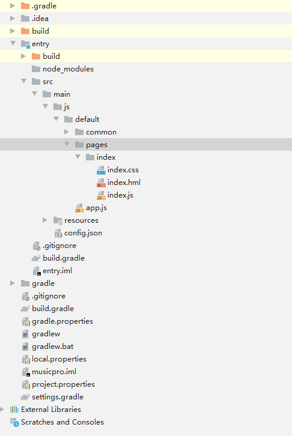

# Adding Pages

## Creating the Home Page \(Creating a Project\)

After the project is created, the  **index**  page is generated by default. The following figure shows the project directory.

**Figure  1**  Project directory  

## Creating Detail and History Pages

Perform the following steps twice to create the rest two pages:

1.  Right-click  **pages**  and choose  **New**  \>  **JS Page**.

    **Figure  2**  Adding a page  
    

2.  Enter the page name.

    **Figure  3**  Entering the page name  
    

3.  Confirm the creation.

    The following figure shows the application project directory after the  **detail**  page and  **history**  page are created. Each page contains a  **.hml**  layout file, a  **.css**  file, and a  **.js**  file \(containing service logic code\).

    **Figure  4**  Complete project directory  
    

