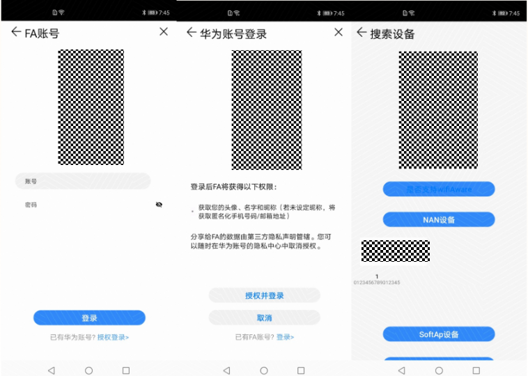
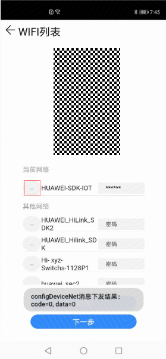
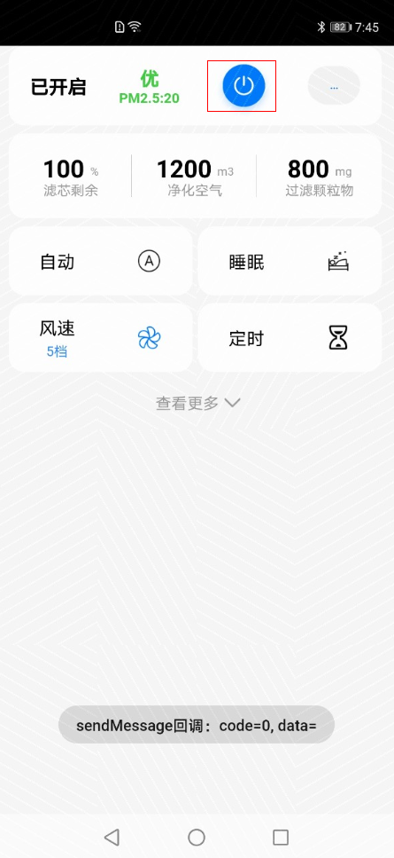
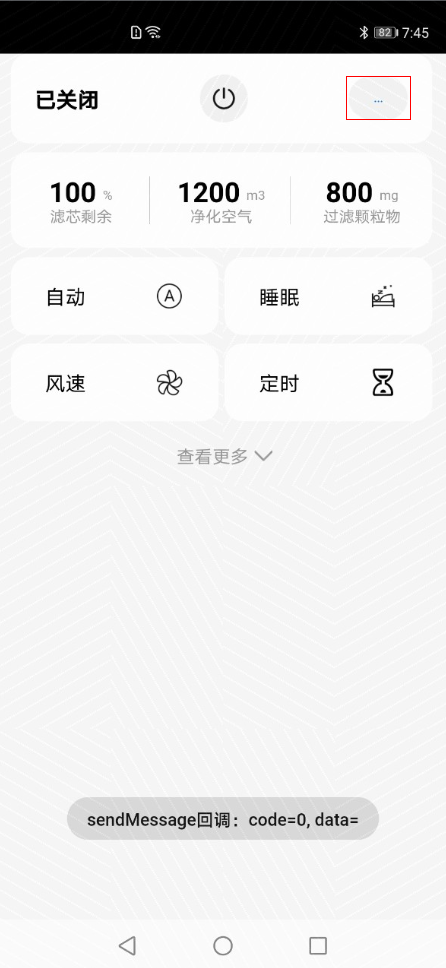
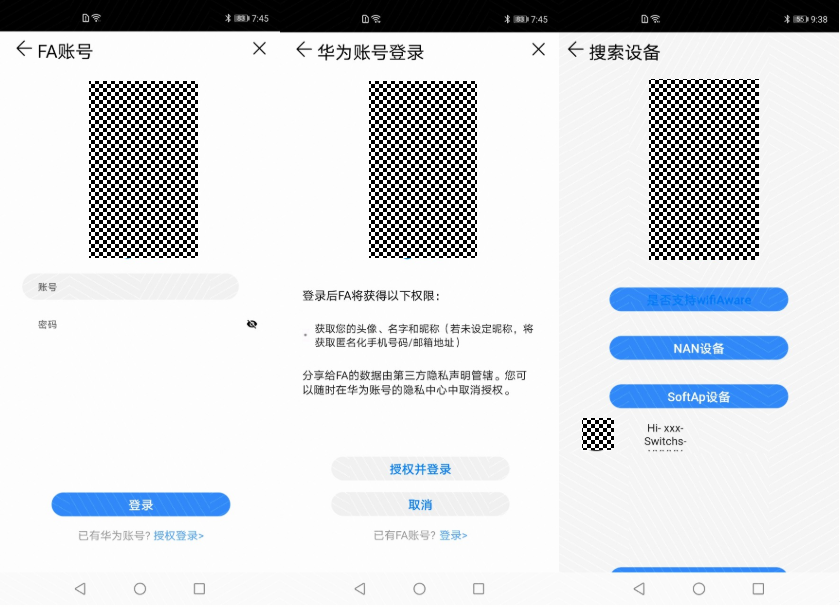
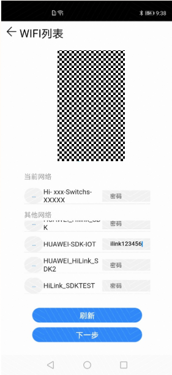

# Debugging and verification<a name="EN-US_TOPIC_0000001054370931"></a>

For details about the burning process, see the Hi3861 Quick Start - Burning. The following describes the verification process of the power distribution network.

## Non-perceptive network distribution function verification<a name="section17434165181917"></a>

1.  Start the module with the power distribution sample service to enable the module to enter the to-be-distributed state, as shown in the following figure.

    ```
    sdk ver:Hi3861V100R001C00SPC023 2020-06-09 13:30:00
    FileSystem mount ok.
    wifi init success!
     app_main test
    [sample] main biz.
    ap start succ
    Nan Init Success
    nan state(0)->(1)
    wait STA join AP
    [sample] main biz.
    [sample] main biz.
    wait STA join AP
    ```

2.  Start the app on the mobile phone. \(This app is an internal debugging demo. Developers need to develop FAs by themselves. The following describes only the network configuration process.\) Click Login Authorization \> Login Authorization \> NAN Device, and place the mobile phone close to the module, a new device is found. \(In the following figure, the product icon is changed to 1, and the SN is changed to 0123456789012345.\)

    **Figure  1**  Discovering a new device<a name="fig1937218217356"></a>  
    

    

3.  Click the device to enter the configuration page. Select the hotspot SSID, enter the password, and click the button for network configuration \(...\), as shown in the following figure.

    **Figure  2**  Wi-Fi network configuration page<a name="fig1430415418710"></a>  
    

    

4.  Click Next. On the second control page that is displayed, click the power button. The device receives the control message, as shown in the following figure.

    **Figure  3**  Control page<a name="fig1942486371"></a>  
    

    

5.  On the second control page, click the disconnection button. After you click the button, the device receives a message indicating that it will exit the NAN.

    **Figure  4**  Exiting the Control Interface<a name="fig4607161183917"></a>  
    

    


## SoftAP network configuration mode verification<a name="section1939531372015"></a>

1.  Start the module with the power distribution sample service to enable the module to enter the to-be-distributed state, as shown in the following figure.

    ```
    sdk ver:Hi3861V100R001C00SPC023 2020-06-09 13:30:00
    FileSystem mount ok.
    wifi init success!
     app_main test
    [sample] main biz.
    ap start succ
    Nan Init Success
    nan state(0)->(1)
    wait STA join AP
    [sample] main biz.
    [sample] main biz.
    wait STA join AP
    ```

2.  Start the app on the mobile phone. \(This app is an internal debugging demo. Developers need to develop FAs by themselves. The following describes only the network configuration process.\) Choose Authorization Login \> Authorization and Login \> SoftAP Device to discover new devices \(Hi-xxx-Switchs-xxxxx in the following figure\).

    **Figure  5**  Discover Device page<a name="fig14593216174012"></a>  
    

    

3.  Tap the device icon and wait for the app to automatically switch to the page for selecting a Wi-Fi hotspot. Select a hotspot, enter the password, and click.... The device receives the network configuration data, as shown in the following figure.

    **Figure  6**  Device configuration page<a name="fig3100125717408"></a>  
    

    


## FAQs<a name="section43521923135514"></a>

None

