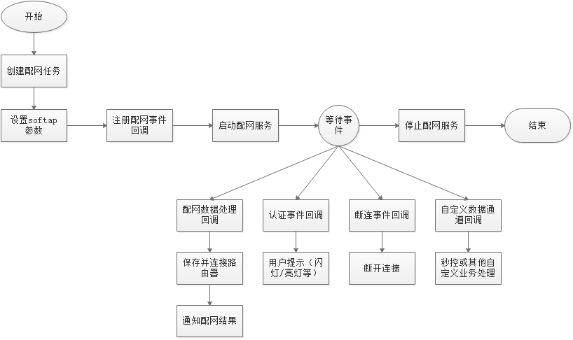

# Development and Compilation<a name="EN-US_TOPIC_0000001054690948"></a>

The examples of the insensitive network configuration are stored in the applications/sample/wifi-iot/app/network\_config/network\_config\_sample.c file. According to, the service process of the non-sense distribution network can be divided into two parts: distribution network service life cycle management and distribution network service callback event processing.

**Figure  1**  Sample flowchart of the non-sensitive power distribution network<a name="fig484117862220"></a>  




**Table  1**  Event Function Description

<a name="table1663195102710"></a>
<table><thead align="left"><tr id="row96641751172718"><th class="cellrowborder" valign="top" width="23.330000000000002%" id="mcps1.2.3.1.1"><p id="p666412518277"><a name="p666412518277"></a><a name="p666412518277"></a><strong id="b1189877390111025"><a name="b1189877390111025"></a><a name="b1189877390111025"></a>Event Type</strong></p>
</th>
<th class="cellrowborder" valign="top" width="76.67%" id="mcps1.2.3.1.2"><p id="p12664165117270"><a name="p12664165117270"></a><a name="p12664165117270"></a>Function</p>
</th>
</tr>
</thead>
<tbody><tr id="row7371114142512"><td class="cellrowborder" valign="top" width="23.330000000000002%" headers="mcps1.2.3.1.1 "><p id="p11371101411253"><a name="p11371101411253"></a><a name="p11371101411253"></a>GetPinCode</p>
</td>
<td class="cellrowborder" valign="top" width="76.67%" headers="mcps1.2.3.1.2 "><p id="p83711414132520"><a name="p83711414132520"></a><a name="p83711414132520"></a>This interface is used to establish a secure channel between a device and a mobile phone. It is used for callback during encryption key negotiation. The security PIN must be preset.</p>
</td>
</tr>
<tr id="row17664185116276"><td class="cellrowborder" valign="top" width="23.330000000000002%" headers="mcps1.2.3.1.1 "><p id="p0664251192719"><a name="p0664251192719"></a><a name="p0664251192719"></a>ParseNetCfgData</p>
</td>
<td class="cellrowborder" valign="top" width="76.67%" headers="mcps1.2.3.1.2 "><p id="p116642051192713"><a name="p116642051192713"></a><a name="p116642051192713"></a>After a connection is set up between the device and mobile phone, the mobile app can send the SSID password to the device. After receiving an SSID password message from a mobile phone, the device invokes this interface to notify the device application.</p>
</td>
</tr>
<tr id="row1766465120271"><td class="cellrowborder" valign="top" width="23.330000000000002%" headers="mcps1.2.3.1.1 "><p id="p9664135118277"><a name="p9664135118277"></a><a name="p9664135118277"></a>OnDisconnect</p>
</td>
<td class="cellrowborder" valign="top" width="76.67%" headers="mcps1.2.3.1.2 "><p id="p14481135185914"><a name="p14481135185914"></a><a name="p14481135185914"></a>The device is disconnected from the mobile phone in the following scenarios:</p>
<a name="ol88722338115"></a><a name="ol88722338115"></a><ol id="ol88722338115"><li>After sending the SSID password, the mobile app sends a disconnection command to the device.</li><li>The heartbeat between the device and the NAN channel of the mobile phone times out, and the device proactively disconnects from the NAN channel.</li></ol>
</td>
</tr>
<tr id="row5664175192720"><td class="cellrowborder" valign="top" width="23.330000000000002%" headers="mcps1.2.3.1.1 "><p id="p3664165114278"><a name="p3664165114278"></a><a name="p3664165114278"></a>RecvRawData</p>
</td>
<td class="cellrowborder" valign="top" width="76.67%" headers="mcps1.2.3.1.2 "><p id="p1766495116277"><a name="p1766495116277"></a><a name="p1766495116277"></a>After the device establishes a connection to the mobile phone, the mobile phone app may send a custom message (for example, a control message) to the device. After receiving such a message, the device transfers the message to the device application through this interface. The device application calls the SendRawData API to send a response to the application.</p>
</td>
</tr>
<tr id="row5585164917297"><td class="cellrowborder" valign="top" width="23.330000000000002%" headers="mcps1.2.3.1.1 "><p id="p3586149102911"><a name="p3586149102911"></a><a name="p3586149102911"></a>NotifyNetCfgStatus</p>
</td>
<td class="cellrowborder" valign="top" width="76.67%" headers="mcps1.2.3.1.2 "><p id="p11586194992912"><a name="p11586194992912"></a><a name="p11586194992912"></a>After a device is successfully connected to a mobile phone, this interface is used to instruct the device application to blink or light the indicator to notify the device that the device is in the network configuration state.</p>
</td>
</tr>
</tbody>
</table>

## Distribution network service lifecycle management<a name="section114323217503"></a>

Distribution network service life cycle management includes creation and release of distribution network services.

1.  Before the network distribution starts, complete network distribution event registration \(configure the callback function\), set the SoftAp hotspot parameters, and start the network distribution service.

    The network configuration callback event consists of four callback functions: GetPinCode, ParseNetCfgData, OnDisconnect, RecvRawData and NotifyNetCfgStatus. This interface is invoked when the network configuration service receives the SSID message, connection release message, second control message, and connection setup message from the mobile phone. You are advised to register all event callback interfaces. If you do not need to pay attention to an event callback interface, you can implement an empty function or set it to NULL, and then register the event by using the RegNetCfgCallback function.

    When setting the hotspot parameters of the SoftAP, pay attention to the input parameters of the int SetSoftAPParameter\(const struct SoftAPParam \*param\) function. For details, see the API description of the NetcfgService module. Note: If the SoftAP does not need to be enabled for the network configuration service, set all the values of the ssid field to 0.

    When starting the network configuration service, pay attention to the three input parameters of the int StartNetCfg\(const struct DevInfo \*devInfoList, unsigned int listSize, enum NetCfgType mode\) function.

    **Table  2**  Parameter structure of the int StartNetCfg type

    <a name="table0623181212572"></a>
    <table><thead align="left"><tr id="row12624141285711"><th class="cellrowborder" valign="top" width="13.41%" id="mcps1.2.3.1.1"><p id="p7624181255719"><a name="p7624181255719"></a><a name="p7624181255719"></a>Input Parameter</p>
    </th>
    <th class="cellrowborder" valign="top" width="86.59%" id="mcps1.2.3.1.2"><p id="p1062451285719"><a name="p1062451285719"></a><a name="p1062451285719"></a>Description</p>
    </th>
    </tr>
    </thead>
    <tbody><tr id="row136241912185720"><td class="cellrowborder" valign="top" width="13.41%" headers="mcps1.2.3.1.1 "><p id="p2624171213579"><a name="p2624171213579"></a><a name="p2624171213579"></a>devInfoList</p>
    </td>
    <td class="cellrowborder" valign="top" width="86.59%" headers="mcps1.2.3.1.2 "><p id="p116243127579"><a name="p116243127579"></a><a name="p116243127579"></a>Indicates the device information list. Currently, the device information to be configured includes productId and sn. The device information is configured in the format of key|value. Example:</p>
    <p id="p72329935618"><a name="p72329935618"></a><a name="p72329935618"></a>struct DevInfo devInfo[2];</p>
    <p id="p132323985613"><a name="p132323985613"></a><a name="p132323985613"></a>memset(&amp;devInfo, 0, sizeof(devInfo));</p>
    <p id="p1623219105610"><a name="p1623219105610"></a><a name="p1623219105610"></a>devInfo[0].key = "productId";</p>
    <p id="p1825117171578"><a name="p1825117171578"></a><a name="p1825117171578"></a>devInfo[0].value = "1";</p>
    <p id="p142325955618"><a name="p142325955618"></a><a name="p142325955618"></a>devInfo[1].key = "sn";</p>
    <p id="p102322945618"><a name="p102322945618"></a><a name="p102322945618"></a>devInfo[1].value = "01234567890123456";</p>
    </td>
    </tr>
    <tr id="row4624201265712"><td class="cellrowborder" valign="top" width="13.41%" headers="mcps1.2.3.1.1 "><p id="p7624101235711"><a name="p7624101235711"></a><a name="p7624101235711"></a>listSize</p>
    </td>
    <td class="cellrowborder" valign="top" width="86.59%" headers="mcps1.2.3.1.2 "><p id="p1262418129576"><a name="p1262418129576"></a><a name="p1262418129576"></a>Number of parameters in the device information list, that is, the size of the devInfo array. Ensure that the size of the devInfo array is correct.</p>
    </td>
    </tr>
    <tr id="row762410128574"><td class="cellrowborder" valign="top" width="13.41%" headers="mcps1.2.3.1.1 "><p id="p156242122577"><a name="p156242122577"></a><a name="p156242122577"></a>mode</p>
    </td>
    <td class="cellrowborder" valign="top" width="86.59%" headers="mcps1.2.3.1.2 "><p id="p11624612145711"><a name="p11624612145711"></a><a name="p11624612145711"></a>Indicates the network configuration mode. Currently, two network configuration modes are provided: single SoftAP network configuration mode and both SoftAP and non-sensitive network configuration mode. Device application developers can select a network configuration mode as required.</p>
    </td>
    </tr>
    </tbody>
    </table>

    > **CAUTION:** 
    >To ensure the normal use of the perception-free network configuration mode, ensure that the enabled AP interface works on channel 6, which complies with the NAN protocol.

    Set SoftAp parameters, register the network configuration event, and start the network configuration service. The following is the code for starting the network configuration service \(using the simultaneous NAN and SoftAp network configuration mode as an example\):

    ```
    static void *SampleBizTask(const char *arg)
    {
        (void)arg;
        int ret;
        LedInit();
    /*Set the transmit power for the NAN safe distance.*/
        ret = SetSafeDistancePower(POWER_NUM);
        if (ret != 0) {
            printf("[sample] Set safe distance power failed\n");
            return NULL;
        }
    /* Set the SoftAP hotspot configuration parameters. In the example, the SSID and encryption type are set to open. */
        struct SoftAPParam config = {0};
        memset_s(&config, sizeof(struct SoftAPParam), 0, sizeof(struct SoftAPParam));
        strncpy_s(config.ssid, sizeof(config.ssid), g_ssid, strlen(g_ssid));
        config.authType = WIFI_SECURITY_OPEN;
        ret = SetSoftAPParameter(&config);
        if (ret != 0) {
            printf("[sample] Set softAP parameters failed\n");
            return NULL;
        }
    /* Register the network configuration event callback function. */
        NetCfgCallback hook;
        memset_s(&hook, sizeof(NetCfgCallback), 0, sizeof(NetCfgCallback));
        hook.GetPinCode = GetPinCode;
        hook.ParseNetCfgData = ParseNetCfgData;
        hook.RecvRawData = RecvRawData;
        hook.NotifyNetCfgStatus = NotifyNetCfgStatus;
        ret = RegNetCfgCallback(&hook);
        if (ret != 0) {
            printf("[sample] Regist config callback failed\n");
            return NULL;
        }
    /* Construct device information parameters. */
        struct DevInfo devInfo[DEVICE_INFO_NUM];
        memset_s(&devInfo, sizeof(devInfo), 0, sizeof(devInfo));
        devInfo[0].key = "productId";
        devInfo[1].key = "sn";
        devInfo[0].value = g_productId;
        devInfo[1].value = g_sn;
    /*Start the distribution network service.*/
        ret = StartNetCfg(devInfo, DEVICE_INFO_NUM, NETCFG_SOFTAP_NAN);
        if (ret != 0) {
            printf("[sample] Start config wifi fail.\n");
            return NULL;
        }
        while (1) {
            printf("[sample] main biz.\n");
            usleep(SAMPLE_BIZ_SLEEP_TIME_US * SAMPLE_TIME_COUNT);
        }
        return NULL;
    }
    ```

2.  After the network configuration is complete, stop the network configuration service.

    When a user does not need to configure the network, the int StopNetCfg\(void\) interface is used to release services and resources.

    ```
    StopNetCfg();
    ```


## Processing of distribution network service callback events<a name="section5942133715548"></a>

After the distribution network service is successfully started in the previous step, the user program needs to wait for the event callback of the distribution network service.

1.  ParseNetCfgData event callback indicates that after receiving the SSID and password information from the mobile phone, the network configuration service notifies the user program by using the function pointer. The following figure shows the process of processing SSID information in the sample.

    ```
    int ParseNetCfgData(const struct WifiInfo *wifiInfo, const unsigned char *vendorData, unsigned int len)
    {
        printf("[NetCfgService] ParseWifiData vendorData len:%d\n", len);
        if (wifiInfo == NULL) {
            printf("[NetCfgService] wifiInfo is NULL\n");
            return -1;
        }
        WifiDeviceConfig netConfig;
        memset_s(&netConfig, sizeof(netConfig), 0, sizeof(netConfig));
        if (memcpy_s(netConfig.ssid, WIFI_MAX_SSID_LEN, wifiInfo->ssid, strlen(wifiInfo->ssid)) != 0) {
            printf("[NetCfgService] copy ssid failed\n");
            return -1;
        }
        if (memcpy_s(netConfig.preSharedKey, WIFI_MAX_KEY_LEN, wifiInfo->pwd, strlen(wifiInfo->pwd)) != 0) {
            printf("[NetCfgService] copy pwd failed\\n");
            return -1;
        }
        if (vendorData != NULL) {
    /* Developer-defined data, which is parsed and processed by the developer */
        }
        DealSsidPwd(&netConfig);
        return 0;
    }
    ```

2.  OnDisconnect indicates that the application is notified that the mobile phone is disconnected from the device. This sample is not processed. You can plan it based on your service requirements.

    ```
    static void DisconnectEventProc(void)
    {
    /* In the sample, only printing is performed. You can add service logic as required. */
        printf("[sample] oncall disconnect event.\n");
    }
    ```

3.  RecvRawData: The mobile phone sends a customized message to the device. The message content is defined by developers. The distribution network service is responsible for end-to-end message transmission and secure encryption and decryption.

    ```
    int RecvRawData(const char *data)
    {
        if (data == NULL) {
            return -1;
        }
        printf("RecvRawData data : %s \n", data);
        return 0;
    }
    ```

4.  NotifyNetCfgStatus indicates that the mobile phone is successfully connected to the network configuration service on the device.

    ```
    void NotifyNetCfgStatus (enum NetCfgStatus status)
    {
        printf("[sample]Recv NetCfg Status : %d \n", status);
        return;
    }
    ```


## Compilation construction<a name="section87851752104812"></a>

1.  The service macro HARMONY\_SUPPORT is defined in the /vendor/hisi/wifi-iot/hi3861/app/demo/src/app\_main.c file. At the end of the app\_main\(\) function, the entry function NetCfgSampleBiz\(\) of the non-sense distribution network sample is called to start the service of the non-sense distribution network sample.

    ```
    #define HARMONY_SUPPORT
    hi_void app_main(hi_void)
    {
        ...
        ...
        extern void NetCfgSampleBiz(void);
        NetCfgSampleBiz();
    }
    ```

2.  Open the encryption and decryption module TEEHUKS, run the sh build.sh menuconfig command in the code directory /vendor/hisi/wifi-iot/hi3861/, and select and save the TEEHUKS support configuration under Security Settings, as shown in the following figure.

    ```
    (Top)
        Main menu
        Target Chip  --->
        Security Settings  --->
        Factory Test Settings  --->
        BSP Settings  --->
        WiFi Settings  --->
        Third Party library  --->
        Lwip Settings  --->
        OTA Settings  --->
        Link Settings  --->
        Debug Log Settings  --->
    ```

    ```
    (Top) → Security Settings
                          Main menu
        Signature Algorithm for bootloader and upgrade file (SHA256)  --->
    (0) boot ver(value form 0 to 16)
    (0) kernel ver(value form 0 to 48)
    [*] TEE HUKS support
    [ ] TEE HUKS demo support
    [ ] FLASH ENCRYPT support(only apply in WIFI CHIP_PKT_32K)
    ```

3.  For details about how to compile the source code, see the Hi3861 Quick Start - Compilation.

