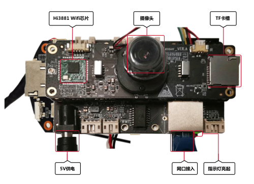
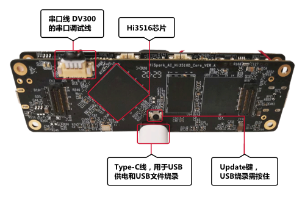

# Introduction to the Hi3516 Development Board

Hi3516DV300 is a new-generation SoC designed for the industry-dedicated smart HD IP camera. It introduces a new-generation ISP, the latest H.265 video compression encoder, and a high-performance NNIE engine, enabling Hi3516C V500 to lead the industry in terms of low bit rate, high image quality, intelligent processing and analysis, and low power consumption. Integrated with the POR, RTC, audio codec, and standby wakeup circuit, Hi3516DV300 can greatly reduce the EBOM costs for customers.

**Figure  1**  Front view of the Hi3516 board  

**Figure  2**  Rear view of the Hi3516 board  

## Software Environment of the Development Board

**Table  1**  Description of the software environment

<table><thead align="left"><tr id="row10572391876"><th class="cellrowborder" valign="top" width="12.96129612961296%" id="mcps1.2.4.1.1">
Hardware

</th>
<th class="cellrowborder" valign="top" width="13.451345134513451%" id="mcps1.2.4.1.2">
Software

</th>
<th class="cellrowborder" valign="top" width="73.5873587358736%" id="mcps1.2.4.1.3">
Description

</th>
</tr>
</thead>
<tbody><tr id="row257399674"><td class="cellrowborder" rowspan="4" valign="top" width="12.96129612961296%" headers="mcps1.2.4.1.1 ">
Hi3516DV300

IoT camera board

</td>
<td class="cellrowborder" valign="top" width="13.451345134513451%" headers="mcps1.2.4.1.2 ">
bootstrap program

</td>
<td class="cellrowborder" valign="top" width="73.5873587358736%" headers="mcps1.2.4.1.3 ">
U-Boot

</td>
</tr>
<tr id="row12574209673"><td class="cellrowborder" valign="top" headers="mcps1.2.4.1.1 ">
Operating system

</td>
<td class="cellrowborder" valign="top" headers="mcps1.2.4.1.2 ">
Huawei-developed operating system HOSP (including the OHOS kernel, application framework, and service framework)

</td>
</tr>
<tr id="row8574109778"><td class="cellrowborder" valign="top" headers="mcps1.2.4.1.1 ">
Application software

</td>
<td class="cellrowborder" valign="top" headers="mcps1.2.4.1.2 ">
Shell (Starts as the system boots)

</td>
</tr>
<tr id="row10574691678"><td class="cellrowborder" valign="top" headers="mcps1.2.4.1.1 ">
Program development library

</td>
<td class="cellrowborder" valign="top" headers="mcps1.2.4.1.2 ">
musl 1.x

</td>
</tr>
</tbody>
</table>

## Development Board Specifications

**Table  2**  Specification list of the Hi3516 development board

<table><thead align="left"><tr id="row10171198194310"><th class="cellrowborder" valign="top" width="14.77%" id="mcps1.2.3.1.1">
Type

</th>
<th class="cellrowborder" valign="top" width="85.22999999999999%" id="mcps1.2.3.1.2">
Specification

</th>
</tr>
</thead>
<tbody><tr id="row0171168114311"><td class="cellrowborder" valign="top" width="14.77%" headers="mcps1.2.3.1.1 ">
<strong id="b157831068243">Processor and internal memory</strong>

</td>
<td class="cellrowborder" valign="top" width="85.22999999999999%" headers="mcps1.2.3.1.2 "><ul id="ul1147113537186"><li>Hi3516D V300</li><li>2 pieces of 16-bit-width DDR3, with 4 Gb capacity each particle</li><li>eMMC with 8 GB capacity</li></ul>
</td>
</tr>
<tr id="row21721687435"><td class="cellrowborder" valign="top" width="14.77%" headers="mcps1.2.3.1.1 ">
<strong id="b927893617261">External Components</strong>

</td>
<td class="cellrowborder" valign="top" width="85.22999999999999%" headers="mcps1.2.3.1.2 "><ul id="ul179543016208"><li>Ethernet port</li><li>Audio and video<ul id="ul5941311869"><li>1-channel voice input</li><li>1-channel (AC_L) mono output, connected to a 3 W power amplifier (LM4871)</li><li>MicroHDMI (1-channel HDMI 1.4)</li></ul>
</li><li>Camera<ul id="ul924263620"><li>Sensor IMX335</li><li>M12 lens with a focal length of 4 mm and an aperture of 1.4</li></ul>
</li><li>Display<ul id="ul101471711667"><li>2.35-inch LCD connector</li><li>5.5-inch LCD connector</li></ul>
</li><li>External components and interfaces<ul id="ul089255556"><li>microSD card port circuit</li><li>JTAG/I2S interface</li><li>ADC interface</li><li>Steer gear interface</li><li>Grove connector</li><li>USB2.0(Type C)</li><li>Three function keys: two customized keys and one update key</li><li>LED indicator (including green and red)</li></ul>
</li></ul>
</td>
</tr>
</tbody>
</table>

