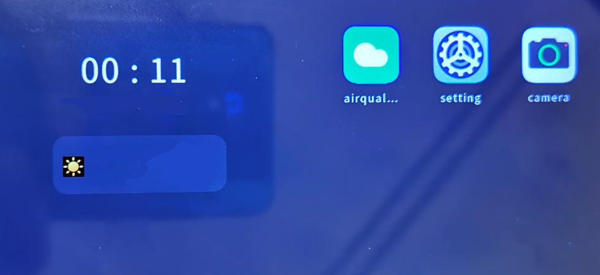

# Running on the Device

For details about the development board, compilation, burning, and image running process, see  [Getting Started with Hi3516](../quick-start/introduction-to-the-hi3516-development-board.md). After running the image and the system is started normally, perform the following steps:

1.  Install the third-party application for the debug version only.

    Store the application installation package \(with the  **debug**  signature\) and installation tool \(**dev\_tools**  in the directory where the image file is generated\) in an SD card. The installation procedure is as follows:

    1.  Run the  **./sdcard/dev\_tools/bin/bm set -d enable**  command to enable the debugging signature.
    2.  Run the  **./sdcard/dev\_tools/bin/bm install -p /sdcard/airquality.hap**  command to install the application. The  **dev\_tools**  directory stores the installation tool, and  **airquality.hap**  is the application installation package.
    3.  After the application is installed, touch the application icon on the home screen to start the application.

    **Figure  1**  Home screen  
    

2.  Uninstall the application.

    Touch and hold the application icon on the home screen, and touch the uninstall button in the displayed menu.

