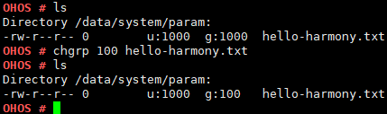

# chgrp

## Command Function

This command is used to change a file group.

## Syntax

chgrp \[_group_\] \[_pathname_\]

## Parameter Description

**Table  1**  Parameters

<table><thead align="left"><tr id="row1055mcpsimp"><th class="cellrowborder" valign="top" width="21%" id="mcps1.2.4.1.1">
<strong id="b152503343511626">Parameter</strong>

</th>
<th class="cellrowborder" valign="top" width="52%" id="mcps1.2.4.1.2">
<strong id="b14728419275">Description</strong>

</th>
<th class="cellrowborder" valign="top" width="27%" id="mcps1.2.4.1.3">
<strong id="b71533702411626">Value Range</strong>

</th>
</tr>
</thead>
<tbody><tr id="row1062mcpsimp"><td class="cellrowborder" valign="top" width="21%" headers="mcps1.2.4.1.1 ">
group

</td>
<td class="cellrowborder" valign="top" width="52%" headers="mcps1.2.4.1.2 ">
Indicates the file group.

</td>
<td class="cellrowborder" valign="top" width="27%" headers="mcps1.2.4.1.3 ">
[0, 0xFFFFFFFF]

</td>
</tr>
<tr id="row172161126124218"><td class="cellrowborder" valign="top" width="21%" headers="mcps1.2.4.1.1 ">
pathname

</td>
<td class="cellrowborder" valign="top" width="52%" headers="mcps1.2.4.1.2 ">
Indicates the file path.

</td>
<td class="cellrowborder" valign="top" width="27%" headers="mcps1.2.4.1.3 ">
An existing file

</td>
</tr>
</tbody>
</table>

## Usage

By specifying a file group before the file name in this command, you can change the group to which the file belongs.

## Example

Enter  **chgrp 100 hello-harmony.txt**.

## Output

**Figure  1**  Changing the group of the  **hello-harmony.txt**  file to  **100**  

