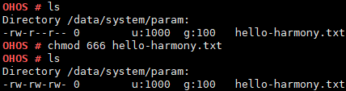

# chmod

## Command Function

This command is used to change the file operation permission.

## Syntax

chmod \[_mode_\] \[_pathname_\]

## Parameter Description

**Table  1**  Parameters

<table><thead align="left"><tr id="row1055mcpsimp"><th class="cellrowborder" valign="top" width="21%" id="mcps1.2.4.1.1">
<strong id="b144816543511718">Parameter</strong>

</th>
<th class="cellrowborder" valign="top" width="52%" id="mcps1.2.4.1.2">
<strong id="b1544627143010">Description</strong>

</th>
<th class="cellrowborder" valign="top" width="27%" id="mcps1.2.4.1.3">
<strong id="b44030524511718">Value Range</strong>

</th>
</tr>
</thead>
<tbody><tr id="row1062mcpsimp"><td class="cellrowborder" valign="top" width="21%" headers="mcps1.2.4.1.1 ">
mode

</td>
<td class="cellrowborder" valign="top" width="52%" headers="mcps1.2.4.1.2 ">
Indicates the permission for a file or directory. The value is an octal number, representing the permission of <strong id="b11602834153114">User</strong> (owner), <strong id="b032113853120">Group</strong> (group), or <strong id="b1980114418310">Other</strong> (other groups).

</td>
<td class="cellrowborder" valign="top" width="27%" headers="mcps1.2.4.1.3 ">
[0, 777]

</td>
</tr>
<tr id="row172161126124218"><td class="cellrowborder" valign="top" width="21%" headers="mcps1.2.4.1.1 ">
pathname

</td>
<td class="cellrowborder" valign="top" width="52%" headers="mcps1.2.4.1.2 ">
Indicates the file path.

</td>
<td class="cellrowborder" valign="top" width="27%" headers="mcps1.2.4.1.3 ">
An existing file

</td>
</tr>
</tbody>
</table>

## Usage

By specifying the  **mode**  parameter before the file name, you can change the permission for this file.

## Example

Enter  **chmod 666 hello-harmony.txt**.

## Output

**Figure  1**  Changing the permission on the  **hello-harmony.txt**  file to  **666**  

