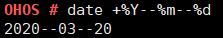

# date

## Command Function

This command is used to query and set the system date and time.

## Syntax

date

date --help

date +\[_Format_\]

date -s_ _\[_YY/MM/DD_\]

date_ _-s_ _\[_hh:mm:ss_\]__

date -r \[_Filename_\]

## Parameter Description

**Table  1**  Parameters

<table><thead align="left"><tr id="row3831mcpsimp"><th class="cellrowborder" valign="top" width="21%" id="mcps1.2.4.1.1">
<strong id="b47334991913">Parameter</strong>

</th>
<th class="cellrowborder" valign="top" width="50%" id="mcps1.2.4.1.2">
<strong id="b1034575101910">Description</strong>

</th>
<th class="cellrowborder" valign="top" width="28.999999999999996%" id="mcps1.2.4.1.3">
<strong id="b10969161293">Value Range</strong>

</th>
</tr>
</thead>
<tbody><tr id="row3838mcpsimp"><td class="cellrowborder" valign="top" width="21%" headers="mcps1.2.4.1.1 ">
--help

</td>
<td class="cellrowborder" valign="top" width="50%" headers="mcps1.2.4.1.2 ">
Uses the help.

</td>
<td class="cellrowborder" valign="top" width="28.999999999999996%" headers="mcps1.2.4.1.3 ">
N/A

</td>
</tr>
<tr id="row3845mcpsimp"><td class="cellrowborder" valign="top" width="21%" headers="mcps1.2.4.1.1 ">
+Format

</td>
<td class="cellrowborder" valign="top" width="50%" headers="mcps1.2.4.1.2 ">
Prints the date and time based on <strong id="b3850mcpsimp">Format</strong>.

</td>
<td class="cellrowborder" valign="top" width="28.999999999999996%" headers="mcps1.2.4.1.3 ">
Placeholders listed in <strong id="b34011737101518">--help</strong>.

</td>
</tr>
<tr id="row3853mcpsimp"><td class="cellrowborder" valign="top" width="21%" headers="mcps1.2.4.1.1 ">
-s YY/MM/DD

</td>
<td class="cellrowborder" valign="top" width="50%" headers="mcps1.2.4.1.2 ">
Sets the system date and separates the year, month, and day by slashes (/).

</td>
<td class="cellrowborder" valign="top" width="28.999999999999996%" headers="mcps1.2.4.1.3 ">
&gt;= 1970/01/01

</td>
</tr>
<tr id="row3860mcpsimp"><td class="cellrowborder" valign="top" width="21%" headers="mcps1.2.4.1.1 ">
-s hh:mm:ss

</td>
<td class="cellrowborder" valign="top" width="50%" headers="mcps1.2.4.1.2 ">
Sets the system time and separates the hour, minute, and second by colons (:).

</td>
<td class="cellrowborder" valign="top" width="28.999999999999996%" headers="mcps1.2.4.1.3 ">
N/A

</td>
</tr>
<tr id="row3867mcpsimp"><td class="cellrowborder" valign="top" width="21%" headers="mcps1.2.4.1.1 ">
-r Filename

</td>
<td class="cellrowborder" valign="top" width="50%" headers="mcps1.2.4.1.2 ">
Queries the modification time of the <strong id="b16916585171">Filename</strong> file.

</td>
<td class="cellrowborder" valign="top" width="28.999999999999996%" headers="mcps1.2.4.1.3 ">
N/A

</td>
</tr>
</tbody>
</table>

## Usage

-   If the  **date**  parameter is not specified, the current system date and time are displayed by default.
-   The  **--help**,  **+Format**,  **-s**, and  **-r**  parameters are mutually exclusive.

## Example

Enter  **date +%Y--%m--%d**.

## Output

**Figure  1**  System date printed based on the specified format  

