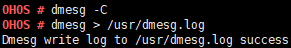

# dmesg

## Command Function

This command is used to control the dmesg buffer of the kernel.

## Syntax

dmesg

dmesg \[_-c/-C/-D/-E/-L/-U_\]

dmesg -s \[_size_\]

dmesg -l \[_level_\]

dmesg \> \[_fileA_\]

## Parameter Description

**Table  1**  Parameters

<table><thead align="left"><tr id="row3906mcpsimp"><th class="cellrowborder" valign="top" width="21%" id="mcps1.2.4.1.1">
<strong id="b1396020482284">Parameter</strong>

</th>
<th class="cellrowborder" valign="top" width="52%" id="mcps1.2.4.1.2">
<strong id="b5731534293">Description</strong>

</th>
<th class="cellrowborder" valign="top" width="27%" id="mcps1.2.4.1.3">
<strong id="b46901499297">Value Range</strong>

</th>
</tr>
</thead>
<tbody><tr id="row3913mcpsimp"><td class="cellrowborder" valign="top" width="21%" headers="mcps1.2.4.1.1 ">
-c

</td>
<td class="cellrowborder" valign="top" width="52%" headers="mcps1.2.4.1.2 ">
Prints content in the buffer and clears the buffer.

</td>
<td class="cellrowborder" valign="top" width="27%" headers="mcps1.2.4.1.3 ">
N/A

</td>
</tr>
<tr id="row3920mcpsimp"><td class="cellrowborder" valign="top" width="21%" headers="mcps1.2.4.1.1 ">
-C

</td>
<td class="cellrowborder" valign="top" width="52%" headers="mcps1.2.4.1.2 ">
Clears the buffer.

</td>
<td class="cellrowborder" valign="top" width="27%" headers="mcps1.2.4.1.3 ">
N/A

</td>
</tr>
<tr id="row3927mcpsimp"><td class="cellrowborder" valign="top" width="21%" headers="mcps1.2.4.1.1 ">
-D/-E

</td>
<td class="cellrowborder" valign="top" width="52%" headers="mcps1.2.4.1.2 ">
Enables or disables printing to the console.

</td>
<td class="cellrowborder" valign="top" width="27%" headers="mcps1.2.4.1.3 ">
N/A

</td>
</tr>
<tr id="row3934mcpsimp"><td class="cellrowborder" valign="top" width="21%" headers="mcps1.2.4.1.1 ">
-L/-U

</td>
<td class="cellrowborder" valign="top" width="52%" headers="mcps1.2.4.1.2 ">
Enables or disables printing via the serial port.

</td>
<td class="cellrowborder" valign="top" width="27%" headers="mcps1.2.4.1.3 ">
N/A

</td>
</tr>
<tr id="row3941mcpsimp"><td class="cellrowborder" valign="top" width="21%" headers="mcps1.2.4.1.1 ">
-s size

</td>
<td class="cellrowborder" valign="top" width="52%" headers="mcps1.2.4.1.2 ">
Sets the size of the buffer.

</td>
<td class="cellrowborder" valign="top" width="27%" headers="mcps1.2.4.1.3 ">
N/A

</td>
</tr>
<tr id="row3948mcpsimp"><td class="cellrowborder" valign="top" width="21%" headers="mcps1.2.4.1.1 ">
-l level

</td>
<td class="cellrowborder" valign="top" width="52%" headers="mcps1.2.4.1.2 ">
Sets the buffering level.

</td>
<td class="cellrowborder" valign="top" width="27%" headers="mcps1.2.4.1.3 ">
0 - 5

</td>
</tr>
<tr id="row3955mcpsimp"><td class="cellrowborder" valign="top" width="21%" headers="mcps1.2.4.1.1 ">
&gt; fileA

</td>
<td class="cellrowborder" valign="top" width="52%" headers="mcps1.2.4.1.2 ">
Writes the content in the buffer to a file.

</td>
<td class="cellrowborder" valign="top" width="27%" headers="mcps1.2.4.1.3 ">
N/A

</td>
</tr>
</tbody>
</table>

## Usage

-   This command depends on  **LOSCFG\_SHELL\_DMESG**. Before running this command, enable the  **Enable Shell dmesg**  configuration item using  **menuconfig**.

    Debug  ---\> Enable a Debug Version ---\> Enable Shell ---\> Enable Shell dmesg

-   If the parameters are not specified, all content in the buffer is printed.
-   The parameters followed by hyphens \(-\) are mutually exclusive.
    1.  Before writing content to a file, ensure that the file system has been mounted.
    2.  Disabling the serial port printing will adversely affect the shell. You are advised to set up a connection using Telnet before disabling the serial port.

## Example

Enter  **dmesg \> /usr/dmesg.log**.

## Output

**Figure  1**  Writing dmesg content to a file  

