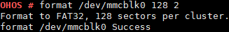

# format

## Command Function

This command is used to format a disk.

## Syntax

format <_dev\_inodename_\> <_sectors_\> <_option_\> \[_label_\]

## Parameter Description

**Table  1**  Parameters

<table><thead align="left"><tr id="row1188mcpsimp"><th class="cellrowborder" valign="top" width="34%" id="mcps1.2.3.1.1">
<strong id="b101095916104">Parameter</strong>

</th>
<th class="cellrowborder" valign="top" width="66%" id="mcps1.2.3.1.2">
<strong id="b14213111171020">Description</strong>

</th>
</tr>
</thead>
<tbody><tr id="row1193mcpsimp"><td class="cellrowborder" valign="top" width="34%" headers="mcps1.2.3.1.1 ">
dev_inodename

</td>
<td class="cellrowborder" valign="top" width="66%" headers="mcps1.2.3.1.2 ">
Indicates the device name.

</td>
</tr>
<tr id="row1203mcpsimp"><td class="cellrowborder" valign="top" width="34%" headers="mcps1.2.3.1.1 ">
sectors

</td>
<td class="cellrowborder" valign="top" width="66%" headers="mcps1.2.3.1.2 ">
Indicates the size of the allocated memory unit or sector. The value <strong id="b1574273871018">0</strong> indicates that the parameter is null. (The value must be <strong id="b16428721113">0</strong> or a power of <strong id="b1053419931111">2</strong>. For FAT32, the maximum value is <strong id="b51473841110">128</strong>. If the parameter is set to <strong id="b99547931214">0</strong>, a proper cluster size is automatically selected. The available cluster size range varies depending on the partition size. If the cluster size is incorrectly specified, the formatting may fail.)

</td>
</tr>
<tr id="row1208mcpsimp"><td class="cellrowborder" valign="top" width="34%" headers="mcps1.2.3.1.1 ">
option

</td>
<td class="cellrowborder" valign="top" width="66%" headers="mcps1.2.3.1.2 ">
Indicates the formatting option for selecting the file system type. The options are as follows:<ul id="ul10971366369"><li><strong id="b169384514517">0x01</strong>: FMT_FAT</li><li><strong id="b143061510125114">0x02</strong>: FMT_FAT32</li><li><strong id="b3245614165116">0x07</strong>: FMT_ANY</li><li><strong id="b018121813512">0x08</strong>: FMT_ERASE (not supported by the USB flash drive)</li></ul>

Other values are invalid. The system will automatically select the formatting mode. If the low-level formatting bit is 1 during the formatting of a USB flash drive, an error message is printed.

</td>
</tr>
<tr id="row1213mcpsimp"><td class="cellrowborder" valign="top" width="34%" headers="mcps1.2.3.1.1 ">
label

</td>
<td class="cellrowborder" valign="top" width="66%" headers="mcps1.2.3.1.2 ">
Indicates the volume label name. This parameter is optional, and the value is a string. If <strong id="b16648426102713">null</strong> is specified for this parameter, the previously set volume label name is cleared.

</td>
</tr>
</tbody>
</table>

## Usage

-   The  **format**  command is used to format a disk. You can find the device name in the  **dev**  directory. A storage card must be installed before the formatting.
-   This command can be used to format only the USB flash drive, SD card, and MMC, but not the NAND flash and NOR flash.
-   The  **sectors**  parameter must be set to a valid value. An invalid value may cause exceptions.

## Example

Enter  **format /dev/mmcblk0 128 2**.

## Output

Formatting result

