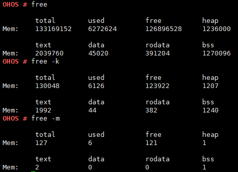

# free

## Command Function

This command is used to display the system memory usage and the sizes of the  **text**,  **data**,  **rodata**, and  **bss**  segments.

## Syntax

free \[_-k | -m_\]

## Parameter Description

**Table  1**  Parameters

<table><thead align="left"><tr id="row116mcpsimp"><th class="cellrowborder" valign="top" width="21%" id="mcps1.2.4.1.1">
<strong id="b2034885242810">Parameter</strong>

</th>
<th class="cellrowborder" valign="top" width="52%" id="mcps1.2.4.1.2">
<strong id="b023810562286">Description</strong>

</th>
<th class="cellrowborder" valign="top" width="27%" id="mcps1.2.4.1.3">
<strong id="b10762357162817">Value Range</strong>

</th>
</tr>
</thead>
<tbody><tr id="row123mcpsimp"><td class="cellrowborder" valign="top" width="21%" headers="mcps1.2.4.1.1 ">
No parameter

</td>
<td class="cellrowborder" valign="top" width="52%" headers="mcps1.2.4.1.2 ">
Displays the size in the unit of byte.

</td>
<td class="cellrowborder" valign="top" width="27%" headers="mcps1.2.4.1.3 ">
N/A

</td>
</tr>
<tr id="row130mcpsimp"><td class="cellrowborder" valign="top" width="21%" headers="mcps1.2.4.1.1 ">
-k

</td>
<td class="cellrowborder" valign="top" width="52%" headers="mcps1.2.4.1.2 ">
Displays the size in the unit of KB.

</td>
<td class="cellrowborder" valign="top" width="27%" headers="mcps1.2.4.1.3 ">
N/A

</td>
</tr>
<tr id="row137mcpsimp"><td class="cellrowborder" valign="top" width="21%" headers="mcps1.2.4.1.1 ">
-m

</td>
<td class="cellrowborder" valign="top" width="52%" headers="mcps1.2.4.1.2 ">
Displays the size in the unit of MB.

</td>
<td class="cellrowborder" valign="top" width="27%" headers="mcps1.2.4.1.3 ">
N/A

</td>
</tr>
</tbody>
</table>

## Usage

None

## Example

Enter  **free**,  **free -k**, and  **free -m**, respectively.

## Output

**Figure  1**  Displaying the memory usage in three units  

**Table  2**  Output description

<table><thead align="left"><tr id="row638mcpsimp"><th class="cellrowborder" valign="top" width="50%" id="mcps1.2.3.1.1">
Parameter

</th>
<th class="cellrowborder" valign="top" width="50%" id="mcps1.2.3.1.2">
Description

</th>
</tr>
</thead>
<tbody><tr id="row643mcpsimp"><td class="cellrowborder" valign="top" width="50%" headers="mcps1.2.3.1.1 ">
total

</td>
<td class="cellrowborder" valign="top" width="50%" headers="mcps1.2.3.1.2 ">
Indicates the total size of the dynamic memory pool.

</td>
</tr>
<tr id="row648mcpsimp"><td class="cellrowborder" valign="top" width="50%" headers="mcps1.2.3.1.1 ">
used

</td>
<td class="cellrowborder" valign="top" width="50%" headers="mcps1.2.3.1.2 ">
Indicates the size of the used memory.

</td>
</tr>
<tr id="row653mcpsimp"><td class="cellrowborder" valign="top" width="50%" headers="mcps1.2.3.1.1 ">
free

</td>
<td class="cellrowborder" valign="top" width="50%" headers="mcps1.2.3.1.2 ">
Indicates the size of the unallocated memory.

</td>
</tr>
<tr id="row658mcpsimp"><td class="cellrowborder" valign="top" width="50%" headers="mcps1.2.3.1.1 ">
heap

</td>
<td class="cellrowborder" valign="top" width="50%" headers="mcps1.2.3.1.2 ">
Indicates the size of the allocated heap.

</td>
</tr>
<tr id="row10101624938"><td class="cellrowborder" valign="top" width="50%" headers="mcps1.2.3.1.1 ">
text

</td>
<td class="cellrowborder" valign="top" width="50%" headers="mcps1.2.3.1.2 ">
Indicates the size of a code segment.

</td>
</tr>
<tr id="row207288271839"><td class="cellrowborder" valign="top" width="50%" headers="mcps1.2.3.1.1 ">
data

</td>
<td class="cellrowborder" valign="top" width="50%" headers="mcps1.2.3.1.2 ">
Indicates the size of a data segment.

</td>
</tr>
<tr id="row1774316321731"><td class="cellrowborder" valign="top" width="50%" headers="mcps1.2.3.1.1 ">
rodata

</td>
<td class="cellrowborder" valign="top" width="50%" headers="mcps1.2.3.1.2 ">
Indicates the size of a read-only data segment.

</td>
</tr>
<tr id="row121618371536"><td class="cellrowborder" valign="top" width="50%" headers="mcps1.2.3.1.1 ">
bss

</td>
<td class="cellrowborder" valign="top" width="50%" headers="mcps1.2.3.1.2 ">
Indicates the size of the memory occupied by uninitialized global variables.

</td>
</tr>
</tbody>
</table>

