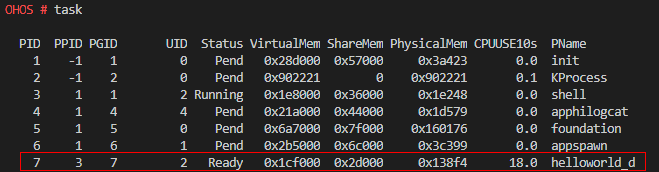
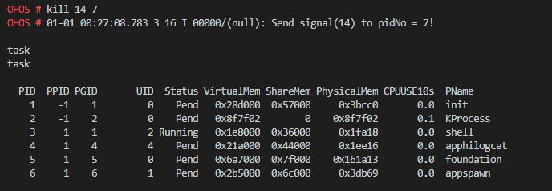
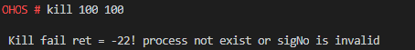

# kill

## Command Function

This command is used to send a specific signal to a specified process.

## Syntax

kill \[_signo_  |  _-signo_\] \[_pid_\]

## Parameter Description

**Table  1**  Parameters

<table><thead align="left"><tr id="row444mcpsimp"><th class="cellrowborder" valign="top" width="21%" id="mcps1.2.4.1.1">
<strong id="b105624422368">Parameter</strong>

</th>
<th class="cellrowborder" valign="top" width="51.92%" id="mcps1.2.4.1.2">
<strong id="b109117451362">Description</strong>

</th>
<th class="cellrowborder" valign="top" width="27.08%" id="mcps1.2.4.1.3">
<strong id="b1410453910286">Value Range</strong>

</th>
</tr>
</thead>
<tbody><tr id="row451mcpsimp"><td class="cellrowborder" valign="top" width="21%" headers="mcps1.2.4.1.1 ">
signo

</td>
<td class="cellrowborder" valign="top" width="51.92%" headers="mcps1.2.4.1.2 ">
Indicates the signal ID.

</td>
<td class="cellrowborder" valign="top" width="27.08%" headers="mcps1.2.4.1.3 ">
[1, 30]

</td>
</tr>
<tr id="row113001232165611"><td class="cellrowborder" valign="top" width="21%" headers="mcps1.2.4.1.1 ">
pid

</td>
<td class="cellrowborder" valign="top" width="51.92%" headers="mcps1.2.4.1.2 ">
Indicates the process ID.

</td>
<td class="cellrowborder" valign="top" width="27.08%" headers="mcps1.2.4.1.3 ">
[1, MAX_INT]

</td>
</tr>
</tbody>
</table>

> **NOTICE:** 
>The valid range of the  **signo**  value is \[0, 64\], and the recommended value range is \[1, 30\]. Other values in the valid range are reserved.

## Usage

The  **signo**  and  **pid**  parameters are mandatory.

The  **pid**  value range varies depending on the system configuration. For example, if the maximum  **pid**  value supported by the system is  **256**, this value range is \[1-256\].

## Example

1.  Query the current process list and determine the PID \(7\) of the process to be killed.

**Figure  1**  Querying PIDs  

2. Run  **kill 14 7**  to send signal 14 \(the default behavior of  **SIGALRM**  is to terminate the process\) to process 7  **helloworld\_d**  \(user-space\). Then query the current process list. Process 7 has been terminated. The result of the  **kill 14 7**  command is the same as that of the  **kill -14 7**  command.

**Figure  2**  Command output  

## Output

The command output is as follows:

**Figure  3**  Sending a signal to a specified process  

The signal is successfully sent if no error is reported.

**Figure  4**  Signal sending failure  

The preceding figure shows a signal sending failure caused by invalid parameters. In this case, check that the signal ID and PID are valid.

