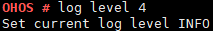

# log

## Command Function

This command is used to modify and query log configurations.

## Syntax

log level \[_levelNum_\]

## Parameter Description

**Table  1**  Parameters

<table><thead align="left"><tr id="row243mcpsimp"><th class="cellrowborder" valign="top" width="21%" id="mcps1.2.4.1.1">
<strong id="b3369319192013">Parameter</strong>

</th>
<th class="cellrowborder" valign="top" width="52%" id="mcps1.2.4.1.2">
<strong id="b12646112413211">Description</strong>

</th>
<th class="cellrowborder" valign="top" width="27%" id="mcps1.2.4.1.3">
<strong id="b13881153318285">Value Range</strong>

</th>
</tr>
</thead>
<tbody><tr id="row250mcpsimp"><td class="cellrowborder" valign="top" width="21%" headers="mcps1.2.4.1.1 ">
levelNum

</td>
<td class="cellrowborder" valign="top" width="52%" headers="mcps1.2.4.1.2 ">
Indicates the print level of configuration logs.

</td>
<td class="cellrowborder" valign="top" width="27%" headers="mcps1.2.4.1.3 ">
[0x0, 0x5]

</td>
</tr>
</tbody>
</table>

## Usage

-   This command depends on  **LOSCFG\_SHELL\_LK**. Before running this command, enable the  **Enable Shell lk**  configuration item using  **menuconfig**.

    Debug ---\> Enable a Debug Version ---\> Enable Shell ---\> Enable Shell lK

-   The  **log level**  command is used to configure log levels, which can be:

    TRACE\_EMG = 0,

    TRACE\_COMMON = 1,

    TRACE\_ERROR = 2,

    TRACE\_WARN = 3,

    TRACE\_INFO = 4,

    TRACE\_DEBUG = 5

    If the level is not within the valid range, a message is printed.

-   If the  **\[levelNum\]**  parameter is not specified, the current log level and its usage are printed by default.

## Example

Enter  **log level 4**.

## Output

