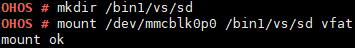

# mount

## Command Function

This command is used to mount a device to a specified directory.

## Syntax

mount <_device_\> <_path_\> <_name_\> \[_uid gid_\]

## Parameter Description

**Table  1**  Parameters

<table><thead align="left"><tr id="row1344mcpsimp"><th class="cellrowborder" valign="top" width="21%" id="mcps1.2.4.1.1">
<strong id="b84913249612">Parameter</strong>

</th>
<th class="cellrowborder" valign="top" width="52%" id="mcps1.2.4.1.2">
<strong id="b1136292612616">Description</strong>

</th>
<th class="cellrowborder" valign="top" width="27%" id="mcps1.2.4.1.3">
<strong id="b4385271067">Value Range</strong>

</th>
</tr>
</thead>
<tbody><tr id="row1351mcpsimp"><td class="cellrowborder" valign="top" width="21%" headers="mcps1.2.4.1.1 ">
device

</td>
<td class="cellrowborder" valign="top" width="52%" headers="mcps1.2.4.1.2 ">
Indicates the path of the device to be mounted. The format is the path of the device.

</td>
<td class="cellrowborder" valign="top" width="27%" headers="mcps1.2.4.1.3 ">
A device in the system

</td>
</tr>
<tr id="row1358mcpsimp"><td class="cellrowborder" valign="top" width="21%" headers="mcps1.2.4.1.1 ">
path

</td>
<td class="cellrowborder" valign="top" width="52%" headers="mcps1.2.4.1.2 ">
Indicates the directory of the device.

The user must have the execution (search) permission for the specified directory.

</td>
<td class="cellrowborder" valign="top" width="27%" headers="mcps1.2.4.1.3 ">
N/A

</td>
</tr>
<tr id="row1366mcpsimp"><td class="cellrowborder" valign="top" width="21%" headers="mcps1.2.4.1.1 ">
name

</td>
<td class="cellrowborder" valign="top" width="52%" headers="mcps1.2.4.1.2 ">
Indicates the file system type.

</td>
<td class="cellrowborder" valign="top" width="27%" headers="mcps1.2.4.1.3 ">
vfat, yaffs, jffs, ramfs, nfs, procfs, romfs

</td>
</tr>
<tr id="row138821392219"><td class="cellrowborder" valign="top" width="21%" headers="mcps1.2.4.1.1 ">
uid gid

</td>
<td class="cellrowborder" valign="top" width="52%" headers="mcps1.2.4.1.2 ">
<strong id="b1647703019395">uid</strong> indicates the user ID.

<strong id="b13341343114017">gid</strong> indicates the group ID.

This parameter is optional. The default values are <strong id="b586915244111">uid:0</strong> and <strong id="b1471656417">gid:0</strong>.

</td>
<td class="cellrowborder" valign="top" width="27%" headers="mcps1.2.4.1.3 ">
N/A

</td>
</tr>
</tbody>
</table>

## Usage

By specifying the device to be mounted, directory, and file system format in the  **mount**  command, you can successfully mount the file system to the specified directory.

## Example

Enter  **mount /dev/mmcblk0p0 /bin1/vs/sd vfat**.

## Output

Mounting  **/dev/mmcblk0p0**  to the  **/bin1/vs/sd**  directory

