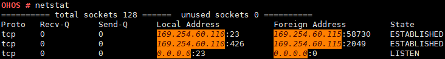

# netstat

## Command Function

The  **netstat**  command is a console command and is used for monitoring the TCP/IP network. It can display the actual network connections and the status of each network interface device. It is used to display the statistics related to the TCP and UDP protocols and check the network connection to each port on the device \(board\).

## Syntax

netstat

## Parameter Description

None

## Usage

Run the command directly.

## Example

Enter  **netstat**.

**Figure  1**  Output information  

## Output

**Table  1**  Output description

<table><thead align="left"><tr id="row2531mcpsimp"><th class="cellrowborder" valign="top" width="50%" id="mcps1.2.3.1.1">
Parameter

</th>
<th class="cellrowborder" valign="top" width="50%" id="mcps1.2.3.1.2">
Description

</th>
</tr>
</thead>
<tbody><tr id="row2536mcpsimp"><td class="cellrowborder" valign="top" width="50%" headers="mcps1.2.3.1.1 ">
Proto

</td>
<td class="cellrowborder" valign="top" width="50%" headers="mcps1.2.3.1.2 ">
Indicates the protocol type.

</td>
</tr>
<tr id="row2546mcpsimp"><td class="cellrowborder" valign="top" width="50%" headers="mcps1.2.3.1.1 ">
Recv-Q

</td>
<td class="cellrowborder" valign="top" width="50%" headers="mcps1.2.3.1.2 ">
Indicates the amount of data that is not read by the user.

For Listen TCP, the value indicates the number of TCP connections that have completed three-way handshake but are not accepted by users.

</td>
</tr>
<tr id="row2553mcpsimp"><td class="cellrowborder" valign="top" width="50%" headers="mcps1.2.3.1.1 ">
Send-Q

</td>
<td class="cellrowborder" valign="top" width="50%" headers="mcps1.2.3.1.2 ">
For a TCP connection, this value indicates the amount of data that has been sent but not acknowledged.

For a UDP connection, this value indicates the amount of data buffered before IP address resolution is complete.

</td>
</tr>
<tr id="row2558mcpsimp"><td class="cellrowborder" valign="top" width="50%" headers="mcps1.2.3.1.1 ">
Local Address

</td>
<td class="cellrowborder" valign="top" width="50%" headers="mcps1.2.3.1.2 ">
Indicates the local IP address and port number.

</td>
</tr>
<tr id="row2563mcpsimp"><td class="cellrowborder" valign="top" width="50%" headers="mcps1.2.3.1.1 ">
Foreign Address

</td>
<td class="cellrowborder" valign="top" width="50%" headers="mcps1.2.3.1.2 ">
Indicates the remote IP address and port number.

</td>
</tr>
<tr id="row2568mcpsimp"><td class="cellrowborder" valign="top" width="50%" headers="mcps1.2.3.1.1 ">
State

</td>
<td class="cellrowborder" valign="top" width="50%" headers="mcps1.2.3.1.2 ">
Indicates the TCP connection status. This parameter is meaningless for UDP.

</td>
</tr>
</tbody>
</table>

> **NOTE:** 
>The command output like "========== total sockets 32 ====== unused sockets 22 BootTime 27 s ==========" indicates that there are 32 sockets in total, 22 sockets are not used, and it has been 27 seconds since the system starts.

