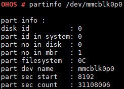

# partinfo

## Command Function

This command is used to query information about multiple partitions of a hard disk or SD card identified by the system.

## Syntax

partinfo <_dev\_inodename_\>

## Parameter Description

**Table  1**  Parameters

<table><thead align="left"><tr id="row1396mcpsimp"><th class="cellrowborder" valign="top" width="22%" id="mcps1.2.4.1.1">
<strong id="b130786349111516">Parameter</strong>

</th>
<th class="cellrowborder" valign="top" width="51%" id="mcps1.2.4.1.2">
<strong id="b1089142031013">Description</strong>

</th>
<th class="cellrowborder" valign="top" width="27%" id="mcps1.2.4.1.3">
<strong id="b17244395211516">Value Range</strong>

</th>
</tr>
</thead>
<tbody><tr id="row1403mcpsimp"><td class="cellrowborder" valign="top" width="22%" headers="mcps1.2.4.1.1 ">
dev_inodename

</td>
<td class="cellrowborder" valign="top" width="51%" headers="mcps1.2.4.1.2 ">
Indicates the name of the partition to be queried.

</td>
<td class="cellrowborder" valign="top" width="27%" headers="mcps1.2.4.1.3 ">
A valid partition name

</td>
</tr>
</tbody>
</table>

## Usage

None

## Example

Enter  **partinfo /dev/mmcblk0p0**.

## Output

