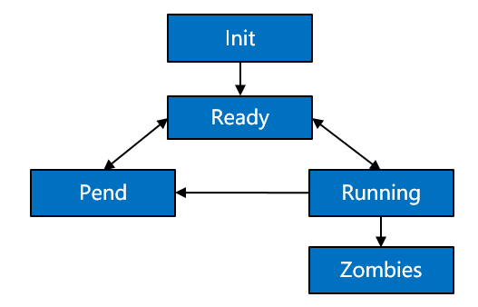

# Process

## Basic Concepts

Processes are resource management units in the OS. They can use or wait to use CPUs and use system resources such as memory. They run independently from one another.

The OpenHarmony kernel allows multiple processes to run simultaneously, switch, and communicate, facilitating your management over service programs. In this regard, you will have more time to devote to the implementation of service functionalities.

Processes in the OpenHarmony kernel use the preemptive scheduling mechanism, either round-robin \(RR\) scheduling or First In First Out \(FIFO\) scheduling.

These processes are assigned 32 priorities \(**0**  to  **31**\). Among them, user processes can be configured with 22 priorities from  **10**  \(highest\) to  **31**  \(lowest\).

A high-priority process can preempt the resources of a low-priority process. The low-priority process can be scheduled only after the high-priority process is blocked or terminated.

Each user-space process has its own memory space, which is invisible to other processes. In this way, processes are isolated from each other.

The user-space root process init is started by the kernel. Then other user-space processes are created by the init process via the  **fork**  call.

**A process may have the following states:**

-   **Init**: The process is being created.

-   **Ready**: The process is in the ready list and waits for being scheduled by the CPU.

-   **Running**: The process is running.

-   **Pend**: The process is blocked and suspended. When all threads in a process are blocked, the process is blocked and suspended.

-   **Zombies**: The process stops running and waits for the parent process to reclaim its control block resources.

**Figure  1**  State transition of a process  

**Description of the process state transition:**

-   Init→Ready:

    When a process is created, the process enters the  **Init**  state to start initialization after obtaining the process control block. After the process is initialized, the process is inserted into the scheduling queue and therefore enters the  **Ready**  state.

-   Ready→Running:

    When a process switchover is triggered, the process with the highest priority in the ready list is executed and enters the  **Running**  state. If this process has no thread in the  **Ready**  state, the process is deleted from the ready list and resides only in the  **Running**  state. However, if it has threads in the  **Ready**  state, the process still stays in the ready list. In this case, the process is in both the  **Ready**  and  **Running**  states.

-   Running→Pend:

    If all threads in a process are entering the  **Pend**  state, the process will enter the  **Pend**  state together with its last thread. Then, a process switchover is triggered.

-   Pend→Ready/Pend→Running:

    When any thread in a  **Pend**  process restores to the  **Ready**  state, the process is added to the ready list and changes to the  **Ready**  state. If a process switchover occurs at this time, the process state changes from the  **Ready**  state to the  **Running**  state.

-   Ready→Pend:

    When the last ready thread in a process enters the  **Pend**  state, the process is deleted from the ready list, and the process changes from the  **Ready**  state to the  **Pend**  state.

-   Running→Ready:

    A process may change from the  **Running**  state to the  **Ready**  state in either of the following scenarios:

    1.  After a process with a higher priority is created or restored, processes will be scheduled. The process with the highest priority in the ready list will change to the  **Running**  state, and the originally running process will change from the  **Running**  state to the  **Ready**  state.
    2.  If a process has the  **SCHED\_RR**  scheduling policy and shares the same priority with another process in the  **Ready**  state, this process will change from the  **Running**  state to the  **Ready**  state after its time slices are used up, and the other process with the same priority will change from the  **Ready**  state to the  **Running**  state.

-   Running→Zombies:

    After the main thread or all threads of a process are stopped, the process changes from the  **Running**  state to the  **Zombies**  state and waits for the parent process to reclaim resources.

## When to Use

After processes are created, you can operate the resources only in your own process space, except shared resources. In user space, processes can be suspended, restored, and delayed. In addition, you can set and obtain the scheduling priority and scheduling policy of processes. When a process is terminated, it proactively releases its resources. However, the PID resources of the process are reclaimed by the parent process via  **wait**/**waitpid**  or when the parent process exits.

## Available APIs

The following table describes the APIs provided by the process management module of the OpenHarmony kernel.

**Table  1**  APIs provided by the process management module

<table><thead align="left"><tr id="row630210427446"><th class="cellrowborder" valign="top" width="13.020000000000001%" id="mcps1.2.5.1.1">
<strong id="b39614238211">Category</strong>

</th>
<th class="cellrowborder" valign="top" width="23.150000000000002%" id="mcps1.2.5.1.2">
<strong id="b852810441211">Function</strong>

</th>
<th class="cellrowborder" valign="top" width="28.93%" id="mcps1.2.5.1.3">
<strong id="b1858304911219">Description</strong>

</th>
<th class="cellrowborder" valign="top" width="34.9%" id="mcps1.2.5.1.4">
<strong id="b1898815613215">Remarks</strong>

</th>
</tr>
</thead>
<tbody><tr id="row12302642134414"><td class="cellrowborder" rowspan="13" valign="top" width="13.020000000000001%" headers="mcps1.2.5.1.1 ">
Process

</td>
<td class="cellrowborder" valign="top" width="23.150000000000002%" headers="mcps1.2.5.1.2 ">
fork

</td>
<td class="cellrowborder" valign="top" width="28.93%" headers="mcps1.2.5.1.3 ">
Creates a new process.

</td>
<td class="cellrowborder" valign="top" width="34.9%" headers="mcps1.2.5.1.4 ">
N/A

</td>
</tr>
<tr id="row20302154218442"><td class="cellrowborder" valign="top" headers="mcps1.2.5.1.1 ">
exit

</td>
<td class="cellrowborder" valign="top" headers="mcps1.2.5.1.2 ">
Exits the process.

</td>
<td class="cellrowborder" valign="top" headers="mcps1.2.5.1.3 ">
N/A

</td>
</tr>
<tr id="row930314421443"><td class="cellrowborder" valign="top" headers="mcps1.2.5.1.1 ">
atexit

</td>
<td class="cellrowborder" valign="top" headers="mcps1.2.5.1.2 ">
Registers the callback that will be called when the process is terminated normally.

</td>
<td class="cellrowborder" valign="top" headers="mcps1.2.5.1.3 ">
N/A

</td>
</tr>
<tr id="row113039426449"><td class="cellrowborder" valign="top" headers="mcps1.2.5.1.1 ">
abort

</td>
<td class="cellrowborder" valign="top" headers="mcps1.2.5.1.2 ">
Terminates the process.

</td>
<td class="cellrowborder" valign="top" headers="mcps1.2.5.1.3 ">
N/A

</td>
</tr>
<tr id="row1330317422445"><td class="cellrowborder" valign="top" headers="mcps1.2.5.1.1 ">
getpid

</td>
<td class="cellrowborder" valign="top" headers="mcps1.2.5.1.2 ">
Obtains the process ID.

</td>
<td class="cellrowborder" valign="top" headers="mcps1.2.5.1.3 ">
N/A

</td>
</tr>
<tr id="row3304204254412"><td class="cellrowborder" valign="top" headers="mcps1.2.5.1.1 ">
getppid

</td>
<td class="cellrowborder" valign="top" headers="mcps1.2.5.1.2 ">
Obtains the parent process ID.

</td>
<td class="cellrowborder" valign="top" headers="mcps1.2.5.1.3 ">
N/A

</td>
</tr>
<tr id="row610863618327"><td class="cellrowborder" valign="top" headers="mcps1.2.5.1.1 ">
getpgrp

</td>
<td class="cellrowborder" valign="top" headers="mcps1.2.5.1.2 ">
Obtains the ID of the process group of the calling process.

</td>
<td class="cellrowborder" valign="top" headers="mcps1.2.5.1.3 ">
N/A

</td>
</tr>
<tr id="row2379940183217"><td class="cellrowborder" valign="top" headers="mcps1.2.5.1.1 ">
getpgid

</td>
<td class="cellrowborder" valign="top" headers="mcps1.2.5.1.2 ">
Obtains the process group ID of the process identified by <strong id="b301564102">pid</strong>.

</td>
<td class="cellrowborder" valign="top" headers="mcps1.2.5.1.3 ">
N/A

</td>
</tr>
<tr id="row1981395963412"><td class="cellrowborder" valign="top" headers="mcps1.2.5.1.1 ">
setpgrp

</td>
<td class="cellrowborder" valign="top" headers="mcps1.2.5.1.2 ">
Sets the process group ID of the calling process.

</td>
<td class="cellrowborder" valign="top" headers="mcps1.2.5.1.3 ">
N/A

</td>
</tr>
<tr id="row194862793516"><td class="cellrowborder" valign="top" headers="mcps1.2.5.1.1 ">
setpgid

</td>
<td class="cellrowborder" valign="top" headers="mcps1.2.5.1.2 ">
Sets the process group ID of the process identified by <strong id="b473312191110">pid</strong>.

</td>
<td class="cellrowborder" valign="top" headers="mcps1.2.5.1.3 ">
N/A

</td>
</tr>
<tr id="row10304742114410"><td class="cellrowborder" valign="top" headers="mcps1.2.5.1.1 ">
kill

</td>
<td class="cellrowborder" valign="top" headers="mcps1.2.5.1.2 ">
Sends a signal to a specified process.

</td>
<td class="cellrowborder" valign="top" headers="mcps1.2.5.1.3 "><ul id="ul949915272011"><li>Only signals 1 to 30 can be sent.</li><li>The default behavior for signals does not include <strong id="b8467181916425">STOP</strong> and <strong id="b1056102115423">CONTINUE</strong> and terminates the process without a core dump.</li><li><strong id="b1937515321030">SIGSTOP</strong>, <strong id="b27003330317">SIGKILL</strong>, and <strong id="b1319037838">SIGCONT</strong> cannot be masked.</li><li>After an asynchronous signal is sent to a process, the signal callback is invoked only after the process is scheduled. For the sake of security, the process can be killed only by itself, and the kernel cannot forcibly kill the process by sending signals.</li><li>After the process is killed, <strong id="b74161730162317">SIGCHLD</strong> is sent to its parent process. The sending action cannot be canceled.</li><li>A sleeping process cannot be woken up by a signal.</li></ul>
</td>
</tr>
<tr id="row1430454210446"><td class="cellrowborder" valign="top" headers="mcps1.2.5.1.1 ">
wait

</td>
<td class="cellrowborder" valign="top" headers="mcps1.2.5.1.2 ">
Waits for any child process to terminate and reclaims its resources.

</td>
<td class="cellrowborder" valign="top" headers="mcps1.2.5.1.3 ">
The <strong id="b156410326361">status</strong> value is defined by the following macros:

<ul id="ul13349201524417"><li><strong id="b06018713811">WIFEXITED(status)</strong>: If the child process terminates normally, <strong id="b63031448163819">true</strong> is returned. Otherwise, <strong id="b8505135423817">false</strong> is returned.</li><li><strong id="b10515451113916">WEXITSTATUS(status)</strong>: If <strong id="b194101084011">WIFEXITED(status)</strong> is <strong id="b125682020164013">true</strong>, this macro can be used to obtain the exit code that the child process passed to <strong id="b311317497406">exit()</strong>.</li><li><strong id="b14193114020473">WTERMSIG(status)</strong>: If a child process terminates abnormally, the child process exit code obtained by the parent process through <strong id="b1162241115210">WTERMSIG</strong> is always <strong id="b1836285675110">SIGUSR2</strong>. This is the only case supported.</li><li>The following operations are not supported: <strong id="b42912379517">WIFSTOPPED</strong>, <strong id="b0024214511">WSTOPSIG</strong>, <strong id="b1989011441751">WCOREDUMP</strong>, and <strong id="b1421913541511">WIFCONTINUED</strong>.</li></ul>
</td>
</tr>
<tr id="row13041742134416"><td class="cellrowborder" valign="top" headers="mcps1.2.5.1.1 ">
waitpid

</td>
<td class="cellrowborder" valign="top" headers="mcps1.2.5.1.2 ">
Waits for a specified child process to terminate and reclaims its resources.

</td>
<td class="cellrowborder" valign="top" headers="mcps1.2.5.1.3 ">
The options to control the function behavior do not support <strong id="b427712262449">WUNTRACED</strong> and <strong id="b0180329164412">WCONTINUED</strong>.

The <strong id="b158163312443">status</strong> value is defined by the following macros:

<ul id="ul7243133164416"><li><strong id="b162659344488">WIFEXITED(status)</strong>: If the child process terminates normally, <strong id="b127015347483">true</strong> is returned. Otherwise, <strong id="b827110347483">false</strong> is returned.</li><li><strong id="b101506426486">WEXITSTATUS(status)</strong>: If <strong id="b1115194211488">WIFEXITED(status)</strong> is <strong id="b115154214817">true</strong>, this macro can be used to obtain the exit code that the child process passed to <strong id="b4152184212486">exit()</strong>.</li><li><strong id="b1327754824815">WTERMSIG(status)</strong>: If a child process terminates abnormally, the child process exit code obtained by the parent process through <strong id="b528264811483">WTERMSIG</strong> is always <strong id="b3282104864815">SIGUSR2</strong>. This is the only case supported.</li><li>The following operations are not supported: <strong id="b1033852104912">WIFSTOPPED</strong>, <strong id="b3550195444911">WSTOPSIG</strong>, <strong id="b563517586492">WCOREDUMP</strong>, and <strong id="b316516775011">WIFCONTINUED</strong>.</li></ul>
</td>
</tr>
<tr id="row4305194294417"><td class="cellrowborder" rowspan="10" valign="top" width="13.020000000000001%" headers="mcps1.2.5.1.1 ">
Scheduling

</td>
<td class="cellrowborder" valign="top" width="23.150000000000002%" headers="mcps1.2.5.1.2 ">
getpriority

</td>
<td class="cellrowborder" valign="top" width="28.93%" headers="mcps1.2.5.1.3 ">
Obtains the static priority of a specified ID.

</td>
<td class="cellrowborder" rowspan="2" valign="top" width="34.9%" headers="mcps1.2.5.1.4 "><ul id="ul185518513478"><li><strong id="b4971715165515">PRIO_PGRP</strong> and <strong id="b8758417185515">PRIO_USER</strong> are not supported.</li></ul>
<ul id="ul85091358174711"><li>The priority to obtain and set refers to the static priority. The dynamic priority is not involved.</li></ul>
</td>
</tr>
<tr id="row930511425448"><td class="cellrowborder" valign="top" headers="mcps1.2.5.1.1 ">
setpriority

</td>
<td class="cellrowborder" valign="top" headers="mcps1.2.5.1.2 ">
Sets the static priority of a specified ID.

</td>
</tr>
<tr id="row2305174216445"><td class="cellrowborder" valign="top" headers="mcps1.2.5.1.1 ">
sched_rr_get_interval

</td>
<td class="cellrowborder" valign="top" headers="mcps1.2.5.1.2 ">
Obtains the execution time limit of a process.

</td>
<td class="cellrowborder" valign="top" headers="mcps1.2.5.1.3 ">
N/A

</td>
</tr>
<tr id="row33061042104416"><td class="cellrowborder" valign="top" headers="mcps1.2.5.1.1 ">
sched_yield

</td>
<td class="cellrowborder" valign="top" headers="mcps1.2.5.1.2 ">
Yields the running process.

</td>
<td class="cellrowborder" valign="top" headers="mcps1.2.5.1.3 ">
N/A

</td>
</tr>
<tr id="row11306134234417"><td class="cellrowborder" valign="top" headers="mcps1.2.5.1.1 ">
sched_get_priority_max

</td>
<td class="cellrowborder" valign="top" headers="mcps1.2.5.1.2 ">
Obtains the maximum static priority that can be used for a process.

</td>
<td class="cellrowborder" rowspan="4" valign="top" headers="mcps1.2.5.1.3 ">
The scheduling policy can only be <strong id="b1085116295185">SCHED_FIFO</strong> or <strong id="b953693512189">SCHED_RR</strong>.

</td>
</tr>
<tr id="row15306242124413"><td class="cellrowborder" valign="top" headers="mcps1.2.5.1.1 ">
sched_get_priority_min

</td>
<td class="cellrowborder" valign="top" headers="mcps1.2.5.1.2 ">
Obtains the minimum static priority that can be used for a process.

</td>
</tr>
<tr id="row730610428448"><td class="cellrowborder" valign="top" headers="mcps1.2.5.1.1 ">
sched_getscheduler

</td>
<td class="cellrowborder" valign="top" headers="mcps1.2.5.1.2 ">
Obtains the scheduling policy of a process.

</td>
</tr>
<tr id="row630764215441"><td class="cellrowborder" valign="top" headers="mcps1.2.5.1.1 ">
sched_setscheduler

</td>
<td class="cellrowborder" valign="top" headers="mcps1.2.5.1.2 ">
Sets a scheduling policy for a process.

</td>
</tr>
<tr id="row3307184274411"><td class="cellrowborder" valign="top" headers="mcps1.2.5.1.1 ">
sched_getparam

</td>
<td class="cellrowborder" valign="top" headers="mcps1.2.5.1.2 ">
Obtains scheduling parameters of a process.

</td>
<td class="cellrowborder" valign="top" headers="mcps1.2.5.1.3 ">
N/A

</td>
</tr>
<tr id="row18307104210449"><td class="cellrowborder" valign="top" headers="mcps1.2.5.1.1 ">
sched_setparam

</td>
<td class="cellrowborder" valign="top" headers="mcps1.2.5.1.2 ">
Sets scheduling parameters related to a scheduling policy for a process.

</td>
<td class="cellrowborder" valign="top" headers="mcps1.2.5.1.3 ">
N/A

</td>
</tr>
<tr id="row17412918306"><td class="cellrowborder" rowspan="6" valign="top" width="13.020000000000001%" headers="mcps1.2.5.1.1 ">
exec

</td>
<td class="cellrowborder" valign="top" width="23.150000000000002%" headers="mcps1.2.5.1.2 ">
execl

</td>
<td class="cellrowborder" valign="top" width="28.93%" headers="mcps1.2.5.1.3 ">
Executes a specified user program file in ELF format.

</td>
<td class="cellrowborder" valign="top" width="34.9%" headers="mcps1.2.5.1.4 ">
N/A

</td>
</tr>
<tr id="row16964151163015"><td class="cellrowborder" valign="top" headers="mcps1.2.5.1.1 ">
execle

</td>
<td class="cellrowborder" valign="top" headers="mcps1.2.5.1.2 ">
Executes a specified user program file in ELF format.

</td>
<td class="cellrowborder" valign="top" headers="mcps1.2.5.1.3 ">
N/A

</td>
</tr>
<tr id="row9418101418309"><td class="cellrowborder" valign="top" headers="mcps1.2.5.1.1 ">
execlp

</td>
<td class="cellrowborder" valign="top" headers="mcps1.2.5.1.2 ">
Executes a specified user program file in ELF format.

</td>
<td class="cellrowborder" valign="top" headers="mcps1.2.5.1.3 ">
N/A

</td>
</tr>
<tr id="row2058611176305"><td class="cellrowborder" valign="top" headers="mcps1.2.5.1.1 ">
execv

</td>
<td class="cellrowborder" valign="top" headers="mcps1.2.5.1.2 ">
Executes a specified user program file in ELF format.

</td>
<td class="cellrowborder" valign="top" headers="mcps1.2.5.1.3 ">
N/A

</td>
</tr>
<tr id="row182359476306"><td class="cellrowborder" valign="top" headers="mcps1.2.5.1.1 ">
execve

</td>
<td class="cellrowborder" valign="top" headers="mcps1.2.5.1.2 ">
Executes a specified user program file in ELF format.

</td>
<td class="cellrowborder" valign="top" headers="mcps1.2.5.1.3 ">
N/A

</td>
</tr>
<tr id="row14242145013304"><td class="cellrowborder" valign="top" headers="mcps1.2.5.1.1 ">
execvp

</td>
<td class="cellrowborder" valign="top" headers="mcps1.2.5.1.2 ">
Executes a specified user program file in ELF format.

</td>
<td class="cellrowborder" valign="top" headers="mcps1.2.5.1.3 ">
N/A

</td>
</tr>
</tbody>
</table>

