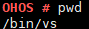

# pwd

## Command Function

This command is used to display the current path.

## Syntax

pwd

## Parameter Description

None

## Usage

The  **pwd**  command writes the full path name of the current directory \(from the root directory\) to the standard output. All directories are separated by slashes \(/\). The directory following the first slash \(/\) indicates the root directory, and the last directory is the current directory.

## Example

Enter  **pwd**.

## Output

**Figure  1**  Querying the current path  

