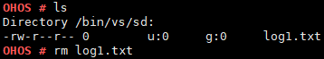

# rm

## Command Function

This command is used to delete a file or folder.

## Syntax

rm \[_-r_\] \[_dirname / filename_\]

## Parameter Description

**Table  1**  Parameters

<table><thead align="left"><tr id="row1513mcpsimp"><th class="cellrowborder" valign="top" width="22.220000000000002%" id="mcps1.2.4.1.1">
<strong id="b8231115224817">Parameter</strong>

</th>
<th class="cellrowborder" valign="top" width="51.519999999999996%" id="mcps1.2.4.1.2">
<strong id="b1599275514488">Description</strong>

</th>
<th class="cellrowborder" valign="top" width="26.26%" id="mcps1.2.4.1.3">
<strong id="b186611453114810">Value Range</strong>

</th>
</tr>
</thead>
<tbody><tr id="row1520mcpsimp"><td class="cellrowborder" valign="top" width="22.220000000000002%" headers="mcps1.2.4.1.1 ">
-r

</td>
<td class="cellrowborder" valign="top" width="51.519999999999996%" headers="mcps1.2.4.1.2 ">
Deletes a directory. This parameter is optional. It is required if a directory is to be deleted.

</td>
<td class="cellrowborder" valign="top" width="26.26%" headers="mcps1.2.4.1.3 ">
N/A

</td>
</tr>
<tr id="row1527mcpsimp"><td class="cellrowborder" valign="top" width="22.220000000000002%" headers="mcps1.2.4.1.1 ">
dirname/filename

</td>
<td class="cellrowborder" valign="top" width="51.519999999999996%" headers="mcps1.2.4.1.2 ">
Indicates the name of the file or directory to be deleted. The value can be a path.

</td>
<td class="cellrowborder" valign="top" width="26.26%" headers="mcps1.2.4.1.3 ">
N/A

</td>
</tr>
</tbody>
</table>

## Usage

-   The  **rm**  command deletes only one file or directory at a time.
-   The  **rm -r**  command can be used to delete a non-empty directory.

## Example

Example:

1.  Enter  **rm log1.txt**.
2.  Enter  **rm -r sd**.

## Output

**Figure  1**  Deleting the  **log1.txt**  file  

**Figure  2**  Deleting the  **sd**  directory  

