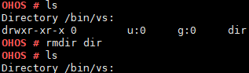

# rmdir

## Command Function

This command is used to delete a directory.

## Syntax

rmdir \[_dir_\]

## Parameter Description

**Table  1**  Parameters

<table><thead align="left"><tr id="row1563mcpsimp"><th class="cellrowborder" valign="top" width="21%" id="mcps1.2.4.1.1">
<strong id="b170710424141">Parameter</strong>

</th>
<th class="cellrowborder" valign="top" width="52%" id="mcps1.2.4.1.2">
<strong id="b10358846121415">Description</strong>

</th>
<th class="cellrowborder" valign="top" width="27%" id="mcps1.2.4.1.3">
<strong id="b171032047111410">Value Range</strong>

</th>
</tr>
</thead>
<tbody><tr id="row1570mcpsimp"><td class="cellrowborder" valign="top" width="21%" headers="mcps1.2.4.1.1 ">
dir

</td>
<td class="cellrowborder" valign="top" width="52%" headers="mcps1.2.4.1.2 ">
Indicates the name of the directory to be deleted. The directory must be empty. You can enter a path for this parameter.

</td>
<td class="cellrowborder" valign="top" width="27%" headers="mcps1.2.4.1.3 ">
N/A

</td>
</tr>
</tbody>
</table>

## Usage

-   The  **rmdir**  command can only be used to delete directories.
-   The  **rmdir**  command can delete only one directory at a time.
-   The  **rmdir**  command can delete only empty directories.

## Example

Enter  **rmdir dir**.

## Output

**Figure  1**  Deleting directory  **dir**  

