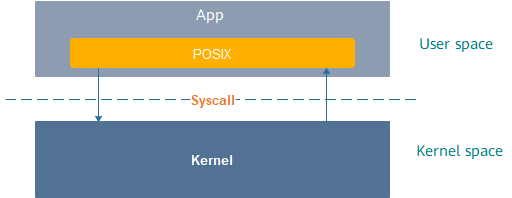

# Standard Library<a name="EN-US_TOPIC_0000001051690267"></a>

The OpenHarmony kernel uses the  **musl libc**  library that supports the Portable Operating System Interface \(POSIX\). You can develop components and applications working on the kernel based on the POSIX.

## Framework<a name="section1247343413257"></a>

**Figure  1**  POSIX framework<a name="fig279734632911"></a>  


When a system invokes an interface, the OpenHarmony kernel is adapted to provide the interface's external features.

## Development Guidelines<a name="section1118675718255"></a>

For details about the APIs supported by the standard library, see the API document of the C library, which also covers the differences between the standard library and the POSIX standard. You can develop components and applications based on the provided APIs.

## Development Example<a name="section4807125622614"></a>

In this example, the main thread creates  **THREAD\_NUM**  child threads. Once a child thread is started, it enters the standby state. After the main thread successfully wakes up all child threads, they continue to execute until the lifecycle ends. The main thread uses the  **pthread\_join**  method to wait until all child threads are executed.

```
#include <stdio.h>
#include <unistd.h>
#include <pthread.h>

#ifdef __cplusplus
#if __cplusplus
extern "C" {
#endif /* __cplusplus */
#endif /* __cplusplus */

#define THREAD_NUM 3
int g_startNum = 0; /* Number of started threads */
int g_wakenNum = 0; /* Number of wakeup threads */

struct testdata {
    pthread_mutex_t mutex;
    pthread_cond_t cond;
} g_td;

/* *
 * Entry function of child threads.
 */
static void *ChildThreadFunc(void *arg)
{
    int rc;
    pthread_t self = pthread_self();

    /* Locks a mutex. */
    rc = pthread_mutex_lock(&g_td.mutex);
    if (rc != 0) {
        printf("ERROR:take mutex lock failed, error code is %d!\n", rc);
        goto EXIT;
    }

    /* The value of g_startNum is increased by 1. The value indicates the number of child threads that have locked a mutex. */
    g_startNum++;

    /* Wait for the condition variable. */
    rc = pthread_cond_wait(&g_td.cond, &g_td.mutex);
    if (rc != 0) {
        printf("ERROR: pthread condition wait failed, error code is %d!\n", rc);
        (void)pthread_mutex_unlock(&g_td.mutex);
        goto EXIT;
    }

    /* Attempt to lock a mutex. */
    rc = pthread_mutex_trylock(&g_td.mutex);
    if (rc == 0) {
        /* Exit if the operation fails. */
        printf("ERROR: mutex trylock failed, error code is %d!\n", rc);
        goto EXIT;
    }

    /* The value of g_wakenNum is increased by 1. The value indicates the number of child threads that have been woken up by the condition variable. */
    g_wakenNum++;

    /* Unlock a mutex. */
    rc = pthread_mutex_unlock(&g_td.mutex);
    if (rc != 0) {
        printf("ERROR: mutex release failed, error code is %d!\n", rc);
        goto EXIT;
    }
EXIT:
    return NULL;
}

static int testcase(void)
{
    int i, rc;
    pthread_t thread[THREAD_NUM];

    /* Initialize a mutex. */
    rc = pthread_mutex_init(&g_td.mutex, NULL);
    if (rc != 0) {
        printf("ERROR: mutex init failed, error code is %d!\n", rc);
        goto ERROROUT;
    }

    /* Initialize the condition variable. */
    rc = pthread_cond_init(&g_td.cond, NULL);
    if (rc != 0) {
        printf("ERROR: pthread condition init failed, error code is %d!\n", rc);
        goto ERROROUT;
    }

    /* Create child threads in batches. The number is specified by THREAD_NUM. */
    for (i = 0; i < THREAD_NUM; i++) {
        rc = pthread_create(&thread[i], NULL, ChildThreadFunc, NULL);
        if (rc != 0) {
            printf("ERROR: pthread create failed, error code is %d!\n", rc);
            goto ERROROUT;
        }
    }

    /* Wait until all child threads lock a mutex. */
    while (g_startNum < THREAD_NUM) {
        usleep(100);
    }

    /* Lock a mutex and block all threads using pthread_cond_wait. */
    rc = pthread_mutex_lock(&g_td.mutex);
    if (rc != 0) {
        printf("ERROR: mutex lock failed, error code is %d\n", rc);
        goto ERROROUT;
    }

    /* Unlock a mutex. */
    rc = pthread_mutex_unlock(&g_td.mutex);
    if (rc != 0) {
        printf("ERROR: mutex unlock failed, error code is %d!\n", rc);
        goto ERROROUT;
    }

    for (int j = 0; j < THREAD_NUM; j++) {
        /* Broadcast signals on the condition variable. */
        rc = pthread_cond_signal(&g_td.cond);
        if (rc != 0) {
            printf("ERROR: pthread condition failed, error code is %d!\n", rc);
            goto ERROROUT;
        }
    }

    sleep(1);

    /* Check whether all child threads are woken up. */
    if (g_wakenNum != THREAD_NUM) {
        printf("ERROR: not all threads awaken, only %d thread(s) awaken!\n", g_wakenNum);
        goto ERROROUT;
    }

    /* Wait for all threads to terminate. */
    for (i = 0; i < THREAD_NUM; i++) {
        rc = pthread_join(thread[i], NULL);
        if (rc != 0) {
            printf("ERROR: pthread join failed, error code is %d!\n", rc);
            goto ERROROUT;
        }
    }

    /* Destroy the condition variable. */
    rc = pthread_cond_destroy(&g_td.cond);
    if (rc != 0) {
        printf("ERROR: pthread condition destroy failed, error code is %d!\n", rc);
        goto ERROROUT;
    }
    return 0;
ERROROUT:
    return -1;
}

/*
 * Sample code main function
 */
int main(int argc, char *argv[])
{
    int rc;

    /* Start the test function. */
    rc = testcase();
    if (rc != 0) {
        printf("ERROR: testcase failed!\n");
    }

    return 0;
}
#ifdef __cplusplus
#if __cplusplus
}
#endif /* __cplusplus */
#endif /* __cplusplus */
```

## FAQs<a name="section1219455217277"></a>

None

