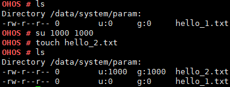

# su

## Command Function

This command is used to switch the user.

## Syntax

su \[_uid_\] \[_gid_\]

## Parameter Description

**Table  1**  Parameters

<table><thead align="left"><tr id="row1055mcpsimp"><th class="cellrowborder" valign="top" width="21%" id="mcps1.2.4.1.1">
<strong id="b2054553312209">Parameter</strong>

</th>
<th class="cellrowborder" valign="top" width="51.93%" id="mcps1.2.4.1.2">
<strong id="b209241335142015">Description</strong>

</th>
<th class="cellrowborder" valign="top" width="27.07%" id="mcps1.2.4.1.3">
<strong id="b13675131682811">Value Range</strong>

</th>
</tr>
</thead>
<tbody><tr id="row1062mcpsimp"><td class="cellrowborder" valign="top" width="21%" headers="mcps1.2.4.1.1 ">
uid

</td>
<td class="cellrowborder" valign="top" width="51.93%" headers="mcps1.2.4.1.2 ">
Indicates the ID of the target user.

</td>
<td class="cellrowborder" valign="top" width="27.07%" headers="mcps1.2.4.1.3 "><ul id="ul14151675449"><li>Left blank</li><li>[0, 60000]</li></ul>
</td>
</tr>
<tr id="row172161126124218"><td class="cellrowborder" valign="top" width="21%" headers="mcps1.2.4.1.1 ">
gid

</td>
<td class="cellrowborder" valign="top" width="51.93%" headers="mcps1.2.4.1.2 ">
Indicates the ID of the target user group.

</td>
<td class="cellrowborder" valign="top" width="27.07%" headers="mcps1.2.4.1.3 "><ul id="ul10433713134417"><li>Left blank</li><li>[0, 60000]</li></ul>
</td>
</tr>
</tbody>
</table>

## Usage

-   The  **su**  command is used to switch to user  **root**  by default. The default value for both  **uid**  and  **gid**  is  **0**.
-   If the  **uid**  and  **gid**  parameters are specified, this command can switch to the user with the specified  **uid**  and  **gid**.
-   If the input parameter is out of the range, an error message is printed.

## Example

Enter  **su 1000 1000**.

## Output

**Figure  1**  Switching to the user whose  **uid**  and  **gid**  are both  **1000**  

