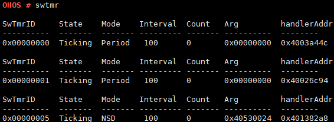

# swtmr

## Command Function

This command is used to query information about system software timers.

## Syntax

swtmr \[_ID_\]

## Parameter Description

**Table  1**  Parameters

<table><thead align="left"><tr id="row523mcpsimp"><th class="cellrowborder" valign="top" width="21%" id="mcps1.2.4.1.1">
<strong id="b28751015911">Parameter</strong>

</th>
<th class="cellrowborder" valign="top" width="52%" id="mcps1.2.4.1.2">
<strong id="b16241861799">Description</strong>

</th>
<th class="cellrowborder" valign="top" width="27%" id="mcps1.2.4.1.3">
<strong id="b2712206132817">Value Range</strong>

</th>
</tr>
</thead>
<tbody><tr id="row530mcpsimp"><td class="cellrowborder" valign="top" width="21%" headers="mcps1.2.4.1.1 ">
ID

</td>
<td class="cellrowborder" valign="top" width="52%" headers="mcps1.2.4.1.2 ">
Indicates the ID of a software timer.

</td>
<td class="cellrowborder" valign="top" width="27%" headers="mcps1.2.4.1.3 ">
[0, 0xFFFFFFFF]

</td>
</tr>
</tbody>
</table>

## Usage

-   If the parameter is not specified, information about all software timers is displayed.
-   If the  **ID**  parameter is specified, information about the specified software timer is displayed.

## Example

Enter  **swtmr**  and  **swtmr 1**.

## Output

**Figure  1**  Querying information about all software timers  

**Figure  2**  Querying information about a specified software timer  

**Table  2**  Output description

<table><thead align="left"><tr id="row556mcpsimp"><th class="cellrowborder" valign="top" width="50%" id="mcps1.2.3.1.1">
Parameter

</th>
<th class="cellrowborder" valign="top" width="50%" id="mcps1.2.3.1.2">
Description

</th>
</tr>
</thead>
<tbody><tr id="row561mcpsimp"><td class="cellrowborder" valign="top" width="50%" headers="mcps1.2.3.1.1 ">
SwTmrID

</td>
<td class="cellrowborder" valign="top" width="50%" headers="mcps1.2.3.1.2 ">
Indicates the ID of the software timer.

</td>
</tr>
<tr id="row566mcpsimp"><td class="cellrowborder" valign="top" width="50%" headers="mcps1.2.3.1.1 ">
State

</td>
<td class="cellrowborder" valign="top" width="50%" headers="mcps1.2.3.1.2 ">
Indicates the status of the software timer.

The value can be <strong id="b10351548112016">UnUsed</strong>, <strong id="b1714715501204">Created</strong>, or <strong id="b36981653142018">Ticking</strong>.

</td>
</tr>
<tr id="row571mcpsimp"><td class="cellrowborder" valign="top" width="50%" headers="mcps1.2.3.1.1 ">
Mode

</td>
<td class="cellrowborder" valign="top" width="50%" headers="mcps1.2.3.1.2 ">
Indicates the mode of the software timer.

The value can be <strong id="b1291181502310">Once</strong>, <strong id="b12266317112316">Period</strong>, or <strong id="b1736331919234">NSD</strong> (one-time timer that will not be automatically deleted after the timer expires).

</td>
</tr>
<tr id="row576mcpsimp"><td class="cellrowborder" valign="top" width="50%" headers="mcps1.2.3.1.1 ">
Interval

</td>
<td class="cellrowborder" valign="top" width="50%" headers="mcps1.2.3.1.2 ">
Indicates the number of ticks used by the software timer.

</td>
</tr>
<tr id="row581mcpsimp"><td class="cellrowborder" valign="top" width="50%" headers="mcps1.2.3.1.1 ">
Count

</td>
<td class="cellrowborder" valign="top" width="50%" headers="mcps1.2.3.1.2 ">
Indicates the number of times that the software timer has been working.

</td>
</tr>
<tr id="row586mcpsimp"><td class="cellrowborder" valign="top" width="50%" headers="mcps1.2.3.1.1 ">
Arg

</td>
<td class="cellrowborder" valign="top" width="50%" headers="mcps1.2.3.1.2 ">
Indicates the input parameter.

</td>
</tr>
<tr id="row591mcpsimp"><td class="cellrowborder" valign="top" width="50%" headers="mcps1.2.3.1.1 ">
handlerAddr

</td>
<td class="cellrowborder" valign="top" width="50%" headers="mcps1.2.3.1.2 ">
Indicates the callback address.

</td>
</tr>
</tbody>
</table>

> **NOTE:** 
>-   The  **ID**  value can be in decimal or hexadecimal format.
>-   If the  **ID**  value is within the range of \[0,  _Number of current software timers - 1_\], the status of the specified software timer is returned. For other values, an error message is displayed.

