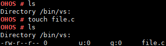

# touch

## Command Function

-   This command is used to create an empty file in a specified directory.
-   If this command is executed to create an existing file, the execution will be successful but the timestamp will not be updated.

## Syntax

touch \[_filename_\]

## Parameter Description

**Table  1**  Parameters

<table><thead align="left"><tr id="row1642mcpsimp"><th class="cellrowborder" valign="top" width="20.73%" id="mcps1.2.4.1.1">
<strong id="b132581435193918">Parameter</strong>

</th>
<th class="cellrowborder" valign="top" width="52.44%" id="mcps1.2.4.1.2">
<strong id="b88661537163918">Description</strong>

</th>
<th class="cellrowborder" valign="top" width="26.83%" id="mcps1.2.4.1.3">
<strong id="b164851738193910">Value Range</strong>

</th>
</tr>
</thead>
<tbody><tr id="row1684mcpsimp"><td class="cellrowborder" valign="top" width="20.73%" headers="mcps1.2.4.1.1 ">
filename

</td>
<td class="cellrowborder" valign="top" width="52.44%" headers="mcps1.2.4.1.2 ">
Indicates the name of the file to be created.

</td>
<td class="cellrowborder" valign="top" width="26.83%" headers="mcps1.2.4.1.3 ">
N/A

</td>
</tr>
</tbody>
</table>

## Usage

-   The  **touch**  command creates a read-write empty file.
-   The  **touch**  command creates only one file at a time.

    > **NOTICE:** 
    >If you run the  **touch**  command to create a file in a path storing important system resources, unexpected results such as a system breakdown may occur. For example, if you run the  **touch uartdev-0**  command in the  **/dev**  path, the system may stop responding.

## Example

Enter  **touch file.c**.

## Output

**Figure  1**  Creating  **file.c**  

