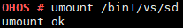

# umount

## Command Function

This command is used to unmount a specified file system.

## Syntax

umount \[_dir_\]

## Parameter Description

**Table  1**  Parameters

<table><thead align="left"><tr id="row1719mcpsimp"><th class="cellrowborder" valign="top" width="21%" id="mcps1.2.4.1.1">
<strong id="b18608121184416">Parameter</strong>

</th>
<th class="cellrowborder" valign="top" width="52%" id="mcps1.2.4.1.2">
<strong id="b123794114417">Description</strong>

</th>
<th class="cellrowborder" valign="top" width="27%" id="mcps1.2.4.1.3">
<strong id="b8664446440">Value Range</strong>

</th>
</tr>
</thead>
<tbody><tr id="row1726mcpsimp"><td class="cellrowborder" valign="top" width="21%" headers="mcps1.2.4.1.1 ">
dir

</td>
<td class="cellrowborder" valign="top" width="52%" headers="mcps1.2.4.1.2 ">
Indicates the directory from which the file system is to be unmounted.

</td>
<td class="cellrowborder" valign="top" width="27%" headers="mcps1.2.4.1.3 ">
Directory to which the file system has been mounted

</td>
</tr>
</tbody>
</table>

## Usage

By specifying the  **dir**  parameter in the  **unmount**  command, you can unmount the specified file system from the directory.

## Example

Enter  **umount /bin1/vs/sd**.

## Output

Unmounting the file system from  **/bin1/vs/sd**

**Figure  1**  Unmounting result  

