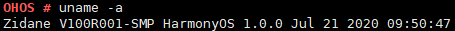

# uname

## Command Function

This command is used to display the name, version creation time, system name, and version information of the current OS.

## Syntax

uname \[_-a | -s | -t | -v | --help_\]

**Table  1**  Parameters

<table><thead align="left"><tr id="row914mcpsimp"><th class="cellrowborder" valign="top" width="34%" id="mcps1.2.3.1.1">
<strong id="b76141525363">Parameter</strong>

</th>
<th class="cellrowborder" valign="top" width="66%" id="mcps1.2.3.1.2">
<strong id="b13349205653619">Description</strong>

</th>
</tr>
</thead>
<tbody><tr id="row119816412718"><td class="cellrowborder" valign="top" width="34%" headers="mcps1.2.3.1.1 ">
No parameter

</td>
<td class="cellrowborder" valign="top" width="66%" headers="mcps1.2.3.1.2 ">
Displays the OS name by default.

</td>
</tr>
<tr id="row919mcpsimp"><td class="cellrowborder" valign="top" width="34%" headers="mcps1.2.3.1.1 ">
-a

</td>
<td class="cellrowborder" valign="top" width="66%" headers="mcps1.2.3.1.2 ">
Displays all information.

</td>
</tr>
<tr id="row924mcpsimp"><td class="cellrowborder" valign="top" width="34%" headers="mcps1.2.3.1.1 ">
-t

</td>
<td class="cellrowborder" valign="top" width="66%" headers="mcps1.2.3.1.2 ">
Displays the time when the version is created.

</td>
</tr>
<tr id="row929mcpsimp"><td class="cellrowborder" valign="top" width="34%" headers="mcps1.2.3.1.1 ">
-s

</td>
<td class="cellrowborder" valign="top" width="66%" headers="mcps1.2.3.1.2 ">
Displays the OS name.

</td>
</tr>
<tr id="row934mcpsimp"><td class="cellrowborder" valign="top" width="34%" headers="mcps1.2.3.1.1 ">
-v

</td>
<td class="cellrowborder" valign="top" width="66%" headers="mcps1.2.3.1.2 ">
Displays the version information.

</td>
</tr>
<tr id="row944mcpsimp"><td class="cellrowborder" valign="top" width="34%" headers="mcps1.2.3.1.1 ">
--help

</td>
<td class="cellrowborder" valign="top" width="66%" headers="mcps1.2.3.1.2 ">
Displays the help information.

</td>
</tr>
</tbody>
</table>

## Usage

The  **uname**  command displays the name of the current OS by default. The  **uname -a | -t| -s| -v**  command displays the name of the in-use OS in the standard output. These parameters are mutually exclusive.

## Example

Enter  **uname -a**.

## Output

Querying system information

