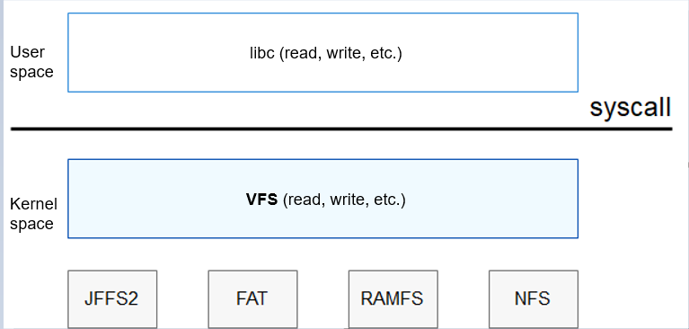
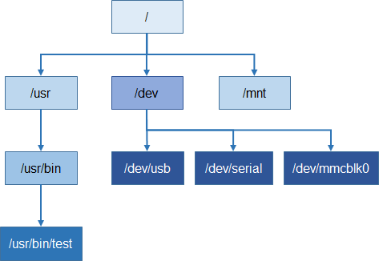

# VFS<a name="EN-US_TOPIC_0000001051451779"></a>

## Overview<a name="section132540468341"></a>

## Basic Concepts<a name="section229417111227"></a>

In essence, VFS is not a real file system. It is an abstract layer on top of a heterogeneous file system and provides you with a unified Unix-like file operation interface.

Different types of file systems provide different interfaces. If there are multiple types of file systems in the system, different and non-standard interfaces are required for accessing these file systems. The VFS can be introduced as an abstract layer in the system to harmonize the differences between these heterogeneous file systems. In this way, the system does not need to care about the storage medium and file system type at the bottom layer when accessing a file system. The figure below illustrates the relationship between the VFS and file systems.

**Figure  1**  Relationship between the VFS and file systems<a name="fig38726213309"></a>  


In the OpenHarmony kernel, the VFS framework is implemented using the tree structure in the memory. Each node in the tree is an  **inode**  structure. After a device is registered and a file system is mounted, the corresponding node is generated in the tree based on the path. VFS provides the following functions:

-   Node query
-   Unified file system invoking \(standard\)

## Working Principles<a name="section18114182834215"></a>

At the VFS layer, standard Unix file operation functions \(such as  **open**,  **read**, and  **write**\) can be used to access different file systems on different media.

There are three types of  **inode**  tree nodes in the VFS framework memory:

-   Virtual node: virtual file of the VFS framework, for example,  **/usr**  and  **/usr/bin**, which ensures the continuity of the tree
-   Device node: mapping to a device in the  **/dev**  directory, for example,  **/dev/mmc0blk0**
-   Mount point: used to mount a specific file system, for example,  **/vs/sd**  or  **/mnt**

**inode**  has two key fields:  **u**  \(pointer to the function structure\) and  **i\_private**  \(data pointer\).

**Figure  2**  Tree structure of the file system<a name="fig1648112392612"></a>  


## Important Notes<a name="section18311145173712"></a>

-   For all file systems in VFS, the name of a directory or file can contain a maximum of 255 bytes, and the maximum length of a full path is 259 bytes. Directories or files whose length exceeds the maximum length cannot be created.

-   Currently, only the JFFS2 file system supports complete permission control.

-   After the  **inode\_find\(\)**  function is called, the number of found  **inode**  connections is incremented by 1. After the call is complete, the  **inode\_release\(\)**  function is called to decrease the number of  **inode**  connections by 1. Therefore, the two functions must be used together.

-   Devices are classified into character devices and block devices. To ensure data security of the file system on a block device, mount the file system and then operate data through the file system interface.

-   The  **los\_vfs\_init\(\)**  function can be called only once. Multiple calls cause exceptions to the file system.

-   The file names and directory names in all file systems of the OpenHarmony kernel can contain only hyphens \(-\) and underscores \(\_\), but no other special characters. If other special characters are used, unpredictable errors may occur.

-   The OpenHarmony kernel supports the  **open\(\)+O\_DIRECTORY**  method to obtain directory data.

-   The mount point must be an empty directory. A file system cannot be mounted to the same mount point or to a directory or file under another mount point. Otherwise, the device or system may be damaged.

-   Only one of the  **O\_RDWR**,  **O\_WRONLY**, and  **O\_RDONLY**  parameters can be used with  **open**  to open a file. If two or more of them are used, the file read or write operation is rejected, and the error code  **EACCESS**  is returned.

-   Before unmounting a file system in the OpenHarmony kernel, ensure that all directories and files are closed. Otherwise, unmounting fails. Forcible unmounting may cause problems such as file system and file damage.

-   Before removing an SD card, ensure that all directories and files are closed and unmounting is performed. Forcible removal may cause problems such as SD card data loss and SD card damage.


## Development Guidelines<a name="section422619258380"></a>

**How to Develop**

It is recommended that driver developers use the VFS framework to register or uninstall devices and the application layer use  **open\(\)**  and  **read\(\)**  to operate character device files to invoke drivers.

1.  After calling  **los\_vfs\_init\(\)**, the system uses the slash \(/\) as  **root\_inode**.

2.  The system calls  **register\_driver\(\)**  and  **register\_blockdriver\(\)**  to generate a device node, and calls  **mount\(\)**  to generate a mount point.

3.  The system files the structure information and inserts the node into a proper position in the tree based on the node name.

4.  During invoking, the system searches the tree for the corresponding device node or mount point based on the path.

5.  The system calls the corresponding function by using the found node pointer.


**File Descriptor**

A process can have a maximum of 256 file descriptors \(including file and socket descriptors\). The system can have a maximum of 640 file descriptors, where there can be a maximum of 

-   512 file descriptors

-   128 socket descriptors


**Operations Supported by VFS**

open, close, read, write, seek, ioctl, fcntl, mmap, sync, dup, dup2, truncate, opendir, closedir, readdir, readdir, rewinddir, mount, umount, statfs, unlink, remove, mkdir, rmdir, rename, stat, utime, seek64, fallocate, fallocate64, truncate64, chmod, and chown

> **NOTE:** 
>-   Currently, only the interfaces for modifying the attributes of JFFS2 files and VFS device nodes are provided. Each system has its own processing mode for attributes such as read-only.
>-   In the OpenHarmony kernel, the attributes do not conflict with each other, and they can be modified randomly.
>-   A read-only file or directory in the OpenHarmony kernel cannot be deleted.
>-   A read-only file or directory in the OpenHarmony kernel can be renamed.
>-   A read-only file cannot be opened in  **O\_CREAT**,  **O\_TRUNC**, or other modes with the write permission.
>-   If the hidden attribute is added to a system file in the OpenHarmony kernel, the system file can be found only on the command line interface \(CLI\) in the Windows OS. \(This system file cannot be viewed regardless of whether  **Show hidden files, folders, and drivers**  is selected.\)

## Use Code<a name="section180311121420"></a>

```
#include <stdio.h>
#include <stdlib.h>
#include <dirent.h>
#include <errno.h>
#include <sys/stat.h>
#include <sys/types.h>

int main()
{
    int ret;
    char *dirname = "/test";
    char *pathname0 = "/test/test0";
    char *pathname1 = "/test/test1";
    char *pathname2 = "/test/test2";
    struct dirent **namelist;
    int num;

    ret = mkdir(dirname, 0777);
    if ((ret < 0) && (errno != EEXIST)) {
        goto EXIT;
    }

    ret = mkdir(pathname0, 0777);
    if ((ret < 0) && (errno != EEXIST)) {
        goto EXIT0;
    }

    ret = mkdir(pathname1, 0777);
    if ((ret < 0) && (errno != EEXIST)) {
        goto EXIT1;
    }

    ret = mkdir(pathname2, 0777);
    if ((ret < 0) && (errno != EEXIST)) {
        goto EXIT2;
    }

    num = scandir(dirname, &namelist, NULL, alphasort);
    if (num < 0) {
        perror("scandir");
    } else {
        while (num--) {
            printf("%s\n", namelist[num]->d_name);
            free(namelist[num]);
        }
        free(namelist);
    }

    printf("fs_demo exit.\n");
    return 0;

EXIT2:
    remove(pathname2);
EXIT1:
    remove(pathname1);
EXIT0:
    remove(pathname0);
EXIT:
    remove(dirname);
    return 0;
}
```

## Result Verification<a name="section16772334714"></a>

```
OHOS # test2
test1
test0
fs_demo exit.
```

