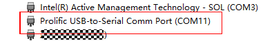
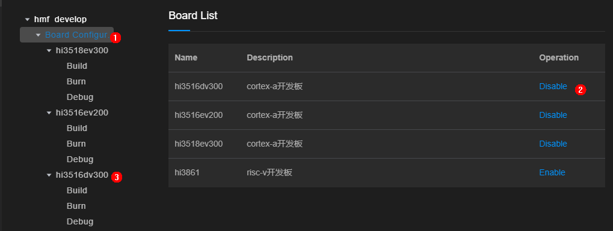
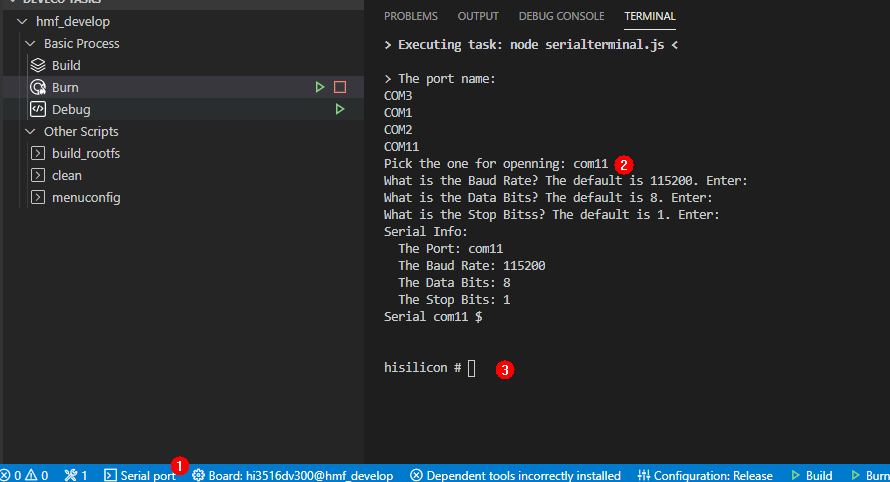
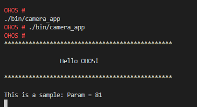

# Developing the First Application Program running on the Hi3516 Development Board<a name="EN-US_TOPIC_0000001052906247"></a>

This section describes how to modify, compile, burn, and run the first application on the board.

## Obtaining the Source Code<a name="section215953714245"></a>

You need to download a set of source code from the Linux server. For details, see  [Source Code Acquisition](en-us_topic_0000001050769927.md).

## Modifying an application<a name="s8efc1952ebfe4d1ea717182e108c29bb"></a>

The  **helloworld.c**  code in the  **applications/sample/camera/app/src**  directory is as following. You can customize the content to be printed. For example, you can change OHOS to World. The current applications can be developed using standard ISO C and C++.

```
#include <stdio.h>
#include "los_sample.h"

int main(int argc, char **argv)
{
    printf("\n************************************************\n");
    printf("\n\t\tHello OHOS!\n");
    printf("\n************************************************\n\n");

    LOS_Sample(g_num);

    return 0;
}
```

## Compiling<a name="section1077671315253"></a>

On the Linux server, go to the root directory of the source code package. The build.py compilation script is stored in the directory. Run the following script to compile the source code package:

Run the following script in the root directory of the source code package to compile the source code package. The result file is generated in the out/ipcamera\_hi3516dv300 directory.

```
python build.py ipcamera_hi3516dv300 -b debug
```

## Burning<a name="section18061240152520"></a>

Network Burning Mode

This method applies only to the board \(such as Hi3516D V300\) that supports the network port. In addition, the PC and the board must be connected by using a network cable and configured on the same network.

> **NOTICE:** 
>The Visual Studio Code software connects the board to the network. If the board cannot connect to the computer network, check the firewall settings. For details, see FAQ 2.

1.  Install the USB-to-serial adapter driver and obtain the serial port number.

    **Figure  1**  Successful driver installation<a name="fig87951742181717"></a>  
    

    1.  Power on the board and connect the serial port cable of the board to the Windows console.
    2.  Install the driver and obtain the driver link.
    3.  Open Device Manager, then check and record the value of  **Prolific USB-to-Serial Comm Port**.

        After the driver is successfully installed, if a warning icon is displayed on the device icon, right-click the device, uninstall the driver, reinstall the driver, and restart the computer as prompted.


2.  On the Windows console, add the IP address 192.168.1.3 for the interconnection network port of the board. The method is as follows:

    **Figure  2**  Adding a Windows host IP address<a name="fig1438112431779"></a>  
    

    1.  Choose Control Panel \> Network and Internet-\> Network Connections, right-click the network adapter connected to the board, and choose Properties from the shortcut menu.
    2.  Double-click Internet 协议版本4（TCP/IPv4）. 
    3.  Configure the IP address and gateway according to the preceding figure.
    4.  Click OK to save the configuration.

3.  hi3516dv300 is added to the board list. After you choose Board Configure and enable a board, the board configuration table is automatically added.

    **Figure  3**  Add a board.<a name="fig152451448203711"></a>  
    

4.  Start the IDE and click the icons in sequence to configure the contents to be burnt over the network.

    **Figure  4**  Network configuration diagram of the IDE tool<a name="fig79672366813"></a>  
    

    

    1.  Select Hi3516 as the board type.
    2.  Click Burn.
    3.  Set Burning Mode to "network".
    4.  Host IP Address: Click to refresh the page and select 192.168.1.3 from the drop-down list box.

5.  Select the chip to be burnt to the flash memory and the burning address.

    **Figure  5**  Setting the parameters for burning files<a name="fig11902195416418"></a>  
    

    

    1.  Select emmc from the Memory Type drop-down list box as the flash memory type.
    2.  Click New to add three files. Enter the OHOS\_Image.bin, rootfs.img, and userfs.img files in the file path in sequence. Set the start address and file length as shown in the following figure, obtain the file from the out/ipcamera\_hi3516dv300 directory.
    3.  Click <cf id="Bold"\>Save</cf\> to save the changes.
    4.  Click Burn on the left to start burning.

6.  Select a serial port number from the drop-down list box displayed in the upper part, for example, COM11.

    **Figure  6**  Selecting the serial port to be connected to the board<a name="fig73452316549"></a>  
    

7.  The burning starts. If a message is displayed, you need to manually restart the board \(by powering off and then powering on the board\).

    **Figure  7**  The system prompts you to power off the board and power on the board again.<a name="fig3421920185520"></a>  
    

    

8.  Burning is complete.

    **Figure  8**  Successful burning<a name="fig88368374585"></a>  
    


## Running an Image<a name="section380511712615"></a>

1.  Connect a serial port cable.

    **Figure  9**  Connect the serial port cables.<a name="fig056645018495"></a>  
    

    

    1.  Click Serial port to enable the serial port.
    2.  Enter the serial port number of the "com11" and press Enter until hisillicon is displayed.
    3.  If the board is started for the first time or the startup parameters are modified, go to step 2. Otherwise, go to step 3.

2.  \(Mandatory when the board is started for the first time\) Modify the bootcmd and bootargs of the U-boot. This step is a fixed operation. If the parameters are not modified, you need to perform this step only once. The system automatically enters the system each time the board is reset.

    > **NOTICE:** 
    >By default, the U-boot boot program waits for two seconds. You can press Enter to interrupt the waiting and the message "hisillicon" is displayed. You can run the reset command to restart the system.

    **Table  1**  U-boot startup parameters

    <a name="table432481061214"></a>
    <table><tbody><tr id="row532461021219"><th class="firstcol" valign="top" width="8.39%" id="mcps1.2.3.1.1"><p id="p1238114718129"><a name="p1238114718129"></a><a name="p1238114718129"></a>Command</p>
    </th>
    <td class="cellrowborder" valign="top" width="91.61%" headers="mcps1.2.3.1.1 "><p id="p93816470127"><a name="p93816470127"></a><a name="p93816470127"></a><strong id="b143728351609"><a name="b143728351609"></a><a name="b143728351609"></a>setenv bootcmd "sf probe 0;mmc read 0x0 0x80000000 0x800 0x4800; go 0x80000000";</strong></p>
    <p id="p83904761218"><a name="p83904761218"></a><a name="p83904761218"></a><strong id="b14389193520014"><a name="b14389193520014"></a><a name="b14389193520014"></a>setenv bootargs "console=ttyAMA0,115200n8 root=emmc fstype=vfat rootaddr=10M rootsize=15M rw";</strong></p>
    <p id="p7399470123"><a name="p7399470123"></a><a name="p7399470123"></a><strong id="b1041015359012"><a name="b1041015359012"></a><a name="b1041015359012"></a>saveenv</strong></p>
    <p id="p14391747131219"><a name="p14391747131219"></a><a name="p14391747131219"></a><strong id="b84127351701"><a name="b84127351701"></a><a name="b84127351701"></a>reset</strong></p>
    </td>
    </tr>
    <tr id="row6324410171216"><th class="firstcol" valign="top" width="8.39%" id="mcps1.2.3.2.1"><p id="p203915473129"><a name="p203915473129"></a><a name="p203915473129"></a>Description</p>
    </th>
    <td class="cellrowborder" valign="top" width="91.61%" headers="mcps1.2.3.2.1 "><p id="p439134715129"><a name="p439134715129"></a><a name="p439134715129"></a><strong id="b14391847171211"><a name="b14391847171211"></a><a name="b14391847171211"></a>setenv bootcmd "mmc read 0x0 0x80000000 0x800 0x4800;go 0x80000000";</strong></p>
    <p id="p1439184741218"><a name="p1439184741218"></a><a name="p1439184741218"></a>This command indicates that flash 0 is selected, and the contents with the start address of 0x800 (unit: 512 bytes, that is, 1 MB) and the size of 0x4800 (unit: 512 bytes, that is, 9 MB) are read to the memory address 0x80000000.</p>
    <p id="p7391347101215"><a name="p7391347101215"></a><a name="p7391347101215"></a><strong id="b0397473129"><a name="b0397473129"></a><a name="b0397473129"></a>setenv bootargs "console=ttyAMA0,115200n8 root=emmc fstype=vfat rootaddr=10M rootsize=15M rw";</strong></p>
    <p id="p939547151215"><a name="p939547151215"></a><a name="p939547151215"></a>This command sets the boot parameters to serial port output, baud rate to 115200, data bit to 8, rootfs to be mounted to the eMMC, and file system type to vfat,</p>
    <p id="p8402475121"><a name="p8402475121"></a><a name="p8402475121"></a>Enter the start burning position and length of rootfs.img in rootaddr=10M rootsize=15M rw. The size must be the same as that of the rootfs.img file added in the IDE.</p>
    <p id="p54034712120"><a name="p54034712120"></a><a name="p54034712120"></a><strong id="b2600155013264"><a name="b2600155013264"></a><a name="b2600155013264"></a>saveenv</strong> indicates that the current configuration is saved.</p>
    <p id="p2401247131212"><a name="p2401247131212"></a><a name="p2401247131212"></a><strong id="b1427444612265"><a name="b1427444612265"></a><a name="b1427444612265"></a>reset</strong> indicates that the board is reset.</p>
    <p id="p1440164791213"><a name="p1440164791213"></a><a name="p1440164791213"></a><strong id="b725515390267"><a name="b725515390267"></a><a name="b725515390267"></a>(Optional) go 0x40000000</strong> indicates that the command is fixed in the startup parameters by default and the board automatically starts after it is reset. If you want to manually start the board, you can press <strong id="b1420714384268"><a name="b1420714384268"></a><a name="b1420714384268"></a>Enter</strong> in the countdown phase of the U-Boot startup to interrupt the automatic startup.</p>
    </td>
    </tr>
    </tbody>
    </table>

3.  Enter reset and press Enter to restart the board. After the board is restarted successfully, press Enter. OHOS is displayed.

    **Figure  10**  Start the system<a name="fig10181006376"></a>  
    

    


## Run the program.<a name="section5276734182615"></a>

In the root directory, run the  **./bin/hello\_uart**  command line to operate the demo program. The following figure shows the compilation result.

**Figure  11**  Why are apps on my phone launching slowly?<a name="fig36537913815"></a>  




