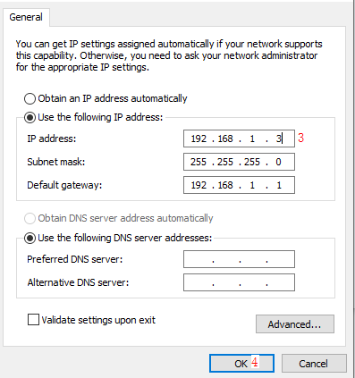
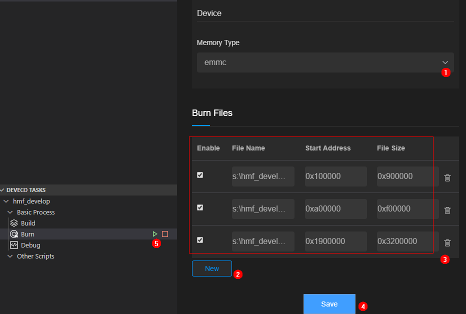

# Developing the First Example Program Running on Hi3516<a name="EN-US_TOPIC_0000001052906247"></a>

This section describes how to modify, compile, burn, and run the first program, and finally print  **Hello OHOS!**  on the develop board.

## Acquiring Source Code<a name="section215953714245"></a>

You need to acquire Hi3516 source code \([http://tools.harmonyos.com/mirrors/os/1.0/ipcamera\_hi3516dv300-1.0.tar.gz](http://tools.harmonyos.com/mirrors/os/1.0/ipcamera_hi3516dv300-1.0.tar.gz)  or  [https://mirrors.huaweicloud.com/harmonyos/1.0/ipcamera\_hi3516dv300-1.0.tar.gz](https://mirrors.huaweicloud.com/harmonyos/1.0/ipcamera_hi3516dv300-1.0.tar.gz)\) and download it on a Linux server. For more obtaining methods, see  [Source Code Acquisition](../get-code/source-code-acquisition.md).

## Modifying a Program<a name="s8efc1952ebfe4d1ea717182e108c29bb"></a>

The code of  **helloworld.c**  in the  **applications/sample/camera/app/src**  directory is shown in the following example. You can customize the content to be printed. For example, you can change  **OHOS**  to  **World**. You can use either C or C++ to develop a program.

```
#include <stdio.h>
#include "los_sample.h"

int main(int argc, char **argv)
{
    printf("\n************************************************\n");
    printf("\n\t\tHello OHOS!\n");
    printf("\n************************************************\n\n");

    LOS_Sample(g_num);

    return 0;
}
```

## Compiling Code<a name="section1077671315253"></a>

On the Linux server, execute the  **build.py**  script stored in the root directory of the source code package. The result files in the  **out/ipcamera\_hi3516dv300**  directory.

```
python build.py ipcamera_hi3516dv300 -b debug
```

## Burning Images<a name="section18061240152520"></a>

This method applies only to development boards that have network ports, for example, the Hi3516DV300 development board. The PC and the development board must be connected to the same network through a network cable.

> **NOTICE:** 
>If the development board fails to connect to the PC, check whether the firewall settings are correct. For details, see problem 2 in FAQs.

1.  Install the USB-to-serial adapter driver and obtain the serial port number.

    **Figure  1**  Successful driver installation<a name="fig18537418237"></a>  
    

    1.  Power on the board and connect the serial port of the board to the Windows workstation.
    2.  Install the  [driver](http://www.hihope.org/download).
    3.  Open  **Device Manager**, and then check and record the port number of  **Prolific USB-to-Serial Comm Port**. In this example, the port number is COM11.

        After the driver is installed, right-click the device to uninstall it if a yellow exclamation mark is displayed on the device icon. After the driver is reinstalled, restart the PC as required.


2.  Add an IP address 192.168.1.3 in this example to the interconnected port of the board.

    **Figure  2**  Adding an IP address<a name="fig1438112431779"></a>  
    

    1.  Choose  **Control Panel**  \>  **Network and Internet**-\>  **Network Connections**. Right-click the network adapter connected to the board, and choose  **Properties**  from the shortcut menu.
    2.  Double-click  **Internet Protocol Version 4 \(TCP/IPv4\)**  and right-click  **Properties**  from the shortcut menu.
    3.  Set the IP address and gateway according to the preceding figure.
    4.  Click OK to save the configuration.

3.  Choose  **Board Configuration**  and enable the hi3516dv300 board in the  **Board List**  area. The hi3516dv300 board will then be added to the  **Board Configuration**  list.

    **Figure  3**  Adding the hi3516dv300 board<a name="fig152451448203711"></a>  
    

4.  Open the IDE and configure the content to burn over the network by following the sequence in the following figure.

    **Figure  4**  Network configuration on the IDE<a name="fig79672366813"></a>  
    

    

    1.  Choose the Hi3516dv300 board.
    2.  Click  **Burn**.
    3.  Set  **Burning Mode**  to  **network**.
    4.  Select the IP address  **192.168.1.3**  from the drop-down list after clicking the refreshing icon.

5.  Select the flash memory type and set the burning addresses.

    **Figure  5**  Burning parameter configuration<a name="fig11902195416418"></a>  
    

    

    1.  Select  **emmc**  from the  **Memory Type**  drop-down list as the  **flash memory**  type.
    2.  Click  **New**  in the  **Burn Files**  area to add three file configuration records, fill  **OHOS\_Image.bin**,  **rootfs.img**, and  **userfs.img**  in the  **out/ipcamera\_hi3516dv300**  directory to File Name one by one, and set the start addresses and file sizes according to the configuration in the preceding figure.
    3.  Click  **Save**.
    4.  Click  **Burn**  to start burning.

6.  Click the text box on the top area of the IDE and select a serial port number from the drop-down list, for example, COM11.

    **Figure  6**  Selecting the serial port that is connected to the board<a name="fig73452316549"></a>  
    

7.  Start burning. If the following prompt message is displayed, you need to manually power off and then restart the board.

    **Figure  7**  Prompt message<a name="fig3421920185520"></a>  
    

    

8.  Check that the burning is successful.

    **Figure  8**  Successful burning<a name="fig88368374585"></a>  
    


## Running an Image<a name="section380511712615"></a>

1.  Connect to a serial port.

    **Figure  9**  Serial port connection<a name="fig056645018495"></a>  
    

    

    1.  Click  **Serial port**  to enable it.
    2.  Enter the serial port number "com11" and press  **Enter**  until  **hisillicon**  is displayed.
    3.  Go to step 2 if the board is started for the first time or the startup parameters need to be modified; go to step 3 otherwise.

2.  \(Mandatory when the board is started for the first time\) Modify the bootcmd and bootargs parameters of U-Boot. You need to perform this step only once if the parameters need not to be modified during the operation. The board automatically starts after it is reset.

    > **NOTICE:** 
    >The default waiting time in the U-Boot is 2s. You can press  **Enter**  to interrupt the waiting and run the  **reset**  command to restart the system after "hisillicon" is displayed.

    **Table  1**  Startup parameters of the U-Boot

    <a name="table432481061214"></a>
    <table><tbody><tr id="row532461021219"><th class="firstcol" valign="top" width="8.39%" id="mcps1.2.3.1.1"><p id="p1238114718129"><a name="p1238114718129"></a><a name="p1238114718129"></a>Command</p>
    </th>
    <td class="cellrowborder" valign="top" width="91.61%" headers="mcps1.2.3.1.1 "><p id="p93816470127"><a name="p93816470127"></a><a name="p93816470127"></a><strong id="b143728351609"><a name="b143728351609"></a><a name="b143728351609"></a>setenv bootcmd "sf probe 0;mmc read 0x0 0x80000000 0x800 0x4800; go 0x80000000";</strong></p>
    <p id="p83904761218"><a name="p83904761218"></a><a name="p83904761218"></a><strong id="b14389193520014"><a name="b14389193520014"></a><a name="b14389193520014"></a>setenv bootargs "console=ttyAMA0,115200n8 root=emmc fstype=vfat rootaddr=10 M rootsize=15 M rw";</strong></p>
    <p id="p7399470123"><a name="p7399470123"></a><a name="p7399470123"></a><strong id="b1041015359012"><a name="b1041015359012"></a><a name="b1041015359012"></a>saveenv</strong></p>
    <p id="p14391747131219"><a name="p14391747131219"></a><a name="p14391747131219"></a><strong id="b84127351701"><a name="b84127351701"></a><a name="b84127351701"></a>reset</strong></p>
    </td>
    </tr>
    <tr id="row6324410171216"><th class="firstcol" valign="top" width="8.39%" id="mcps1.2.3.2.1"><p id="p203915473129"><a name="p203915473129"></a><a name="p203915473129"></a>Description</p>
    </th>
    <td class="cellrowborder" valign="top" width="91.61%" headers="mcps1.2.3.2.1 "><p id="p439134715129"><a name="p439134715129"></a><a name="p439134715129"></a><strong id="b14391847171211"><a name="b14391847171211"></a><a name="b14391847171211"></a>setenv bootcmd "mmc read 0x0 0x80000000 0x800 0x4800;go 0x80000000";</strong></p>
    <p id="p1439184741218"><a name="p1439184741218"></a><a name="p1439184741218"></a>Run this command to set the flash number to 0, and read content that has a size of 0x4800 (9 MB) and a start address of 0x800 (1 MB) to the memory address 0x80000000.</p>
    <p id="p7391347101215"><a name="p7391347101215"></a><a name="p7391347101215"></a><strong id="b0397473129"><a name="b0397473129"></a><a name="b0397473129"></a>setenv bootargs "console=ttyAMA0,115200n8 root=emmc fstype=vfat rootaddr=10 M rootsize=15 M rw";</strong></p>
    <p id="p939547151215"><a name="p939547151215"></a><a name="p939547151215"></a>Run this command to set the output mode to serial port output, baud rate to <strong id="b117741732177"><a name="b117741732177"></a><a name="b117741732177"></a>115200</strong>, data bit to <strong id="b946218717177"><a name="b946218717177"></a><a name="b946218717177"></a>8</strong>, <strong id="b1731025331313"><a name="b1731025331313"></a><a name="b1731025331313"></a>rootfs</strong> to be mounted to the <strong id="b9425113171715"><a name="b9425113171715"></a><a name="b9425113171715"></a>emmc</strong> component, and file system type to <strong id="b1526310519141"><a name="b1526310519141"></a><a name="b1526310519141"></a>vfat</strong>.</p>
    <p id="p8402475121"><a name="p8402475121"></a><a name="p8402475121"></a><strong id="b815584925312"><a name="b815584925312"></a><a name="b815584925312"></a>rootaddr=10 M, rootsize=15 M rw</strong> indicates the start address and size of the rootfs.img file to be burnt, respectively. The file size must be the same as that of the compiled file in the IDE.</p>
    <p id="p54034712120"><a name="p54034712120"></a><a name="p54034712120"></a><strong id="b2600155013264"><a name="b2600155013264"></a><a name="b2600155013264"></a>saveenv</strong> means to save the current configuration.</p>
    <p id="p2401247131212"><a name="p2401247131212"></a><a name="p2401247131212"></a><strong id="b1427444612265"><a name="b1427444612265"></a><a name="b1427444612265"></a>reset</strong> means to reset the board.</p>
    <p id="p1440164791213"><a name="p1440164791213"></a><a name="p1440164791213"></a><strong id="b725515390267"><a name="b725515390267"></a><a name="b725515390267"></a>(Optional) go 0x80000000</strong> indicates that the command is fixed in the startup parameters by default and the board automatically starts after it is reset. If you want to manually start the board, press <strong id="b1420714384268"><a name="b1420714384268"></a><a name="b1420714384268"></a>Enter</strong> in the countdown phase of the U-Boot startup to interrupt the automatic startup.</p>
    </td>
    </tr>
    </tbody>
    </table>

3.  Run the  **reset**  command and press  **Enter**  to restart the board. After the board is restarted,  **OHOS**  is displayed when you press  **Enter**.

    **Figure  10**  System startup<a name="fig10181006376"></a>  
    

    


## Run a Program<a name="section5276734182615"></a>

In the root directory, run the  **./bin/camera\_app**  command to operate the demo program. The following figure shows the compilation result.

**Figure  11**  Program started successfully<a name="fig36537913815"></a>  


