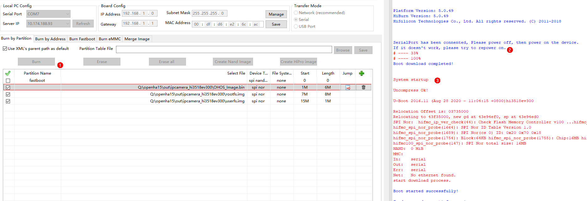
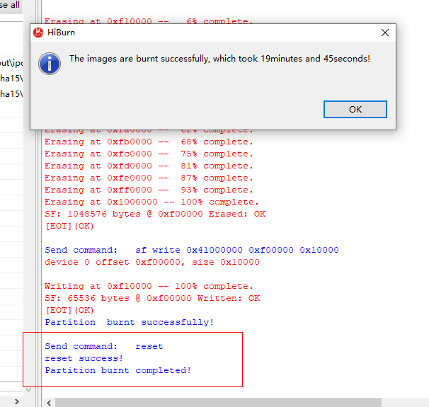
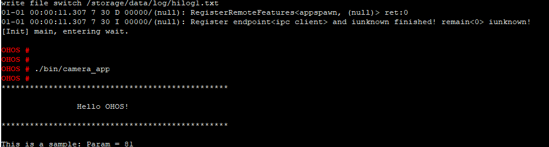

# Developing the First Example Program running on Hi3518<a name="EN-US_TOPIC_0000001053422339"></a>

This section describes how to modify, compile, burn, and run the first program on the board, and finally print  **Hello OHOS!**.

## Acquiring Source Code<a name="section1726092873119"></a>

You need to acquire Hi3518 source code \([http://tools.harmonyos.com/mirrors/os/1.0/ipcamera\_hi3518ev300-1.0.tar.gz](http://tools.harmonyos.com/mirrors/os/1.0/ipcamera_hi3518ev300-1.0.tar.gz)  or  [https://mirrors.huaweicloud.com/harmonyos/1.0/ipcamera\_hi3518ev300-1.0.tar.gz](https://mirrors.huaweicloud.com/harmonyos/1.0/ipcamera_hi3518ev300-1.0.tar.gz)\) and download it on a Linux server. For details, see  [Source Code Acquisition](../get-code/source-code-acquisition.md).

## Modifying a Program<a name="s8efc1952ebfe4d1ea717182e108c29bb"></a>

The following example shows the  **helloworld.c**  code in the  **applications/sample/camera/app/src**  directory. You can customize the content to be printed. For example, you can change OHOS to World. You can use either ISO C or C++ to develop a program.

```
#include <stdio.h>
#include "los_sample.h"

int main(int argc, char **argv)
{
    printf("\n************************************************\n");
    printf("\n\t\tHello OHOS!\n");
    printf("\n************************************************\n\n");

    LOS_Sample(g_num);

    return 0;
}
```

## Compiling Code<a name="section234175193114"></a>

On the Linux server, access the root directory of the source code package and run the following script to compile the source code package. The result files are generated in the  **out/ipcamera\_hi3518ev300**  directory.

Hi3518EV300

```
python build.py ipcamera_hi3518ev300 -b debug
```

## Burning Images<a name="section13453727165513"></a>

Burn images to the Hi3518EV300 board over the serial port.

1.  Connect a serial cable \(USB port\) of the board to the Windows host and start  **Device Manager**  to check whether the serial port number is COM7.

    > **NOTICE:** 
    >To update the USB-to-Serial driver, you need to start  **Device Manager**, right-click the device, and choose  **Update Driver Software**  \>  **Search automatically for updated driver software**.

    **Figure  1**  Successful driver installation<a name="fig44731317340"></a>  
    

2.  Start the HiTool, select the  **Hi3518EV300**  chip, select  **COM7**  for  **Local PC Config**, and select  **Serial**  for  **Transfer Mode**.

    **Figure  2**  Configuring the serial port on HiTool<a name="fig39175210590"></a>  
    

3.  Burn the newly compiled  **OHOS\_Image.bin**  file,  **rootfs.img**, and  **userfs.img**  files to the board. Ensure the file path, flash type, burning start address, and burning length are correct. Modify relevant parameters based on the file size. The value is rounded up, in MB.

    **Figure  3**  Burning images using HiTool<a name="fig86613431218"></a>  
    

4.  Click  **Burn**  and power on the board as required. \(If the board is powered on, power it off and then power it on.\)

    **Figure  4** <a name="fig25501252753"></a>  
    

5.  Click  **OK**.

    **Figure  5**  Successful burning<a name="fig1527452663210"></a>  
    


## Running an Image<a name="section62131033183710"></a>

1.  Connect to the serial port. After the images are burnt successfully, start the terminal, click  **Settings**, set  **View Title**  to  **Terminal 11**  and  **Port**  to  **COM7**, and click  **OK**  to open the serial port. You have logged in to the U-Boot if  **hisilicon \#**  is displayed.

    **Figure  6**  Serial port connection<a name="fig197461744191012"></a>  
    

2.  \(Mandatory for the first burning\) Modify the  **bootcmd**  and  **bootargs**  parameters of U-Boot. This step is a fixed operation and the result can be saved. However, you need to perform the following steps again if U-Boot needs to be reburnt.

    **Table  1**  Parameters of the Hi3518EV300 U-Boot

    <a name="table1671622991613"></a>
    <table><tbody><tr id="row1371652914168"><th class="firstcol" valign="top" width="8.38%" id="mcps1.2.3.1.1"><p id="p1598685321618"><a name="p1598685321618"></a><a name="p1598685321618"></a>Command</p>
    </th>
    <td class="cellrowborder" valign="top" width="91.62%" headers="mcps1.2.3.1.1 "><p id="p1598616535166"><a name="p1598616535166"></a><a name="p1598616535166"></a>setenv bootcmd "sf probe 0;sf read 0x40000000 0x100000 0x600000;go 0x40000000";</p>
    <p id="p183481352181718"><a name="p183481352181718"></a><a name="p183481352181718"></a>setenv bootargs "console=ttyAMA0,115200n8 root=flash fstype=jffs2 rw rootaddr=7 M rootsize=8 M"; saveenv;</p>
    <p id="p1784612265186"><a name="p1784612265186"></a><a name="p1784612265186"></a>reset</p>
    </td>
    </tr>
    <tr id="row9716152914161"><th class="firstcol" valign="top" width="8.38%" id="mcps1.2.3.2.1"><p id="p998695361611"><a name="p998695361611"></a><a name="p998695361611"></a>Description</p>
    </th>
    <td class="cellrowborder" valign="top" width="91.62%" headers="mcps1.2.3.2.1 "><p id="p1198615316165"><a name="p1198615316165"></a><a name="p1198615316165"></a><strong id="b11610792311"><a name="b11610792311"></a><a name="b11610792311"></a>setenv bootcmd "sf probe 0;sf read 0x40000000 0x100000 0x600000;go 0x40000000";</strong></p>
    <p id="p2986125310164"><a name="p2986125310164"></a><a name="p2986125310164"></a>Run this command to set the content of <strong id="b1915115872811"><a name="b1915115872811"></a><a name="b1915115872811"></a>bootcmd</strong>. Select the flash whose number is 0, and read content that has a size of 0x600000 and a start address of 0x100000 to memory address 0x40000000.</p>
    <p id="p5759815112613"><a name="p5759815112613"></a><a name="p5759815112613"></a><strong id="b19527719203716"><a name="b19527719203716"></a><a name="b19527719203716"></a>(Optional) go 0x40000000</strong> indicates that the command is fixed in the startup parameters by default and the board automatically starts after it is reset. If you want to manually start the board, press <strong id="b118621929144219"><a name="b118621929144219"></a><a name="b118621929144219"></a>Enter</strong> in the countdown phase of the U-Boot startup to interrupt the automatic startup.</p>
    <p id="p340215818235"><a name="p340215818235"></a><a name="p340215818235"></a><strong id="b119855142415"><a name="b119855142415"></a><a name="b119855142415"></a>setenv bootargs "console=ttyAMA0,115200n8 root=flash fstype=jffs2 rw rootaddr=7 M rootsize=8 M";</strong></p>
    <p id="p8987115381613"><a name="p8987115381613"></a><a name="p8987115381613"></a>In this command, <strong id="b177343793718"><a name="b177343793718"></a><a name="b177343793718"></a>bootargs</strong> is set to the serial port output, the baud rate is 115200, the data bit is 8, and the <strong id="b033817523412"><a name="b033817523412"></a><a name="b033817523412"></a>rootfs</strong> is mounted to the flash memory. The file system type is set to <strong id="b16149152018429"><a name="b16149152018429"></a><a name="b16149152018429"></a>jffs2 rw</strong>, which provides the read-write attribute for the JFFS2 file system.</p>
    <p id="p1888191482518"><a name="p1888191482518"></a><a name="p1888191482518"></a><strong id="b14704195842212"><a name="b14704195842212"></a><a name="b14704195842212"></a>rootaddr=7 M rootsize=8 M</strong> indicates the actual start address and length of the <strong id="b1299173342420"><a name="b1299173342420"></a><a name="b1299173342420"></a>rootfs.img</strong> file to be burnt. The size must be the same as that of the compiled files in the HiTool.</p>
    <p id="p1198755319162"><a name="p1198755319162"></a><a name="p1198755319162"></a><strong id="b75716918518"><a name="b75716918518"></a><a name="b75716918518"></a>saveenv</strong> indicates that the current configuration is saved.</p>
    <p id="p0987125371614"><a name="p0987125371614"></a><a name="p0987125371614"></a><strong id="b267841314518"><a name="b267841314518"></a><a name="b267841314518"></a>reset</strong> indicates that the board is reset.</p>
    <p id="p094912253363"><a name="p094912253363"></a><a name="p094912253363"></a><strong id="b319886366"><a name="b319886366"></a><a name="b319886366"></a>pri</strong> indicates the display parameters to be viewed.</p>
    </td>
    </tr>
    </tbody>
    </table>

    **Figure  7**  Startup parameter settings<a name="fig11101652163517"></a>  
    

3.  If  **hisilicon \#**  is displayed during the startup, run the  **reset**  command. After the system automatically starts and  **OHOS**  is displayed, run the  **./bin/camera\_app**  command and then press  **Enter**. The system is started successfully if information shown in the following figure is displayed.

    **Figure  8**  Successful system startup and program execution<a name="fig11838403383"></a>  
    


## Follow-up Learning<a name="section9712145420182"></a>

Congratulations! You have finished all steps! You are advised to go on learning how to develop  [Cameras with a Screen](../guide/camera-control.md).

