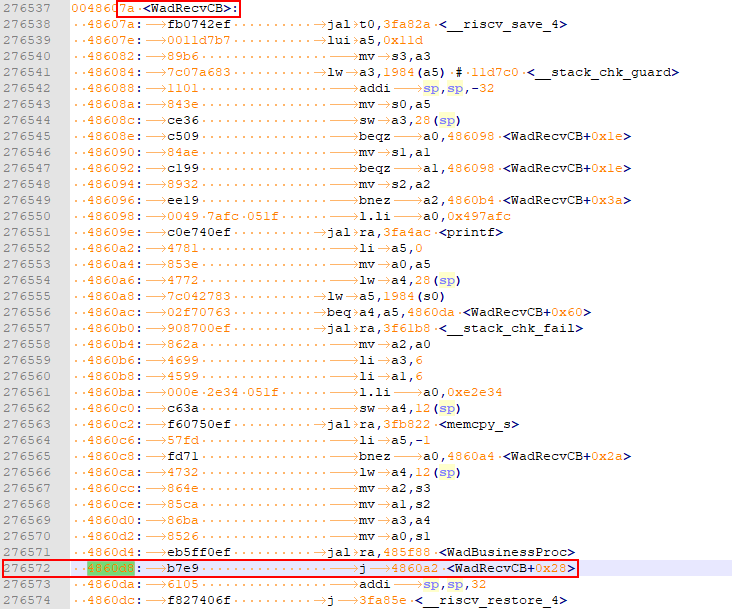

# Developing the Second Example Program Running on Hi3861<a name="EN-US_TOPIC_0000001053183925"></a>

This example shows how to compile a simple service and print  **Hello World**.

## Modifying Source Code<a name="section9360141181414"></a>

The source code needs to be modified when fixing bugs or compiling a new service. The following describes how to modify the source code when compiling a new service.

1.  Determine the directory structure.

    Before compiling a service, you must create a directory \(or a directory structure\) in  **./applications/sample/wifi-iot/app**  to store source code files.

    For example, add the  **my\_first\_app**  service to the  **app**  directory, where  **hello\_world.c**  is the service code and  **BUILD.gn**  is the compilation script. The directory structure is shown as follows:

    ```
    .
    └── applications
        └── sample
            └── wifi-iot
                └── app
                    │── my_first_app
                    │  │── hello_world.c
                    │  └── BUILD.gn
                    └── BUILD.gn
    ```

2.  Compile the service code.

    Create the service entry function  **HelloWorld**  in  **hello\_world.c**  and implement service logic. Use the SYS\_RUN\(\) of the OpenHarmony  **bootstrap**  module to start services. \(**SYS\_RUN**  is defined in the  **ohos\_init.h**  file.\)

    ```
    #include "ohos_init.h"
    #include "ohos_types.h"
    
    void HelloWorld(void)
    {
        printf("[DEMO] Hello world.\n");
    }
    SYS_RUN(HelloWorld);
    ```

3.  Compile the  **BUILD.gn**  file for building services into a static library.

    The  **BUILD.gn**  file consists of three parts, including target, source file, and header file path. You need to fill in all of these parts. Take  **my\_first\_app**  as an example, you need to create  **./applications/sample/wifi-iot/app/my\_first\_app/BUILD.gn**  and complete the following configurations:

    ```
    static_library("myapp") {
        sources = [
            "hello_world.c"
        ]
        include_dirs = [
            "//utils/native/liteos/include"
        ]
    }
    ```

    -   Specify the compilation result named libmyapp.a in  **static\_library**. You can fill in this part based on your need.
    -   Specify the .c file on which a file depends and its path in  **sources**. The path that contains  **//**  represents an absolute path \(the code root path\), otherwise it is a relative path.
    -   Specify the path of .h file on which  **sources**  depends in  **include\_dirs**.

4.  Compile the  **BUILD.gn**  file and specify the feature modules to be built.

    Configure the  **./applications/sample/wifi-iot/app/BUILD.gn**  file and add an index to the  **features**  field to enable the target to be involved in compilation. Specify the path and target of a service module in  **features**. The following uses  **my\_first\_app**  as an example and the  **features**  is configured as follows:

    ```
    import("//build/lite/config/component/lite_component.gni")
    
    lite_component("app") {
        features = [
            "my_first_app:myapp",
        ]
    }
    ```

    -   **my\_first\_app**  is a relative path that points to  **./applications/sample/wifi-iot/app/my\_first\_app/BUILD.gn**.
    -   **myapp**  represents the static library in  **./applications/sample/wifi-iot/app/my\_first\_app/BUILD.gn**.


## Debugging and Verification<a name="section1621064881419"></a>

Currently, there are two debugging and verification methods: using printf to print logs and using asm files to locate  **panic**  problems. You can select one of them based on your need.

As the service shown is simple, use the printf method. The following describes the two debugging methods.

## printf<a name="section1246911301217"></a>

Add  **printf**  function to the code, which helps print data to the serial port. You can add log printing in key service paths or service exception locations, as shown in the following figure.

```
void HelloWorld(void)
{
    printf("[DEMO] Hello world.\n");
}
```

## Locating Exceptions Using the asm File<a name="section197271353219"></a>

When the system exits abnormally, the call stack information about the abnormal exit is displayed on the serial port. The following is an example: You can locate the exception by parsing the exception stack information.

```
=======KERNEL PANIC=======
**********************Call Stack*********************
Call Stack 0 -- 4860d8 addr:f784c
Call Stack 1 -- 47b2b2 addr:f788c
Call Stack 2 -- 3e562c addr:f789c
Call Stack 3 -- 4101de addr:f78ac
Call Stack 4 -- 3e5f32 addr:f78cc
Call Stack 5 -- 3f78c0 addr:f78ec
Call Stack 6 -- 3f5e24 addr:f78fc
********************Call Stack end*******************
```

To parse the call stack information, the  **Hi3861\_wifiiot\_app.asm**  file is required. This file records the symbol addresses of the functions in the code in the flash memory and the disassembly information. The asm file is built and output together with the version software package and is stored in the  **./out/wifiiot/**  directory.

1.  \(Optional\) Save the** CallStack**  information to a txt file for editing.
2.  Open the asm file, search for the function address in each call stack, and list the corresponding function. Generally, you only need to find the functions matching the first several stacks to locate exceptions.

    ```
    Call Stack 0 -- 4860d8 addr:f784c -- WadRecvCB
    Call Stack 1 -- 47b2b2 addr:f788c -- wal_sdp_process_rx_data
    Call Stack 2 -- 3e562c addr:f789c
    Call Stack 3 -- 4101de addr:f78ac
    Call Stack 4 -- 3e5f32 addr:f78cc
    Call Stack 5 -- 3f78c0 addr:f78ec
    Call Stack 6 -- 3f5e24 addr:f78fc
    ```

3.  Determined that an exception occurs in the  **WadRecvCB**  function based on the call stack information.

    

4.  Check and modify the code.

## Viewing Execution Result<a name="section18115713118"></a>

After the sample code is compiled, burnt, run, and debugged, the following information is displayed:

```
ready to OS start
FileSystem mount ok.
wifi init success!
[DEMO] Hello world.
```

## Follow-up Learning<a name="section9712145420182"></a>

Congratulations! You have finished all steps! You are advised to go on learning how to develop  [WLAN-connected products](../guide/overview.md).

