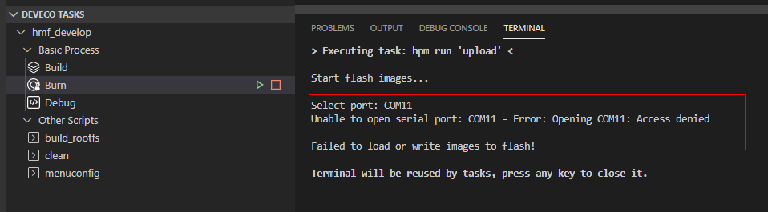
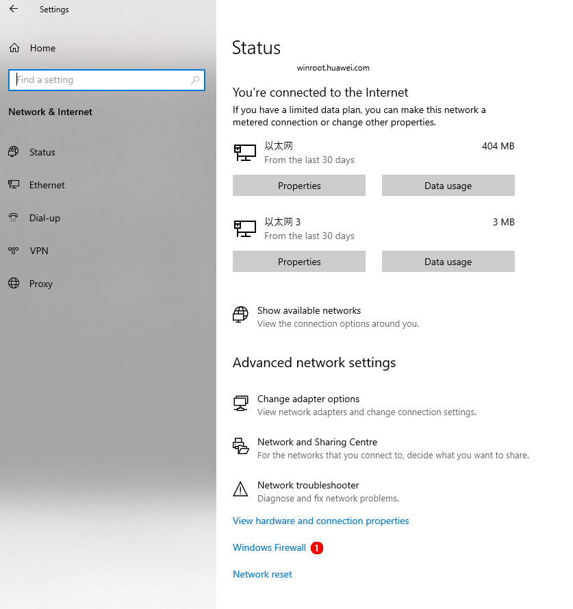
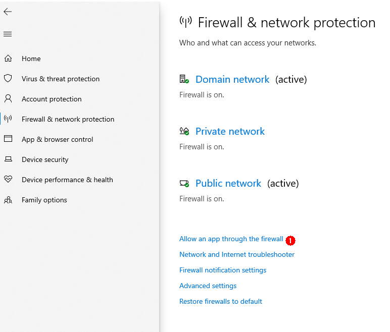
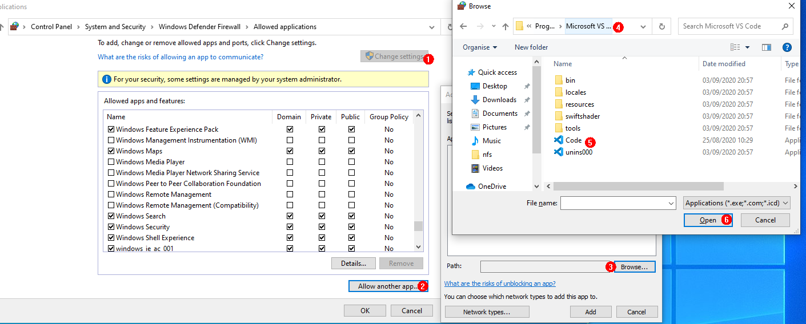
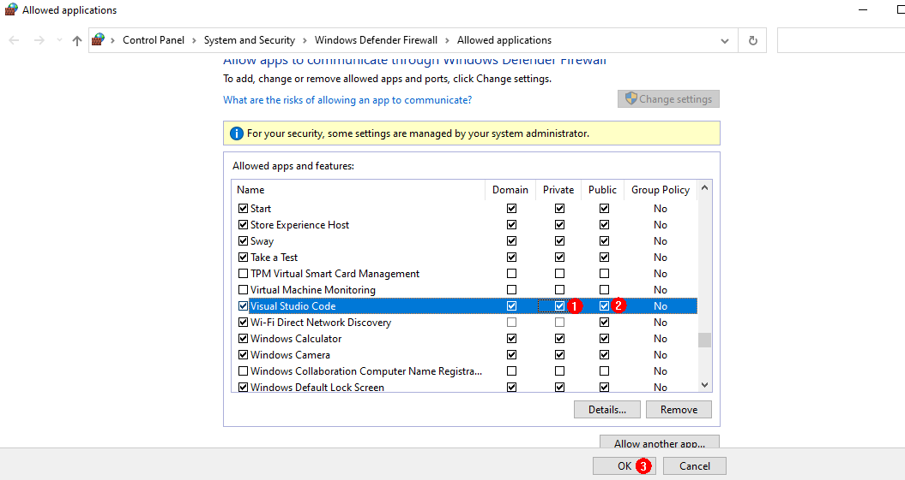

# FAQs<a name="EN-US_TOPIC_0000001053466255"></a>

**Problem 1: What should I do when the images failed to be burnt over the selected serial port?**

-   **Symptom**

    **Error: Opening COMxx: Access denied**  is displayed after clicking  **Burn**  and selecting a serial port.

    **Figure  1**  Failed to open the serial port<a name="fig066333283916"></a>  
    

-   **Possible Causes**

    The serial port has been used.

-   **Solutions**

1.  Search for the terminal using serial-xx from the drop-down list in the  **TERMINAL**  panel.

    **Figure  2**  Checking whether the serial port is used<a name="fig165994164420"></a>  
    

2.  Click the dustbin icon as shown in the following figure to disable the terminal using the serial port.

    **Figure  3**  Disabling the terminal using the serial port<a name="fig7911282453"></a>  
    

3.  Click  **Burn**, select the serial port, and start burning images again.

    **Figure  4**  Restarting burning<a name="fig1138624316485"></a>  
    


**Problem 2: What should I do when Windows-based PC failed to be connected to the board?**

-   **Symptom**

    The file image cannot be obtained after clicking  **Burn**  and selecting a serial port.

    **Figure  5**  Failed to obtain the image file due to unavailable connection<a name="fig5218920223"></a>  
    

-   **Possible Causes**

    The board is disconnected from the Windows-based PC.

    Windows Firewall does not allow Visual Studio Code to access the network.

-   **Solutions**

1.  Check whether the network cable is properly connected.
2.  Click  **Windows Firewall**.

    **Figure  6**  Network and firewall setting<a name="fig62141417794"></a>  
    

3.  Click  **Firewall & network protection**, and on the displayed page, click  **Allow applications to communicate through Windows Firewall**.

    **Figure  7**  Firewall and network protection<a name="fig20703151111116"></a>  
    

4.  Select the Visual Studio Code application

    **Figure  8**  Selecting the Visual Studio Code application<a name="fig462316612165"></a>  
    

5.  Select the  **Private**  and  **Public**  network access rights for the Visual Studio Code application.

    **Figure  9**  Allowing the Visual Studio Code application to access the network<a name="fig132725269184"></a>  
    


**Problem 3: What should I do when the image failed to be burnt?**

-   **Symptom**

    The burning status is not displayed after clicking  **Burn**  and selecting a serial port.

-   **Possible Causes**

    The IDE is not restarted after the DevEco plug-in is installed.

-   **Solutions**

    Restart the IDE.


**Question 4:** **What should I do when the message indicating Python cannot be found is displayed during compilation and building?**

-   **Symptom**

    


-   **Possible Cause 1**: Python is not installed.
-   **Solutions**

    Install the Python environment by referring to  [Installing a Python Environment](setting-up-a-development-environment.md#section126831816258).

-   **Possible Cause 2: **The soft link that points to the Python does not exist in the usr/bin directory.

    

-   **Solutions**

    Run the following command:

    ```
    # cd /usr/bin/
    # which python3
    # ln -s /usr/local/bin/python3 python
    # python --version
    ```

    Example:

    


