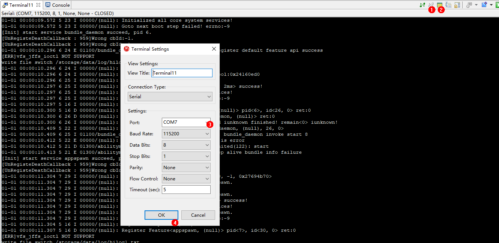

# FAQs

**Problem 1:** **No command output is displayed.**

-   **Description**

    The serial port shows that the connection has been established. After the board is restarted, nothing is displayed when you press  **Enter**.

-   **Possible Causes**
    -   The serial port is connected incorrectly.
    -   The U-Boot of the board is damaged.

-   **Solutions**

    Open the Device Manager to check whether the serial port connected to the board is the same as that connected to the terminal. If not, change the serial port as required.

    **Figure  1**  Procedures for changing the serial port number  
    

1.  Disconnect from the current serial port.
2.  Click  **Settings**.
3.  Change the serial port number in the dialog box and click  **OK**.
4.  Press  **Enter**  in the dialog box to check whether any command output is displayed after the connection is established.

If the fault persists after you perform all the preceding operations, the U-Boot of the board may be damaged. You can burn the U-Boot by performing the following steps.

1.  Obtain the U-Boot file.

    > **NOTICE:** 
    >The U-Boot file of the board can be obtained from  **vendor\\hisi\\hi35xx\\hi3518ev300\\uboot\\out\\boot\\u-boot-hi3518ev300.bin**  in the open-source package.

2.  Use HiTool to burn the U-Boot as required and click  **Burn**.

    **Figure  2**  Procedures for burning the U-Boot using HiTool  
    

    1.  Select the COM7 serial port.
    2.  Set  **Transfer Mode**  to serial.
    3.  Select  **Burn Fastboot**.
    4.  Set the flash type to  **spi nor**.
    5.  Click  **Browse**  and select the corresponding U-Boot file.
    6.  Click  **Burn**  to start burning.

3.  Power off the board and then power it on. Connect the serial port after the burning is complete, and the result is shown in the following figure.

    **Figure  3**  Serial port display after burning the U-Boot  
    

**Problem 2: The following error is reported when HiTool is burning the U-Boot.**

-   **Description**

    **Figure  4**  Burning error reporting  
    

    

-   **Possible Cause**

    The flash type selected by HiTool is incorrect.

-   **Solution**

    Change the flash type in the area marked with  **1**  in the following figure.

    **Figure  5**  Incorrect flash type  
    

    

