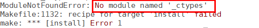
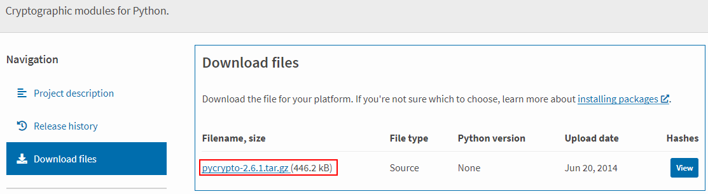
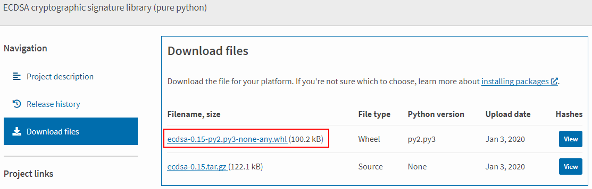
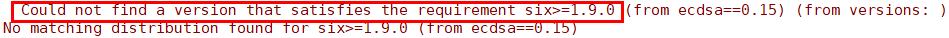
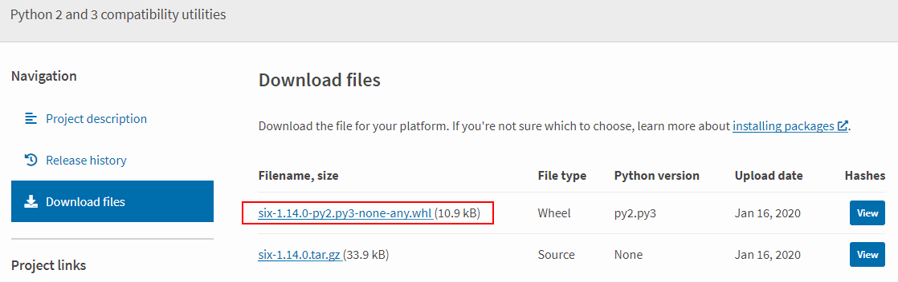
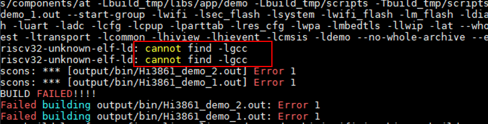
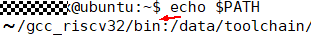
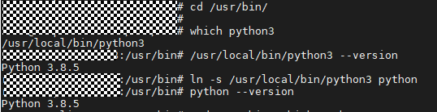

# FAQs<a name="EN-US_TOPIC_0000001053143860"></a>

**Question 1:**  What should I do when the message  **configure: error: no acceptable C compiler found in $PATH**  is displayed during Python 3 installation?

-   **Symptom**

    

-   **Possible Causes**

    **gcc**  is not installed.

-   **Solutions**

    1. Run the  **apt-get install gcc**  command to install  **gcc**  online.

    2. After the installation, reinstall Python 3.


**Question 2:**  What should I do when the message  **-bash: make: command not found**  is displayed during Python 3 installation?

-   **Symptom**

    

-   **Possible Causes**

    **make**  is not installed.

-   **Solutions**

    1. Run the  **apt-get install make**  command to install  **make**  online.

    2. After the installation, reinstall Python 3.


**Question 3:**  What should I do when the message  **zlib not available**  is displayed during Python 3 installation?

-   **Symptom**

    

-   **Possible Causes**

    **zlib**  is not installed.

-   **Solutions**

    Method 1: Run the  **apt-get install zlib**  command to install  **zlib**  online.

    Method 2: If the software source does not contain  **zlib**, download the source code from http://www.zlib.net/ and install it offline.

    

    Installation commands:

    tar xvf zlib-1.2.11.tar.gz

    cd zlib-1.2.11

    ./configure

    make && make install

    3. After the installation, reinstall Python 3.


**Question 4:**  What should I do when the message  **No module named '\_ctypes'**  is displayed during Python 3 installation?

-   **Symptom**

    


-   **Possible Causes**

    **libffi**  and  **libffi-devel**  are not installed.


-   **Solutions**

    1. Run the  **apt-get install libffi\* -y**  command to install  **libffi**  and  **libffi-devel**  online.

    2. After the installation, reinstall Python 3.


**Question 5:**  What should I do when the message  **No module named 'Crypto'**  is displayed during compilation and building?

-   **Symptom**

    


-   **Possible Causes**

    **Crypto**  is not installed.


-   **Solutions**

    Method 1: Run the  **pip3 install Crypto**  command to install  **Crypto**  online.

    Method 2: Install  **Crypto**  offline.

    -   Download the source code from  [https://pypi.org/project/pycrypto/\#files](https://pypi.org/project/pycrypto/#files).

    

    -   Save the source code package to the Linux server, decompress the package, and run the  **python3 setup.py install**  command to install  **Crypto**.
    -   Rebuild an environment.


**Problem 6:**  What should I do when the message  **No module named 'ecdsa'**  is displayed during compilation and building?

-   **Symptom**

    


-   **Possible Causes**

    **ecdsa**  is not installed.


-   **Solutions**

    Method 1: Run the  **pip3 install ecdsa**  command to install  **ecdsa**  online.

    Method 2: Install  **ecdsa**  offline.

    -   Download the installation package from  [https://pypi.org/project/ecdsa/\#files](https://pypi.org/project/ecdsa/#files).

    

    -   Save the installation package to the Linux server and run the  **pip3 install ecdsa-0.15-py2.py3-none-any.whl**  command to install  **ecdsa**.
    -   Rebuild an environment.


**Question 7:**  What should I do when the message  **Could not find a version that satisfies the requirement six\>=1.9.0**  is displayed during compilation and building?

-   **Symptom**

    


-   **Possible Causes**

    **six**  is not installed.


-   **Solutions**

    Method 1: Run the  **pip3 install six**  command to install  **six**  online.

    Method 2: Install  **six**  offline.

    -   Download the installation package from  [https://pypi.org/project/six/\#files](https://pypi.org/project/six/#files).

    

    -   Save the source code to the Linux server and run the  **pip3 install six-1.14.0-py2.py3-none-any.whl**  command to install  **six**.
    -   Rebuild an environment.


**Question 8:**  What should I do when the message  **cannot find -lgcc**  is displayed during compilation and building?

-   **Symptom**

    


-   **Possible Causes**

    The PATH is incorrectly written by  **gcc\_riscv32**, as shown in the following figure. There is an extra slash \(/\).

    


-   **Solutions**

    Modify the PATH by deleting the slash \(/\).

    


**Question 9:**  What should I do when the message indicating Python cannot be found is displayed during compilation and building?

-   **Symptom**

    


-   **Possible Cause 1:**  Python is not installed.
-   **Solutions**

    Install Python by referring to  [Installing a Python Environment](setting-up-a-development-environment.md#section126831816258).

-   **Possible Cause 2:**  The soft link that points to the Python does not exist in the  **usr/bin**  directory.

    

-   **Solutions**

    Run the following command:

    ```
    # cd /usr/bin/
    # which python3
    # ln -s /usr/local/bin/python3 python
    # python --version
    ```

    Example:

    


