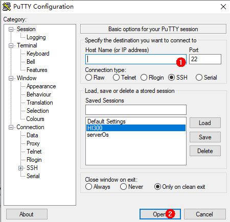

# Hi3516 Board Environment Setup<a name="EN-US_TOPIC_0000001054501981"></a>

## Environment Requirements<a name="section179175261196"></a>

## Hardware<a name="section185788208272"></a>

-   Linux server
-   Windows workstation \(Host computer\)
-   Hi3516DV300 IoT Camera development board
-   USB cable and network cable \(The Windows workbench is connected to Hi3516DV300 development board through the USB cable and network cable.\)

[Figure 1](#fa54d47112b684c65b3dbf1779413545a)  shows the hardware connections.

**Figure  1**  Hardware connections<a name="fig351512693815"></a>  


## Software<a name="section3343841379"></a>

**Table  1**  Platforms required for Hi3516DV300 development board

<a name="tc50585b2b3fe43f7835154789b0e25af"></a>
<table><thead align="left"><tr id="ra9df6acc53154b819d5f86d885d994de"><th class="cellrowborder" valign="top" width="8.53%" id="mcps1.2.5.1.1"><p id="a999bb40532eb4f74a7383e1e776bb94a"><a name="a999bb40532eb4f74a7383e1e776bb94a"></a><a name="a999bb40532eb4f74a7383e1e776bb94a"></a>Hardware</p>
</th>
<th class="cellrowborder" valign="top" width="11.66%" id="mcps1.2.5.1.2"><p id="ae63cf791fbe348d3b907d20fc4927df8"><a name="ae63cf791fbe348d3b907d20fc4927df8"></a><a name="ae63cf791fbe348d3b907d20fc4927df8"></a>Software</p>
</th>
<th class="cellrowborder" valign="top" width="66%" id="mcps1.2.5.1.3"><p id="a54c4c80c43c84cb187342865a1d2b51e"><a name="a54c4c80c43c84cb187342865a1d2b51e"></a><a name="a54c4c80c43c84cb187342865a1d2b51e"></a>Description</p>
</th>
<th class="cellrowborder" valign="top" width="13.81%" id="mcps1.2.5.1.4"><p id="a11e8d096fb204378a63d8805cd6d1f88"><a name="a11e8d096fb204378a63d8805cd6d1f88"></a><a name="a11e8d096fb204378a63d8805cd6d1f88"></a>Remarks</p>
</th>
</tr>
</thead>
<tbody><tr id="row117591159175819"><td class="cellrowborder" valign="top" width="8.53%" headers="mcps1.2.5.1.1 "><p id="a0c1290183f2548898dbfc516a4db2c4b"><a name="a0c1290183f2548898dbfc516a4db2c4b"></a><a name="a0c1290183f2548898dbfc516a4db2c4b"></a>Linux compile server</p>
</td>
<td class="cellrowborder" valign="top" width="11.66%" headers="mcps1.2.5.1.2 "><p id="a687efa8001f140488dc1da9a2ee8f6d1"><a name="a687efa8001f140488dc1da9a2ee8f6d1"></a><a name="a687efa8001f140488dc1da9a2ee8f6d1"></a>Operating system</p>
</td>
<td class="cellrowborder" valign="top" width="66%" headers="mcps1.2.5.1.3 "><p id="ace724e00c9094eccb8c600d6ad426ed8"><a name="ace724e00c9094eccb8c600d6ad426ed8"></a><a name="ace724e00c9094eccb8c600d6ad426ed8"></a>Ubuntu 16.04 64-bit or later is used for the Linux OS, and Bash is used for the shell.</p>
<div class="note" id="note124531828194919"><a name="note124531828194919"></a><a name="note124531828194919"></a><span class="notetitle"> NOTE: </span><div class="notebody"><p id="p1244243142810"><a name="p1244243142810"></a><a name="p1244243142810"></a>Common software such as samba and vim is installed by default in the system. Adaptation is required to support Linux file sharing.</p>
</div></div>
</td>
<td class="cellrowborder" rowspan="3" valign="top" width="13.81%" headers="mcps1.2.5.1.4 "><p id="a4d0e2c8444484554ab58949ce322be32"><a name="a4d0e2c8444484554ab58949ce322be32"></a><a name="a4d0e2c8444484554ab58949ce322be32"></a>You can develop programs on the Windows workstation or on the Linux server through remote login.</p>
</td>
</tr>
<tr id="r85c4bf56ff3244e48db9d2f5b622b340"><td class="cellrowborder" rowspan="2" valign="top" headers="mcps1.2.5.1.1 "><p id="a8e99fd0262cb4489b70cf86c2144c294"><a name="a8e99fd0262cb4489b70cf86c2144c294"></a><a name="a8e99fd0262cb4489b70cf86c2144c294"></a>Windows workstation</p>
</td>
<td class="cellrowborder" valign="top" headers="mcps1.2.5.1.2 "><p id="a44d6164ce2e9421f9ade362f600c2815"><a name="a44d6164ce2e9421f9ade362f600c2815"></a><a name="a44d6164ce2e9421f9ade362f600c2815"></a>Operating system</p>
</td>
<td class="cellrowborder" valign="top" headers="mcps1.2.5.1.3 "><p id="a1c17349e334a44ada5c5f150457fe17d"><a name="a1c17349e334a44ada5c5f150457fe17d"></a><a name="a1c17349e334a44ada5c5f150457fe17d"></a>Windows XP/Windows7/Windows10</p>
</td>
</tr>
<tr id="r2c85a3b244764425b0d08fa20503da12"><td class="cellrowborder" valign="top" headers="mcps1.2.5.1.1 "><p id="a70beb9d769e340018c9c39c7d44cf424"><a name="a70beb9d769e340018c9c39c7d44cf424"></a><a name="a70beb9d769e340018c9c39c7d44cf424"></a>USB-serial adapter driver</p>
</td>
<td class="cellrowborder" valign="top" headers="mcps1.2.5.1.2 "><p id="adf64234e124c498d904e2367238b6176"><a name="adf64234e124c498d904e2367238b6176"></a><a name="adf64234e124c498d904e2367238b6176"></a>http://www.totalcardiagnostics.com/files/PL2303_64bit_Installer.exe</p>
</td>
</tr>
</tbody>
</table>

## Build Tools for Linux<a name="section20374218687"></a>

The following table lists the obtaining channels and common tools required for Linux.

**Table  2**  Development tools and obtaining channels for the Linux server

<a name="table6299192712513"></a>
<table><thead align="left"><tr id="row122993276512"><th class="cellrowborder" valign="top" width="33.33333333333333%" id="mcps1.2.4.1.1"><p id="p1829914271858"><a name="p1829914271858"></a><a name="p1829914271858"></a>Development tool</p>
</th>
<th class="cellrowborder" valign="top" width="33.33333333333333%" id="mcps1.2.4.1.2"><p id="p429918274517"><a name="p429918274517"></a><a name="p429918274517"></a>Description</p>
</th>
<th class="cellrowborder" valign="top" width="33.33333333333333%" id="mcps1.2.4.1.3"><p id="p12997271757"><a name="p12997271757"></a><a name="p12997271757"></a>Obtaining Channel</p>
</th>
</tr>
</thead>
<tbody><tr id="row430016273514"><td class="cellrowborder" valign="top" width="33.33333333333333%" headers="mcps1.2.4.1.1 "><p id="p330015271158"><a name="p330015271158"></a><a name="p330015271158"></a>Python3.7+</p>
</td>
<td class="cellrowborder" valign="top" width="33.33333333333333%" headers="mcps1.2.4.1.2 "><p id="p43003270510"><a name="p43003270510"></a><a name="p43003270510"></a>Runs the compilation scripts.</p>
</td>
<td class="cellrowborder" valign="top" width="33.33333333333333%" headers="mcps1.2.4.1.3 "><p id="p722419345151"><a name="p722419345151"></a><a name="p722419345151"></a>Public internet</p>
</td>
</tr>
<tr id="row42668197206"><td class="cellrowborder" valign="top" width="33.33333333333333%" headers="mcps1.2.4.1.1 "><p id="p426711912014"><a name="p426711912014"></a><a name="p426711912014"></a>bash</p>
</td>
<td class="cellrowborder" valign="top" width="33.33333333333333%" headers="mcps1.2.4.1.2 "><p id="p14267131962014"><a name="p14267131962014"></a><a name="p14267131962014"></a>Executes commands.</p>
</td>
<td class="cellrowborder" valign="top" width="33.33333333333333%" headers="mcps1.2.4.1.3 "><p id="p14267101962014"><a name="p14267101962014"></a><a name="p14267101962014"></a>Public internet</p>
</td>
</tr>
<tr id="row1711946154018"><td class="cellrowborder" valign="top" width="33.33333333333333%" headers="mcps1.2.4.1.1 "><p id="p15588165684216"><a name="p15588165684216"></a><a name="p15588165684216"></a>gn</p>
</td>
<td class="cellrowborder" valign="top" width="33.33333333333333%" headers="mcps1.2.4.1.2 "><p id="p4588135634213"><a name="p4588135634213"></a><a name="p4588135634213"></a>Generates ninja compilation scripts.</p>
</td>
<td class="cellrowborder" valign="top" width="33.33333333333333%" headers="mcps1.2.4.1.3 "><p id="p971620134114"><a name="p971620134114"></a><a name="p971620134114"></a><a href="http://tools.harmonyos.com/mirrors/gn/1523/linux/gn-linux-1523.tar" target="_blank" rel="noopener noreferrer">http://tools.harmonyos.com/mirrors/gn/1523/linux/gn-linux-1523.tar</a></p>
</td>
</tr>
<tr id="row16990164213404"><td class="cellrowborder" valign="top" width="33.33333333333333%" headers="mcps1.2.4.1.1 "><p id="p1858825613428"><a name="p1858825613428"></a><a name="p1858825613428"></a>ninja</p>
</td>
<td class="cellrowborder" valign="top" width="33.33333333333333%" headers="mcps1.2.4.1.2 "><p id="p15844174611816"><a name="p15844174611816"></a><a name="p15844174611816"></a>Runs ninja compilation scripts.</p>
</td>
<td class="cellrowborder" valign="top" width="33.33333333333333%" headers="mcps1.2.4.1.3 "><p id="p1991121915416"><a name="p1991121915416"></a><a name="p1991121915416"></a><a href="http://tools.harmonyos.com/mirrors/ninja/1.9.0/linux/ninja-linux-1.9.0.tar" target="_blank" rel="noopener noreferrer">http://tools.harmonyos.com/mirrors/ninja/1.9.0/linux/ninja-linux-1.9.0.tar</a></p>
</td>
</tr>
<tr id="row192161027104010"><td class="cellrowborder" valign="top" width="33.33333333333333%" headers="mcps1.2.4.1.1 "><p id="p15217227174016"><a name="p15217227174016"></a><a name="p15217227174016"></a>LLVM</p>
</td>
<td class="cellrowborder" valign="top" width="33.33333333333333%" headers="mcps1.2.4.1.2 "><p id="p122171727184019"><a name="p122171727184019"></a><a name="p122171727184019"></a>Performs code editing.</p>
</td>
<td class="cellrowborder" valign="top" width="33.33333333333333%" headers="mcps1.2.4.1.3 "><p id="p20217172711408"><a name="p20217172711408"></a><a name="p20217172711408"></a><a href="http://tools.harmonyos.com/mirrors/clang/9.0.0-33042/linux/llvm-linux-9.0.0-33042.tar" target="_blank" rel="noopener noreferrer">http://tools.harmonyos.com/mirrors/clang/9.0.0-33042/linux/llvm-linux-9.0.0-33042.tar</a></p>
</td>
</tr>
<tr id="row105773499422"><td class="cellrowborder" valign="top" width="33.33333333333333%" headers="mcps1.2.4.1.1 "><p id="p15300102717517"><a name="p15300102717517"></a><a name="p15300102717517"></a>IPOP, PuTTY, or HyperTerminal</p>
</td>
<td class="cellrowborder" valign="top" width="33.33333333333333%" headers="mcps1.2.4.1.2 "><p id="p109418530386"><a name="p109418530386"></a><a name="p109418530386"></a>Connects to the Linux server(choose one).</p>
</td>
<td class="cellrowborder" valign="top" width="33.33333333333333%" headers="mcps1.2.4.1.3 "><p id="p7312122523813"><a name="p7312122523813"></a><a name="p7312122523813"></a>Public internet (for example, <a href="https://www.putty.org/" target="_blank" rel="noopener noreferrer">https://www.putty.org/</a>)</p>
</td>
</tr>
</tbody>
</table>

## Development Tools for Windows<a name="section11161833102716"></a>

**Table  3**  Development tools and obtaining channels for the Windows workstation

<a name="table1313323311274"></a>
<table><thead align="left"><tr id="row3133133312711"><th class="cellrowborder" valign="top" width="16.371637163716375%" id="mcps1.2.4.1.1"><p id="p16132203372716"><a name="p16132203372716"></a><a name="p16132203372716"></a>Development tool</p>
</th>
<th class="cellrowborder" valign="top" width="50.29502950295029%" id="mcps1.2.4.1.2"><p id="p1413219339278"><a name="p1413219339278"></a><a name="p1413219339278"></a>Description</p>
</th>
<th class="cellrowborder" valign="top" width="33.33333333333333%" id="mcps1.2.4.1.3"><p id="p17133183312711"><a name="p17133183312711"></a><a name="p17133183312711"></a>Obtaining Channel</p>
</th>
</tr>
</thead>
<tbody><tr id="row13697410143219"><td class="cellrowborder" valign="top" width="16.371637163716375%" headers="mcps1.2.4.1.1 "><p id="p163612016916"><a name="p163612016916"></a><a name="p163612016916"></a>Visual Studio Code</p>
</td>
<td class="cellrowborder" valign="top" width="50.29502950295029%" headers="mcps1.2.4.1.2 "><p id="p1563690791"><a name="p1563690791"></a><a name="p1563690791"></a>Performs code editing.</p>
</td>
<td class="cellrowborder" valign="top" width="33.33333333333333%" headers="mcps1.2.4.1.3 "><p id="p146361701097"><a name="p146361701097"></a><a name="p146361701097"></a><a href="https://code.visualstudio.com/" target="_blank" rel="noopener noreferrer">https://code.visualstudio.com/</a></p>
</td>
</tr>
<tr id="row12133123315277"><td class="cellrowborder" valign="top" width="16.371637163716375%" headers="mcps1.2.4.1.1 "><p id="p613393317271"><a name="p613393317271"></a><a name="p613393317271"></a>HUAWEI DevEco Device Tool</p>
</td>
<td class="cellrowborder" valign="top" width="50.29502950295029%" headers="mcps1.2.4.1.2 "><p id="p10133193310276"><a name="p10133193310276"></a><a name="p10133193310276"></a>Suppports code compilation, burning, debugging, and C++ languages.</p>
<div class="note" id="note7133193392718"><a name="note7133193392718"></a><a name="note7133193392718"></a><span class="notetitle"> NOTE: </span><div class="notebody"><p id="p1133183310277"><a name="p1133183310277"></a><a name="p1133183310277"></a>HUAWEI DevEco Device Tool is a one-stop integrated development tool provided by <span id="text47341052113"><a name="text47341052113"></a><a name="text47341052113"></a>OpenHarmony</span> for smart device developers. It supports customization of <span id="text1173915522119"><a name="text1173915522119"></a><a name="text1173915522119"></a>OpenHarmony</span> components based on demands, and functions such as code editing, compilation, burning, and debugging. It also supports C and C++ languages, and is deployed on Visual Studio Code as a plug-in.</p>
</div></div>
</td>
<td class="cellrowborder" valign="top" width="33.33333333333333%" headers="mcps1.2.4.1.3 "><p id="p12133113319277"><a name="p12133113319277"></a><a name="p12133113319277"></a><a href="https://partnerdevicetest.devccsrnd.hwcloudtest.cn:3092/cn/ide" target="_blank" rel="noopener noreferrer">https://partnerdevicetest.devccsrnd.hwcloudtest.cn:3092/cn/ide</a></p>
</td>
</tr>
</tbody>
</table>

## Installing the Basic Compilation Environment<a name="section497484245614"></a>

## connecting to the Linux server<a name="section73731485127"></a>

Using PuTTY on Windows to log into Linux server

1.  Open  [puTTY](https://www.putty.org/), enter the IP address of the Linux server, and click  **Open**.

    **Figure  2**  PuTTY configuration page<a name="en-us_topic_0000001054781998_f825e6d7569cc487db9b744e454c7157a"></a>  
    

2.  Select  **Yes**  in the dialog displaying a security alert.

    **Figure  3**  PuTTY Security Alert dialog<a name="en-us_topic_0000001054781998_fc3ef6d32e0ee41bbaaaee0d41446ef18"></a>  
    

3.  Enter the account and password.

    **Figure  4**  Login page<a name="en-us_topic_0000001054781998_fe1428afffbdd45f9b4a39497691ff5ff"></a>  
    

4.  The login is successful.

    **Figure  5**  Successful login page<a name="en-us_topic_0000001054781998_f11bea69483e14bd39fef4a10b1ed1a3a"></a>  
    


## h2 Change Linux shell to bash.<a name="section11741048173311"></a>

Run the following command on the terminal to check whether the shell is bash:

```
ls -l /bin/sh
```

如果为显示为/bin/sh -\> bash则为正常，否则请按以下方式修改：

**方法一**

在终端运行如下命令，然后选择 no。

```
sudo dpkg-reconfigure dash
```

**方法二**

Delete sh and run sh again.

```
rm -rf /bin/sh
sudo ln -s /bin/bash /bin/sh
```

## Installing the Python environment<a name="section16270312203916"></a>

1.  Open the terminal of the Linux compilation server.
2.  Run the  **python3 --version**  command to check the Python version. Python 3.7 or later is required. Otherwise, perform the following steps \(Python 3.8 is used as an example\):
    -   If the Ubuntu version is 18, run the sudo apt-get install python3.8 command.
    -   If the Ubuntu version is 16, download the installation package and install Python.

        1. Run the following command to install the python dependency:

        Run sudo apt-get install gcc to install gcc.

        Install g++ and run sudo apt-get install g++.

        Run the sudo apt-get install make command to install make.

        Run the sudo apt-get install zlib\* command to install zlib.

        Install libffi and run "sudo apt-get install libffi-dev".

        2. Obtaining the python3.8.5 Installation Package

        3. Run the  **tar -xvzf Python-3.8.5.tgz**  command.

        4. Run the  **cd Python-3.8.5**  command.

        5. Run the  **sudo ./configure**  command.

        6. Run the  **make**  command.

        7. Run the  **sudo make install**  command.


    -   Run the sudo apt-get install python3-setuptools python3-pip -y command to install the Python package management tool. \(The root/sudo permission is required for the installation.\) Upgrade pip3 and run "sudo pip3 install --upgrade pip".

        Alternatively, install the Python package management tool as instructed by the official website. Download "curl https://bootstrap.pypa.io/get-pip.py -o get-pip.py" and run python get-pip.py.


3.  Install  **setuptools**  by running the  **pip3 install setuptools**  command.
4.  Install GUI menuconfig by running the  **sudo pip3 install kconfiglib**  command. The Kconfiglib 13.2.0+ version is recommended. \(The root/sudo permission is required.\)

    You can also perform the following steps to install Kconfiglib 13.2.0+:

    1.  Download the .whl file \(for example, kconfiglib-13.2.0-py2.py3-none-any.whl\).

        Download path: https://pypi.org/project/kconfiglib\#files


    1.  Install the .whl file by running the  **sudo pip3 install kconfiglib-xxx.whl**  command \(for example,  **sudo pip3 install kconfiglib-13.2.0-py2.py3-none-any.whl**\). \(The root/sudo permission is required.\)
    2.  If an error of  **subprocess.CalledProcessError: Command '\('lsb\_release', '-a'\)' returned non-zero exit status 1.**  occurs, run the  **find / -name lsb\_release**  command, for example,  **rm -rf /usr/bin/lsb\_release**  to locate  **sb\_release**  and release it.


##  Installing  **gn**<a name="section1737610811213"></a>

1.  Open a Linux terminal.
2.  Download  [gn](https://chrome-infra-packages.appspot.com/dl/gn/gn/linux-amd64/+/latest).
3.  Decompress the tool package to the  **\~/gn**  directory on the Linux server.
4.  Set environment variables by running the  **vim /etc/profile**  command and add new variables by running the  **export PATH=\~/gn:$PATH**  command.
5.  Validate environment variables by running the  **source /etc/profile**  command.

## Installing  **ninjah**<a name="section103777819124"></a>

1.  Open a Linux terminal.
2.  Download  [ninja](https://github.com/ninja-build/ninja/releases/download/v1.10.0/ninja-linux.zip).
3.  Decompress the tool package to the  **\~/ninja**  directory on the Linux server.
4.  Set environment variables by running the  **vim /etc/profile**  command and add new variables by running the  **PATH=\~/ninja:$PATH**  command.
5.  Validate environment variables by running the  **source /etc/profile**  command.

## Installing the LLVM tool chain<a name="section11613193644213"></a>

1.  Open a Linux terminal.
2.  Download  [http://tools.harmonyos.com/mirrors/clang/9.0.0-33042/linux/llvm-linux-9.0.0-33042.tar](http://tools.harmonyos.com/mirrors/clang/9.0.0-33042/linux/llvm-linux-9.0.0-33042.tar).
3.  Decompress the tool package to the  **\~/llvm**  directory on the Linux server.
4.  Set environment variables by adding  **export PATH=\~/bin:$PATH**  to the  **vim /etc/profile**  profile.
5.  Validate environment variables by running the  **source /etc/profile**  command.

## Installing File Packing Tools<a name="section5835152153720"></a>

1.  Open a Linux terminal.
2.  Run the  **mkfs.vfat**  command. If the command is not found, run the  **sudo apt-get install dosfstools**  command.
3.  Run the  **mcopy**  command. If the command is not found, run the  **sudo apt-get install mtools**  command.

